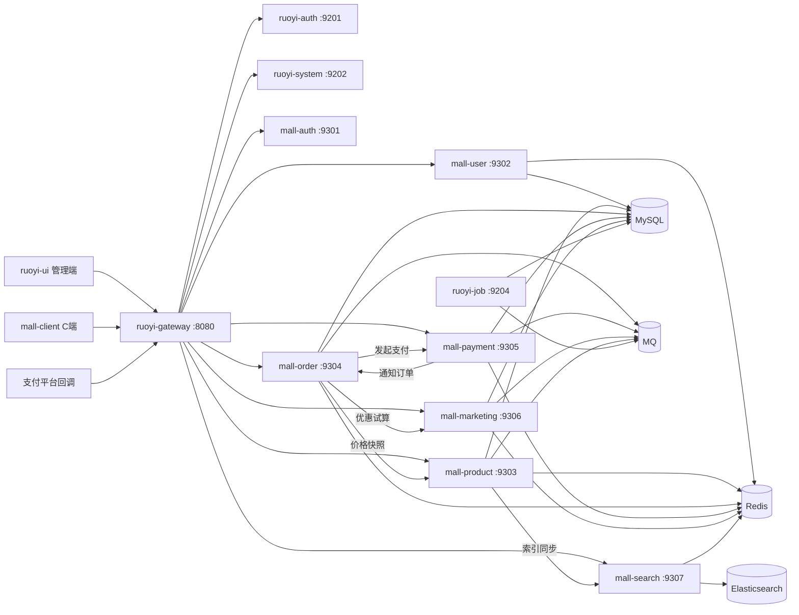
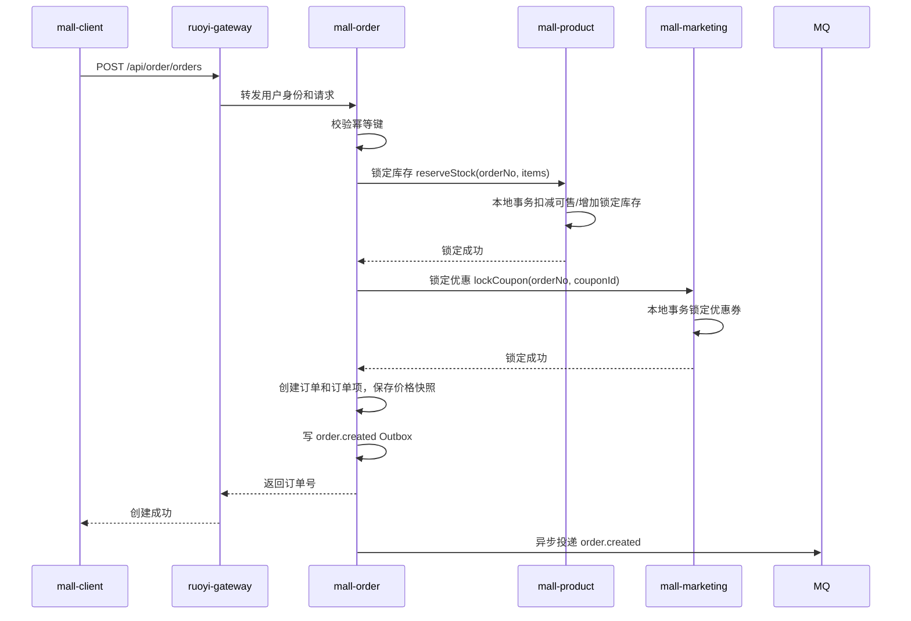
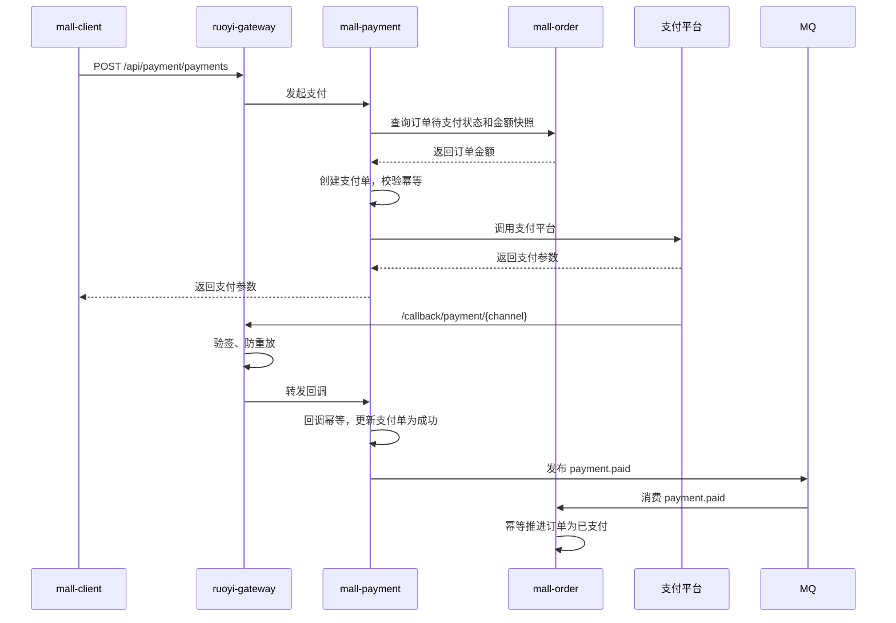
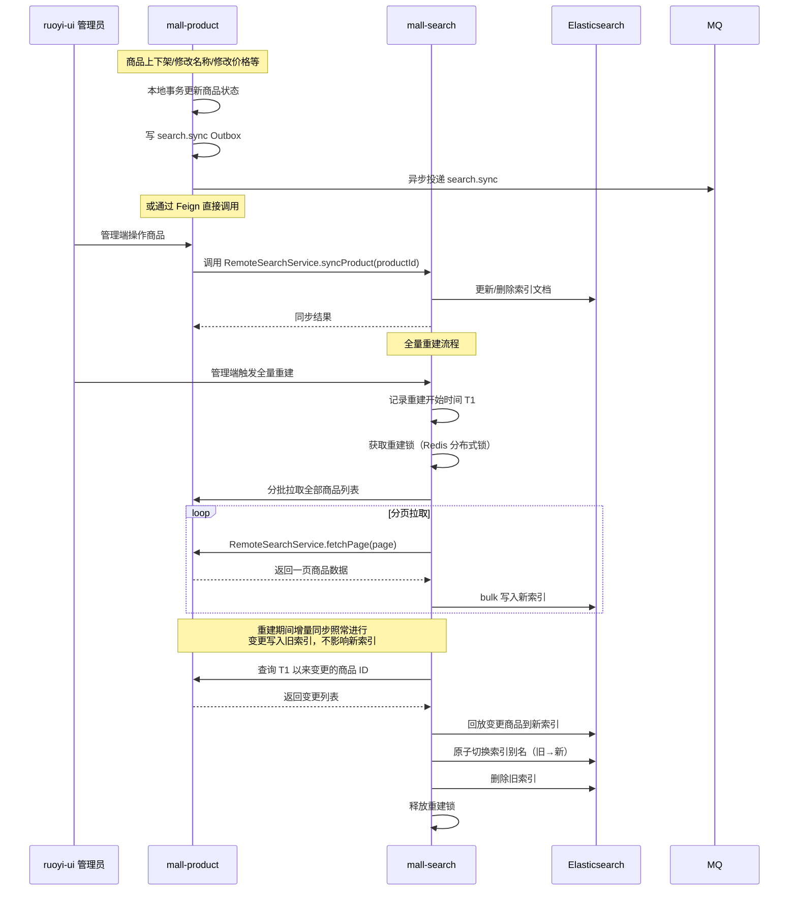

# JH-Store 系统概要设计

> 基于 RuoYi-Cloud v3.6.8（Spring Boot 4.0 / Spring Cloud 2025.1.0）二次开发。
> **运行时环境：JDK 21**（POM 中 `<java.version>17</java.version>` 仅控制编译字节码版本，实际部署为 JDK 21）。
> 若依原生代码完全封闭在 `server/manager/` 中，商城业务在 `server/mall/` 中独立扩展，
> 两者通过 `ruoyi-common` 全局公共模块共享基础设施。

---

## 一、架构原则

### 1.1 若依作为完整管理框架

若依负责网关、认证、管理员、角色、菜单、权限、公共工具、文件、任务、监控等管理和基础能力。商城业务在 `server/mall/` 中按业务域新增模块，复用若依全局能力，但不把商城业务规则写入若依系统管理模块。

约束：

- 保留若依原生物理结构 `server/manager/`，不在此目录中写入商城业务代码
- 商城后端模块放在 `server/mall/` 下，与 `server/manager/` 保持同级目录关系
- 全局技术能力直接复用 `ruoyi-common-*`，例如返回结构、异常、Redis、日志、安全上下文、Feign、Swagger、MyBatis 等
- 服务间契约放在 `mall-api/`，只放 Feign Client、DTO、事件对象和必要枚举
- 商城业务规则、订单状态、支付规则、优惠规则不能写入 `ruoyi-common-*` 或 `ruoyi-system`
- 如必须读取若依管理员、角色、权限信息，通过 `ruoyi-api-system` 契约或网关注入身份完成，不跨模块直接访问 `ruoyi-system` 表

### 1.2 网关复用若依网关

统一网关复用 `ruoyi-gateway`。商城只在网关配置中增加路由、白名单、限流和过滤链，不另建网关。

网关职责：

- 路由转发
- 管理端认证链路
- C 端认证链路
- 外部回调验签链路
- 限流、黑白名单、请求日志、traceId 注入

网关不负责：

- 复杂业务判断
- 数据库访问
- 跨服务事务编排
- 把认证失败包装成业务成功

### 1.3 服务拥有自己的数据

每个服务拥有自己的表和业务状态。服务之间不能跨库跨表 join，不能直接读写对方表。

早期可以物理上共用一个 MySQL 实例甚至同一个 schema，但必须通过表前缀、迁移目录、Mapper 包和 `DO/` 实体归属保持逻辑隔离。

数据库实体类约束：

- `DO/` 是数据库实体类目录，对应本服务拥有的 MySQL 表
- `mall-user` 的用户、会员、地址实体只放在 `mall-user/DO`
- `mall-product` 的商品、SKU、库存实体只放在 `mall-product/DO`
- `mall-order` 的购物车、订单、订单项、售后实体只放在 `mall-order/DO`
- `mall-payment` 的支付单、退款单、渠道流水实体只放在 `mall-payment/DO`
- `mall-marketing` 的优惠券、活动、核销记录实体只放在 `mall-marketing/DO`
- 任何 `DO` 实体不能放入 `mall-api` 或 `ruoyi-common-*`

### 1.4 API 契约不暴露数据库实体

服务间调用只使用契约 DTO 和 Feign 客户端接口。VO 在各服务 `convert/` 中定义，不放入 `mall-api`。数据库实体、Mapper、Service 实现不能放进 `mall-api`。

### 1.5 关键链路用最终一致性

商城核心链路默认采用本地事务 + 可靠消息 + 幂等 + 补偿任务。除非有强监管或强一致要求，不默认引入全局 XA 事务。库存锁定和优惠锁定除外，使用同步 Feign 调用保证实时反馈。

### 1.6 服务拆分适度

当前只做逻辑服务拆分，保留用户、商品、订单、支付、营销、搜索六个核心商城模块。购物车、售后等先放入订单域内部，业务复杂后再拆。避免一开始拆出过多独立工程、独立公共包或独立平台层导致调用链、事务和部署复杂度失控。

---

## 二、技术栈

| 层            | 技术                                                                        |
| ------------- | --------------------------------------------------------------------------- |
| 后端框架      | Spring Boot 4.0.3 + Spring Cloud 2025.1.0 + Spring Cloud Alibaba 2025.1.0.0 |
| 运行时环境    | **JDK 21**（若依模块 `<java.version>17</java.version>`，商城模块覆盖为 `21`） |
| 注册/配置中心 | Nacos 3.2.1                                                                 |
| 网关          | Spring Cloud Gateway                                                        |
| ORM           | MyBatis-Plus 3.5.15（`mybatis-plus-spring-boot4-starter` + `mybatis-plus-jsqlparser`）+ PageHelper 2.1.0（管理端分页）                                                        |
| 代码生成      | Lombok 1.18.38（`@Data` / `@Slf4j` / `@RequiredArgsConstructor`）           |
| 数据源        | Druid + Dynamic Datasource                                                  |
| 分布式事务    | Seata（ruoyi-common-seata）                                                 |
| 熔断降级      | Sentinel（随 Spring Cloud Alibaba 引入）                                    |
| 链路追踪      | SkyWalking（Java Agent）                                                    |
| 缓存          | Redis 7.4.9（ruoyi-common-redis）                                           |
| 搜索引擎      | Elasticsearch 9.x + Spring Data Elasticsearch（mall-search）                |
| 消息队列      | RocketMQ 5.5.0 + rocketmq-spring-boot-starter 2.3.5（消息模型见 12.4）                       |
| 管理端前端    | Vue 3 + Vite + Element Plus + Pinia                                         |
| C端前端       | Vue 3 + Vite + Element Plus + Pinia（响应式）                               |

---

## 三、目录结构

```
JH-Store/
├─ AGENTS.md                  # AI Agent 指令
├─ client/                    # 🖥️ 所有前端项目统一管理
│  ├─ ruoyi-ui/               # 若依管理端前端（Vue3+Vite+Element Plus）
│  │  ├─ src/                 # 前端源码
│  │  │  ├─ api/              # 接口请求层
│  │  │  │  ├─ system/        # 若依原生系统接口
│  │  │  │  └─ mall/          # 商城管理接口
│  │  │  ├─ views/            # 页面视图
│  │  │  │  ├─ system/        # 若依原生系统页面
│  │  │  │  ├─ monitor/       # 若依原生监控页面
│  │  │  │  └─ mall/          # 新增的商城管理页面
│  │  │  │     ├─ user/       # 用户管理页
│  │  │  │     ├─ product/    # 商品管理页
│  │  │  │     ├─ order/      # 订单管理页
│  │  │  │     └─ marketing/  # 营销管理页
│  │  ├─ package.json         # 前端依赖配置
│  │  └─ vite.config.js       # Vite 构建配置
│  │
│  └─ mall-client/            # 商城C端前端（Vue3+Vite+Element Plus，响应式网站）
│     ├─ public/              # 静态资源（favicon、robots.txt 等）
│     ├─ src/                 # 前端源码
│     │  ├─ api/              # 接口请求
│     │  ├─ assets/           # 静态资源
│     │  ├─ components/       # 公共组件
│     │  ├─ layout/           # 布局组件
│     │  ├─ router/           # 路由
│     │  ├─ store/            # 状态管理
│     │  ├─ utils/            # 工具类
│     │  └─ views/            # 页面
│     │     ├─ home/          # 首页
│     │     ├─ product/       # 商品页
│     │     ├─ search/        # 商品搜索页
│     │     ├─ cart/          # 购物车
│     │     ├─ order/         # 订单页
│     │     └─ user/          # 个人中心
│     ├─ package.json         # 前端依赖配置
│     └─ vite.config.js       # Vite 构建配置
│
├─ db/                        # 📦 数据库脚本（Flyway 增量迁移）
│  ├─ manager/                # 若依原生库 DDL + 种子数据
│  └─ mall/                   # 商城业务库 DDL + 种子数据
│     ├─ mall-user/           # 用户/会员表
│     ├─ mall-product/        # 商品/SKU/库存表
│     ├─ mall-order/          # 订单/购物车/售后表
│     ├─ mall-payment/        # 支付/退款/对账表
│     ├─ mall-marketing/      # 优惠券/活动表
│     └─ mall-search/         # 搜索索引管理脚本
│
├─ deploy/                    # 🚀 部署配置
│  ├─ docker/                 # Docker Compose 编排
│  ├─ nginx/                  # Nginx 反向代理配置
│  └─ sql/                    # 部署环境初始化 SQL
│
├─ docs/                      # 项目文档
│  └─ design/                 # 架构设计文档
│
└─ server/                    # 🔧 所有后端服务
   ├─ manager/                # 🔒 若依后端管理系统（完全封闭，原生代码不动）
   │  ├─ pom.xml              # groupId: com.ruoyi / artifactId: ruoyi / v3.6.8
   │  │
   │  ├─ ruoyi-gateway/       # 全局统一网关（8080端口，唯一公网入口）
   │  │  └─ src/main/java/com/ruoyi/gateway/
   │  │     ├─ filter/           # 网关过滤器
   │  │     │  ├─ AuthFilter.java           # 若依管理员认证过滤器
   │  │     │  └─ MallAuthFilter.java       # 商城用户认证过滤器（新增）
   │  │     └─ GatewayApplication.java      # 网关启动类
   │  │
   │  ├─ ruoyi-auth/          # 管理端专属认证中心（9201端口，仅管理员登录）
   │  │
   │  ├─ ruoyi-api/           # 若依内部API（仅管理端内部调用，不要依赖）
   │  │  └─ ruoyi-api-system/    # 系统内部 API 定义
   │  │
   │  ├─ ruoyi-common/        # 🌍 全局公共模块（所有服务共用，纯依赖库）
   │  │  ├─ ruoyi-common-core/        # 核心工具包（常量、异常、返回结果、工具类）
   │  │  ├─ ruoyi-common-security/    # 安全模块
   │  │  ├─ ruoyi-common-swagger/     # 接口文档
   │  │  ├─ ruoyi-common-redis/       # 缓存服务
   │  │  ├─ ruoyi-common-log/         # 日志记录
   │  │  ├─ ruoyi-common-seata/       # 分布式事务
   │  │  ├─ ruoyi-common-datascope/   # 数据权限
   │  │  ├─ ruoyi-common-datasource/  # 多数据源
   │  │  └─ ruoyi-common-sensitive/   # 数据脱敏
   │  │
   │  ├─ ruoyi-modules/       # 若依内部业务模块
   │  │  ├─ ruoyi-system/     # 管理端系统模块（9202端口：管理员、角色、权限、菜单）
   │  │  ├─ ruoyi-gen/        # ⚙️ 代码生成器（9203端口，生产环境删除）
   │  │  ├─ ruoyi-job/        # ✅ 全局复用：分布式定时任务（9204端口）
   │  │  └─ ruoyi-file/       # ✅ 全局复用：统一文件服务（9205端口）
   │  │
   │  └─ ruoyi-visual/        # 若依可视化模块
   │     └─ ruoyi-visual-monitor/ # ✅ 全局复用：服务监控中心（9206端口）
   │
   └─ mall/                   # 🛒 商城业务域（完全独立，与 manager 平级）
      ├─ pom.xml              # 商城父POM（groupId: com.jhstore / artifactId: jhstore-mall）
      │
      ├─ mall-api/            # 商城服务间契约（纯依赖库，无启动类）
      │  └─ src/main/java/com/mall/api/
      │     ├─ dto/           # 数据传输对象（XxxDTO，Feign 跨服务传参）
      │     │  ├─ user/       # 用户 DTO
      │     │  ├─ member/     # 会员 DTO
      │     │  ├─ product/    # 商品 DTO
      │     │  ├─ search/     # 搜索 DTO
      │     │  ├─ order/      # 订单 DTO
      │     │  ├─ payment/    # 支付 DTO
      │     │  └─ marketing/  # 营销 DTO
      │     ├─ feign/          # Feign远程调用接口 + fallback降级
      │     │  ├─ RemoteUserService.java        # 用户服务远程调用
      │     │  ├─ RemoteProductService.java     # 商品服务远程调用
      │     │  ├─ RemoteOrderService.java       # 订单服务远程调用
      │     │  ├─ RemotePaymentService.java     # 支付服务远程调用
      │     │  ├─ RemoteMarketingService.java   # 营销服务远程调用
      │     │  └─ RemoteSearchService.java      # 搜索索引同步（商品变更时触发）
      │     └─ enums/          # 跨服务必须共享的枚举
      │
      ├─ mall-common/          # C 端公共基础设施（纯依赖库，无启动类）
      │  └─ src/main/java/com/mall/common/
      │     ├─ handler/        # 全局异常处理器等横切关注点
      │     └─ ...
      │
      ├─ mall-auth/           # 商城专属认证中心（9301端口，仅C端用户登录）
      │  └─ src/main/java/com/mall/auth/
      │     ├─ controller/ApiAuthController.java  # C端认证接口（登录/注册/刷新令牌）
      │     ├─ service/                # 认证业务逻辑
      │     └─ MallAuthApplication.java  # 认证服务启动类
      │
      ├─ mall-user/           # 商城用户+会员服务（9302端口）
      │  └─ src/main/java/com/mall/user/
      │     ├─ controller/    # 控制层（C端扁平；inner/ 内部 Feign）
      │     ├─ DO/            # 数据库实体（MallUserDO, MallUserAddressDO, MallMemberDO 等）
     │     ├─ service/       # 业务逻辑层
     │     │  ├─ user/       # 用户业务
     │     │  └─ member/     # 会员业务
     │     ├─ mapper/        # MyBatis 数据访问层
      │     ├─ infrastructure/ # MQ、外部 Feign 适配
      │     ├─ convert/       # DTO/VO/Entity 转换
      │     └─ MallUserApplication.java  # 用户服务启动类
      │
      ├─ mall-product/        # 商城商品服务（9303端口）
      │  └─ src/main/java/com/mall/product/
      │     ├─ controller/    # 控制层
      │     ├─ DO/            # MallProductDO, MallProductSkuDO, MallProductCategoryDO
     │     ├─ service/       # 业务逻辑层
     │     ├─ mapper/        # MyBatis 数据访问层
      │     ├─ infrastructure/ # MQ、搜索索引同步适配
      │     ├─ convert/       # DTO/VO/Entity 转换
      │     └─ MallProductApplication.java  # 商品服务启动类
      │
      ├─ mall-order/          # 商城订单服务（9304端口）
      │  └─ src/main/java/com/mall/order/
      │     ├─ controller/    # 控制层
      │     ├─ DO/            # MallOrderDO, MallOrderItemDO, MallCartDO, MallAfterSaleDO
     │     ├─ service/       # 业务逻辑层
     │     ├─ mapper/        # MyBatis 数据访问层
      │     ├─ statemachine/  # 订单状态机
      │     ├─ infrastructure/ # MQ、外部 Feign 适配
      │     ├─ convert/       # DTO/VO/Entity 转换
      │     └─ MallOrderApplication.java  # 订单服务启动类
      │
      ├─ mall-payment/        # 商城支付服务（9305端口）
      │  └─ src/main/java/com/mall/payment/
      │     ├─ controller/    # 控制层
      │     ├─ DO/            # MallPaymentDO, MallRefundDO, MallPaymentChannelDO
     │     ├─ service/       # 业务逻辑层
     │     ├─ mapper/        # MyBatis 数据访问层
      │     ├─ statemachine/  # 支付状态机
      │     ├─ infrastructure/ # 支付渠道适配、回调处理
      │     ├─ convert/       # DTO/VO/Entity 转换
      │     └─ MallPaymentApplication.java  # 支付服务启动类
      │
      ├─ mall-marketing/      # 商城营销服务（9306端口）
      │  └─ src/main/java/com/mall/marketing/
      │     ├─ controller/    # 控制层
      │     ├─ DO/            # MallCouponDO, MallCouponRecordDO, MallPromotionDO
     │     ├─ service/       # 业务逻辑层
     │     ├─ mapper/        # MyBatis 数据访问层
      │     ├─ infrastructure/ # MQ、优惠试算适配
      │     ├─ convert/       # DTO/VO/Entity 转换
      │     └─ MallMarketingApplication.java  # 营销服务启动类
      │
      └─ mall-search/         # 商城搜索服务（9307端口，基于 Elasticsearch）
         └─ src/main/java/com/mall/search/
            ├─ controller/    # api/ 搜索接口
            ├─ DO/            # ES 索引实体（ProductIndex，ES 非 MySQL，不加 DO）
            ├─ service/       # 业务逻辑层
            │  ├─ index/      # 索引管理（全量重建/增量同步）
            │  └─ search/     # 搜索业务（全文搜索/聚合筛选/搜索建议）
            ├─ repository/    # Spring Data Elasticsearch Repository
            ├─ infrastructure/ # ES 连接、重试、降级
            ├─ convert/       # DTO/VO/ES Entity 转换
            └─ MallSearchApplication.java  # 搜索服务启动类
```

---

## 四、模块依赖规则

### 4.1 允许的依赖方向

```
ruoyi-ui / mall-client
  -> ruoyi-gateway
    -> ruoyi-auth / ruoyi-system
    -> mall-auth / mall-* services

mall-* services
  -> ruoyi-common-*
  -> mall-api
  -> other mall-api-* when necessary
  -> ruoyi-api-system when administrator/user contract is required
  -> ruoyi-file / Redis / MySQL / MQ / Elasticsearch

mall-product           # 商品变更时触发搜索索引同步
  -> mall-api (feign/RemoteSearchService)

ruoyi-*  -> ruoyi-common-* / ruoyi-api-*

ruoyi-job
  -> mall service API or HTTP endpoint when compensation/check tasks are required
```

### 4.2 禁止的依赖

- `mall-*` 禁止依赖其他商城服务的实现模块，例如 `mall-order` 不能依赖 `mall-product`
- `mall-api` 禁止放 `Entity`、`Mapper`、`ServiceImpl`、Controller VO
- `ruoyi-common-*` 禁止放商城订单状态、支付渠道业务规则、优惠券规则等业务语义
- `ruoyi-system` 禁止承载商城订单、商品、支付、营销等业务表和业务流程
- `DO/` 数据库实体禁止上移到公共模块，必须保留在拥有该表的微服务模块内
- `mall-search` 是唯一一个不直接操作 MySQL 的业务服务（通过 ES 索引提供服务）
- 网关禁止依赖 Mapper 或业务 Service

### 4.3 API 契约包规范

`mall-api` 严格只放跨服务契约：

```
mall-api/
└─ src/main/java/com/mall/api/
   ├─ dto/                        # 服务间请求与响应 DTO
   ├─ feign/                      # Feign Client + fallback 降级
   └─ enums/                      # 跨服务必须共享的枚举
```

不允许放入 `mall-api`：

```
DO/            # 数据库实体
mapper/        # 数据访问
service/       # 业务逻辑实现
controller/    # 控制层
vo/            # 视图对象（在各服务 convert/ 中定义）
constant/      # 业务常量（各自服务维护，跨服务常量放 enums/）
```

---

## 五、运行时架构



---

## 六、架构决策记录

| 决策                  | 说明                                                                                                                                                                                                                                     |
| --------------------- | ---------------------------------------------------------------------------------------------------------------------------------------------------------------------------------------------------------------------------------------- |
| **管理端公共模块**    | 管理端复用 `server/manager/ruoyi-common/` 下的子模块（core/security/swagger/redis/log/seata 等）。商城服务通过 Maven 依赖 `com.ruoyi:ruoyi-common-xxx` 引入                                                                               |
| **C 端公共模块**      | C 端全局公共基础设施位于 `mall-common`（纯依赖库，无启动类），放置全局异常处理器等与若依无关的横切关注点。`mall-common` 依赖 `mall-api`，被所有 `mall-*` 业务模块依赖                                      |
| **两套认证中心**      | `ruoyi-auth(9201)` 管管理员登录，`mall-auth(9301)` 管 C 端用户登录。网关层通过 `AuthFilter` + `MallAuthFilter` 按路由前缀分流。两套 Token 体系隔离，符合若依管理端与商城业务解耦的目标                                                   |
| **全局复用模块**      | `ruoyi-job`、`ruoyi-file`、`ruoyi-visual-monitor` 物理上在 `manager/ruoyi-modules/` 下，但逻辑上是全局服务。商城模块通过 Feign 调用时，需在 `mall/pom.xml` 的 `dependencyManagement` 中引入 `com.ruoyi:ruoyi` BOM 或直接声明依赖版本     |
| **mall-api 边界**     | `mall-api` 只放跨服务契约（DTO/Feign/枚举），不放 VO 和业务常量。VO 在各服务 `convert/` 中定义，避免前端展示模型与服务间契约耦合                                                                                                         |
| **用户与会员**        | 合并在 `mall-user(9302)` 一个服务内，不拆分。因为商城用户天然就是会员，拆分过度会增加服务间调用的复杂度                                                                                                                                  |
| **基础设施**          | Sentinel（熔断降级）随 Spring Cloud Alibaba 2025.1.0.0 引入；Seata（分布式事务）已包含在 `ruoyi-common-seata`；SkyWalking 作为 Java Agent 附加，不引入 Maven 依赖                                                                        |
| **搜索服务**          | `mall-search(9307)` 基于 Elasticsearch 独立部署。商品索引通过 `mall-product` 在商品变更时调用 Feign 接口 `RemoteSearchService` 触发增量同步；全量重建由 `mall-search` 自身维护。C 端搜索走 `mall-search` 的 `api/` 接口，不走数据库 LIKE |
| **支付服务**          | `mall-payment(9305)` 独立部署，具体交互方式（同步 Feign / 异步 MQ / 回调处理）待详细设计时确定                                                                                                                                           |
| **包名**              | 若依原生：`com.ruoyi`；商城业务：`com.mall.xxx`。两者通过 Nacos 中配置的 `spring.application.name` 进行服务发现和 Feign 调用                                                                                                             |
| **网关位置**          | 复用 `ruoyi-gateway`，不新增独立网关                                                                                                                                                                                                     |
| **商城模块位置**      | 放在 `server/mall/`，与 `server/manager/` 平级，物理隔离                                                                                                                                                                                 |
| **管理端与 C 端认证** | 两套 token、两套链路，用户模型和风险策略不同                                                                                                                                                                                             |
| **C 端不依赖若依公共模块** | `ruoyi-common-*` 在 mall 模块中仅服务于管理端 Controller。C 端 Controller/Service（`.api` 包）禁止直接依赖 `ruoyi-common-*` 中的管理端功能（如 `@Log`、`GlobalExceptionHandler`）。C 端公共能力由 `mall-common` 提供                    |
| **数据实体归属**      | `DO/` 拆到各微服务模块，避免跨服务表模型耦合                                                                                                                                                                                         |
| **跨服务事务**        | 本地事务 + Outbox + MQ + 补偿任务，不默认使用全局分布式事务                                                                                                                                                                              |
| **服务拆分**          | 六个核心服务（user/product/order/payment/marketing/search），购物车和售后先放订单域                                                                                                                                                      |

---

## 七、服务端口分配

| 服务                         | 端口 | 所属    |
| ---------------------------- | ---- | ------- |
| ruoyi-gateway（网关）        | 8080 | manager |
| ruoyi-auth（管理端认证）     | 9201 | manager |
| ruoyi-system（系统模块）     | 9202 | manager |
| ruoyi-gen（代码生成）        | 9203 | manager |
| ruoyi-job（定时任务）        | 9204 | manager |
| ruoyi-visual-monitor（监控） | 9206 | manager |
| ruoyi-file（文件服务）       | 9205 | manager |
| mall-auth（商城认证）        | 9301 | mall    |
| mall-user（用户会员）        | 9302 | mall    |
| mall-product（商品）         | 9303 | mall    |
| mall-order（订单）           | 9304 | mall    |
| mall-payment（支付）         | 9305 | mall    |
| mall-marketing（营销）       | 9306 | mall    |
| mall-search（搜索）          | 9307 | mall    |

> 注：`mall-search` 是唯一一个不直接操作 MySQL 的业务服务，数据索引存放在 Elasticsearch 中。

---

## 八、网关与路由设计

### 8.1 路由前缀

| 路由                      | 目标             | Stripprefix | 认证链路      | 说明                                                                                           |
| ------------------------- | ---------------- | :---------: | ------------- | ---------------------------------------------------------------------------------------------- |
| `/auth/**`                | `ruoyi-auth`     |      1      | 管理端登录    | 管理员登录、刷新 token                                                                         |
| `/system/**`              | `ruoyi-system`   |      1      | 管理端 JWT    | 若依系统管理能力                                                                               |
| `/code/**`                | `ruoyi-gen`      |      1      | 管理端 JWT    | 代码生成器                                                                                     |
| `/schedule/**`            | `ruoyi-job`      |      1      | 管理端 JWT    | 定时任务                                                                                       |
| `/file/**`                | `ruoyi-file`     |      1      | 管理端 JWT    | 文件服务                                                                                       |
| `/{serviceId}/**`（自动） | 所有注册服务     |      —      | 管理端 JWT    | discovery.locator 自动路由，如 `/mall-user/user/list` → `@RequestMapping("/user")` → list 方法 |
| `/api/auth/**`            | `mall-auth`      |      0      | C 端登录/匿名 | 手机号、微信等登录                                                                             |
| `/api/user/**`            | `mall-user`      |      0      | C 端 JWT      | 用户资料、地址、会员                                                                           |
| `/api/product/**`         | `mall-product`   |      0      | 匿名/C 端 JWT | 商品浏览、详情                                                                                 |
| `/api/order/**`           | `mall-order`     |      0      | C 端 JWT      | 购物车、下单、订单查询                                                                         |
| `/api/payment/**`         | `mall-payment`   |      0      | C 端 JWT      | 支付发起、支付状态查询                                                                         |
| `/api/marketing/**`       | `mall-marketing` |      0      | C 端 JWT      | 领券、活动、权益                                                                               |
| `/api/search/**`          | `mall-search`    |      0      | 匿名/C 端 JWT | 商品搜索                                                                                       |
| `/callback/payment/**`    | `mall-payment`   |      1      | 支付平台验签  | 支付、退款回调                                                                                 |

### 8.2 过滤器链

网关按 `Ordered` 顺序执行以下过滤器：

|  顺序   | 过滤器                    | 类型            | 职责                                     |
| :-----: | ------------------------- | --------------- | ---------------------------------------- |
| HIGHEST | `SentinelFallbackHandler` | Handler         | Sentinel 限流降级兜底                    |
|  -200   | `AuthFilter`              | `GlobalFilter`  | 管理端 JWT 校验，注入 `X-Admin-*` 请求头 |
|  -150   | `MallAuthFilter`          | `GlobalFilter`  | C 端 JWT 校验，注入 `X-User-*` 请求头    |
|  -100   | `XssFilter`               | `GlobalFilter`  | JSON body XSS 过滤                       |
|  route  | `ValidateCodeFilter`      | `GatewayFilter` | `/auth/login` 和 `/auth/register` 验证码 |
|  route  | `BlackListUrlFilter`      | `GatewayFilter` | IP 黑名单拦截                            |

认证分流通过两层机制配合实现：

1. AuthFilter（order=-200）：检查白名单 `security.ignore.whites`，白名单内路径直接放行，非白名单路径校验管理端 JWT
2. MallAuthFilter（order=-150）：仅处理 `/api/` 开头路径校验 C 端 JWT，其余路径直接放行
   两个过滤器串行执行，互不干扰。

### 8.3 MallAuthFilter（C 端认证）

```java
@Component
public class MallAuthFilter implements GlobalFilter, Ordered {
    @Override
    public int getOrder() { return -150; }

    public Mono<Void> filter(exchange, chain) {
        // 仅处理 /api/** 路径
        // 跳过的白名单在 Nacos security.ignore.whites 中定义
        // 校验 C 端 JWT（独立的 secret 和 Redis 前缀 mall:user:token:）
        // 注入 X-User-Id、X-Member-Id 请求头
        // 不校验的路径直接转发
    }
}
```

### 8.4 网关安全链路

**管理端链路：**

1. 校验管理端 token（AuthFilter）
2. 解析管理员 ID、角色、权限码
3. 注入内部请求头：`X-Admin-Id`、`X-Admin-Roles`、`X-Request-Id`
4. 转发到后端服务

**C 端链路：**

1. 校验 C 端 token（MallAuthFilter）
2. 解析用户 ID、会员 ID
3. 注入内部请求头：`X-User-Id`、`X-Member-Id`、`X-Request-Id`
4. 转发到后端服务

**回调链路：**

1. 不经过任何 JWT 过滤器（已在白名单 `/callback/**`）
2. 直接路由到 `mall-payment`
3. `mall-payment` 自行校验签名、IP 白名单、防重放

### 8.5 内部请求头保护

业务服务不能盲信外部传入的 `X-User-Id`。网关必须在转发前清理所有外部 `X-User-*`、`X-Admin-*`、`X-Internal-*` 请求头，再注入可信头。

生产环境必须增加内部签名头：

```
X-Internal-Timestamp
X-Internal-Nonce
X-Internal-Signature
```

服务端使用共享密钥或网关私钥验证签名，避免绕过网关直接调用服务。此机制为**强制**要求，不允许关闭。

### 8.6 安全总纲

**传输安全：**

- 所有生产环境接口强制 HTTPS，网关层终止 TLS
- HTTP 请求直接返回 403，不允许降级为 HTTP
- 开发环境可放宽，但网关配置中必须同时保留 HTTPS 监听

**存储安全：**

- 手机号、身份证号、邮箱等个人敏感信息（PII）在 MySQL 中加密存储（AES-256），密钥独立管理
- 日志输出时对 PII 字段自动脱敏（保留前缀 3 位 + 后缀 4 位，中间掩码）
- 加密字段的查询操作必须通过专用 Service 方法，不允许在 Mapper 层直接解密
- 支付平台密钥、JWT secret、数据库密码等凭据不进配置文件，由密钥管理系统或环境变量注入

**隐私合规：**

- 用户注册时必须明确同意隐私协议，留存用户 IP 和同意的确凿证据
- 账号注销时个人数据必须彻底清除或匿名化（匿名化后不可逆）
- 日志和审计数据保留不超过 90 天（有财务对账需求的支付日志保留 5 年）
- 用户可导出其个人数据（账号快照、订单记录等）

**安全审计：**

- 以下操作必须记录审计日志，审计日志只追加不删除：管理员登录/登出、C 端登录/登出、修改密码、换绑手机/邮箱、退款审核、优惠券发放、权限变更
- 审计日志至少记录：操作人、操作时间、操作 IP、操作类型、操作对象、操作前后状态
- 审计日志写入独立表或独立日志索引，与业务表生命周期解耦

**防重放：**

- 所有写接口（下单、支付、退款、领券、改密等）必须支持幂等键去重（已有 12.2 幂等要求）
- 除支付平台回调外，建议增加 `X-Request-Nonce` 请求头防重放校验，网关层统一检查 5 分钟时间窗口内的 nonce 重复

### 8.7 网关部署形态

代码层统一使用 `ruoyi-gateway` 模块。管理端和 C 端共用同一网关实例，通过路由前缀 + 过滤器链实现认证分流。

如需生产环境拆分（不同域名、证书、限流策略），可按 route 粒度拆分：

```
admin-gateway    只保留 discovery.locator 自动路由 + 若依显式路由
api-gateway      只保留 /api/** 和 /callback/** 显式路由
```

拆分时两个实例均指向同一 Nacos 集群，各自加载不同的路由配置即可。

---

## 九、认证与权限设计

### 9.1 管理端认证

管理端认证由 `ruoyi-auth` 负责。权限模型沿用若依的用户、角色、菜单、权限码。

商城后台接口的权限码由若依代码生成器按 `{module_name}:{business_name}:{action}` 三段式自动生成，开发无需手动维护。`action` 可选值：`list`（列表）、`query`（详情）、`add`（新增）、`edit`（修改）、`remove`（删除）、`export`（导出）。

### 9.2 C 端认证

C 端认证由 `mall-auth` 负责，独立于管理端。

要求：

- C 端 token 与管理端 token 使用不同 issuer、secret、Redis key 前缀
- 多端登录策略：多端共存，手机 + PC + Pad 可同时在线，每端独立 token
- C 端用户状态变更后，应支持主动踢下线
- 登录、绑定手机号、换绑、注销账号要有审计日志

### 9.3 权限分层

| 层级       | 负责内容                               |
| ---------- | -------------------------------------- |
| 网关       | token 校验、路由级权限、限流、黑白名单 |
| Controller | 参数校验、权限注解、资源归属快速校验   |
| Service    | 业务权限、状态机校验、幂等校验         |
| DAO        | 只负责数据访问，不做业务权限决策       |

### 9.4 C 端参数校验

C 端 Controller 统一使用 `@Validated`（或 `@Valid`）进行参数校验，禁止在各 Controller 方法中手动编写 null 检查。

**约定：**
- 请求 DTO 字段使用 `jakarta.validation.constraints` 注解：`@NotBlank`、`@NotNull`、`@Size`、`@Pattern` 等
- Controller 方法参数使用 `@Valid @RequestBody` 触发校验
- 全局异常处理器 `MallExceptionHandler` 统一处理 `MethodArgumentNotValidException` → 返回 `MallResult.error("A0401", 字段错误消息)`
- `@Size(min=8, max=32)` 覆盖密码长度校验，`validatePassword()` 仅检查字母+数字组合

> 管理端 Controller 沿用若依约定（`ruoyi-common-security` 的 `GlobalExceptionHandler` 处理），不受此约束。

---

## 十、服务边界

### 10.1 mall-user（用户会员服务）

**职责：**

- C 端用户账号
- 会员资料
- 地址簿
- 积分账户和成长值账户
- 用户状态、注销、黑名单

**不负责：**

- 订单历史统计的最终口径
- 优惠券核销规则
- 支付账户流水

### 10.2 mall-product（商品服务）

**职责：**

- 类目、品牌、SPU、SKU
- 商品上下架
- SKU 库存
- 商品基础价格
- 商品缓存和搜索索引同步

**不负责：**

- 订单成交价
- 优惠后价格
- 支付金额

**关键约束：** 订单必须保存商品名称、SKU、图片、成交价等快照，不能在历史订单展示时依赖实时商品数据。同时提供搜索降级时的数据库兜底查询接口（分页 + 关键词模糊匹配），降级时 C 端商品列表和搜索页通过此接口兜底。

### 10.3 mall-order（订单服务）

**职责：**

- 购物车
- 订单创建
- 订单项
- 订单状态机
- 订单价格快照
- 订单取消、超时关闭
- 售后申请状态、退款业务单

**不负责：**

- 实际支付渠道交互
- 真实退款通道调用
- 商品库存最终存储

**关键约束：** `mall-order` 是下单链路编排方，但不拥有商品库存和支付流水。

### 10.4 mall-payment（支付服务）

**职责：**

- 支付单
- 退款单
- 支付渠道配置
- 支付发起
- 支付回调
- 退款回调
- 对账

**不负责：**

- 修改商品库存
- 直接修改用户积分
- 绕过订单服务修改订单业务状态

**关键约束：** 支付成功后通过事件或订单 API 通知 `mall-order`，由订单服务根据状态机推进订单状态。

### 10.5 mall-marketing（营销服务）

**职责：**

- 优惠券
- 活动
- 促销规则
- 优惠试算
- 优惠锁定
- 优惠核销
- 优惠释放

**不负责：**

- 订单最终金额落库
- 支付金额确认

**关键约束：** 订单创建时，`mall-order` 调用 `mall-marketing` 进行优惠试算和锁定，最终金额由订单服务落快照。

### 10.6 mall-search（搜索服务）

**职责：**

- 商品搜索索引管理（全量重建/增量同步）
- 全文搜索（关键词匹配商品名称、描述、SKU）
- 聚合筛选（类目、品牌、价格区间、标签等）
- 搜索建议（自动补全、热门搜索词）
- 搜索排序（综合/销量/价格/新品）

**不负责：**

- 商品基础信息的持久化存储
- 订单和用户数据的索引（目前只索引商品）

**关键约束：** 搜索服务是唯一一个不直接操作 MySQL 的业务服务。商品数据通过 `mall-product` 在变更时调用 `RemoteSearchService` 同步到 ES，搜索服务自身不做商品数据的持久化。C 端商品浏览和搜索全部走 `mall-search`，不允许在 `mall-product` 中通过数据库 LIKE 提供搜索能力。

**ES 索引管理原则：**

| 方面         | 原则                                                                                              |
| ------------ | ------------------------------------------------------------------------------------------------- |
| 索引命名     | 按业务域 `{domain}_v{version}`，如 `product_v1`，通过别名 `product` 对外提供服务                  |
| 索引变更     | 不原地修改已有索引 mapping。通过重建新版本索引 + 原子切换别名方式完成，保证切换期间搜索服务不中断 |
| 生命周期     | 新索引切换后，旧索引保留 3 天供紧急回滚，之后删除                                                 |
| 集群部署     | 开发/测试单节点；生产至少 3 节点集群，配置副本分片保证高可用                                      |
| mapping 设计 | 具体的字段类型、分词器选型、analyzer 配置在详细设计阶段确定                                       |

---

## 十一、数据架构

### 11.1 数据库归属

| 服务             | 表前缀                                                                     | 说明                                                                         |
| ---------------- | -------------------------------------------------------------------------- | ---------------------------------------------------------------------------- |
| `ruoyi-system`   | `sys_*`                                                                    | 若依系统表                                                                   |
| `mall-user`      | `mall_user_*`、`mall_member_*`、`mall_user_points_*`、`mall_user_growth_*` | 用户、会员、地址、积分、成长值                                               |
| `mall-product`   | `mall_product_*`                                                           | 商品、SKU、库存、类目、品牌                                                  |
| `mall-order`     | `mall_order_*`                                                             | 购物车、订单、售后                                                           |
| `mall-payment`   | `mall_payment_*`                                                           | 支付、退款、回调                                                             |
| `mall-marketing` | `mall_marketing_*`                                                         | 优惠券、活动                                                                 |
| `mall-search`    | 无 MySQL 表                                                                | 索引存在 Elasticsearch 中，索引别名格式 `mall_product_v1`、`mall_product_v2` |

早期建议部署在同一个 MySQL 实例和同一个 schema 中，通过表前缀、Mapper 包、`DO/` 实体目录和迁移脚本目录隔离访问范围。

### 11.2 基础字段

业务表建议统一字段：

```
id                  bigint primary key
create_time         datetime
update_time         datetime
create_by           varchar
update_by           varchar
deleted             tinyint
version             int
remark              varchar
```

订单、支付、退款、优惠券核销等关键表额外要求：

```
biz_no              varchar unique      # 业务单号
request_id          varchar             # 请求追踪
idempotent_key      varchar             # 幂等键
status              varchar/int         # 状态机状态
status_reason       varchar             # 状态原因
```

### 11.3 数据迁移

数据库变更放在 `db/{service}/` 下，按版本递增：

```
db/mall-order/
├─ V1.0.0__create_order_tables.sql
├─ V1.0.1__add_order_timeout_index.sql
└─ V1.1.0__create_after_sale_tables.sql
```

要求：

- 禁止手工改生产表后不提交迁移脚本
- 索引变更需要说明查询场景
- 大表 DDL 必须有灰度或在线变更方案

### 11.4 Outbox 表

每个需要发布事件的服务维护本地 Outbox 表：

```
id
message_id
topic
event_type
aggregate_type
aggregate_id
payload
status              # NEW / SENT / FAILED
retry_count
next_retry_time
create_time
update_time
```

业务状态和 Outbox 消息必须在同一个本地事务中提交。投递器异步扫描并发送 MQ。已成功投递的 Outbox 记录延迟 7 天后清理，避免表膨胀。

### 11.5 Redis Key 规范

```
{mall}:{service}:{biz}:{id}
```

| Key 格式                                    | 用途             | 建议 TTL                                |
| ------------------------------------------- | ---------------- | --------------------------------------- |
| `mall:user:token:{token}`                   | 登录令牌         | 同 token 有效期（如 30 分钟，自动续期） |
| `mall:user:profile:{userId}`                | 用户信息缓存     | 30 分钟                                 |
| `mall:product:sku:{skuId}`                  | SKU 信息缓存     | 10 分钟                                 |
| `mall:order:idempotent:{key}`               | 幂等键记录       | 24 小时（超过订单最长生命周期）         |
| `mall:payment:callback:{channel}:{tradeNo}` | 回调防重放       | 24 小时                                 |
| `mall:marketing:coupon_lock:{orderNo}`      | 优惠券锁定标记   | 30 分钟（超时自动释放）                 |
| `mall:search:index:rebuild_lock`            | 全量重建分布式锁 | 锁持有期间+30秒                         |
| `mall:search:suggestion:hot_keywords`       | 热门搜索词缓存   | 1 小时                                  |

要求：

- 所有 key 必须有明确 TTL（上表为建议值），禁止无过期时间的 key
- 分布式锁必须设置过期时间和唯一 value
- 不能用 Redis 作为唯一事实来源，核心状态必须落 MySQL

---

## 十二、一致性与事务设计

### 12.1 基本策略

默认策略：

```
本地事务提交业务状态
  -> 写 Outbox 消息
  -> 异步投递 MQ
  -> 消费方幂等处理
  -> 失败进入重试或补偿任务
```

不默认使用全局分布式事务。跨服务状态通过业务状态机、可靠消息和补偿任务达成最终一致。

### 12.2 幂等要求

必须做幂等的场景：

- 创建订单
- 锁库存
- 锁优惠券
- 发起支付
- 支付回调
- 退款申请
- 退款回调
- 积分发放
- 搜索索引同步（商品变更 → 增量同步 ES）
- 搜索全量重建（防止重复触发全量重建）
- MQ 消费

幂等键建议：

```
用户请求：userId + clientRequestNo
订单操作：orderNo + action
支付回调：channel + tradeNo + eventType
退款回调：channel + refundNo + eventType
MQ 消费：messageId + consumerGroup
```

### 12.3 核心事件

```
mall:order:created
mall:order:cancelled
mall:order:paid
mall:order:completed
mall:stock:reserved
mall:stock:released
mall:payment:created
mall:payment:paid
mall:payment:failed
mall:refund:created
mall:refund:succeeded
mall:coupon:locked
mall:coupon:used
mall:coupon:released
mall:search:sync                 # 商品索引增量同步
mall:search:rebuild              # 商品索引全量重建完成
```

事件 payload 使用稳定 DTO，不直接序列化数据库实体。

### 12.4 消息模型规范

**Topic 命名：**

```
{domain}:{event}:{action}

mall:order:created          # 订单创建
mall:order:cancelled        # 订单取消
mall:order:paid             # 订单支付成功
mall:payment:paid           # 支付成功
mall:payment:failed         # 支付失败
mall:refund:succeeded       # 退款成功
mall:stock:reserved         # 库存锁定
mall:stock:released         # 库存释放
mall:coupon:locked          # 优惠券锁定
mall:coupon:used            # 优惠券核销
mall:coupon:released        # 优惠券释放
mall:search:sync            # 搜索索引增量同步
mall:search:rebuild         # 搜索索引全量重建
```

**消费组命名：**

```
{service}:{topic}

mall-order:mall-order:created          # 订单服务消费自己的事件
mall-product:mall-stock:reserved       # 商品服务处理库存事件
mall-product:mall-search:sync          # 商品服务触发索引同步
mall-order:mall-payment:paid           # 订单服务消费支付成功事件
mall-payment:mall-order:paid           # 支付服务消费订单已支付
```

**消息约束：**

| 要求     | 说明                                                                                  |
| -------- | ------------------------------------------------------------------------------------- |
| 顺序消息 | 订单生命周期相关事件（创建→支付→完成）使用普通消息+状态机保证顺序，不使用严格顺序消息 |
| 重试策略 | 消费失败最多重试 3 次，间隔 10s/30s/60s；超过 3 次进入死信队列                        |
| 死信队列 | 每个 topic 对应一个死信 topic（`{topic}:dlq`），死信消息人工处理或补偿任务扫描        |
| 消息幂等 | 消费方通过 `messageId + consumerGroup` 幂等键去重，幂等记录存 Redis（TTL 24h）        |
| 消息积压 | 消费方必须监控消费延迟，延迟超过阈值触发告警                                          |
| payload  | 统一使用 JSON 格式，字段用 lowerCamelCase，禁止序列化数据库实体                       |

**Outbox 投递器归属：**

- 各服务各自维护本地 Outbox 表，由服务内的定时任务扫描并投递
- 投递成功后标记 `status = SENT`，延迟 7 天后清理
- 投递连续失败 3 次标记 `status = FAILED`，由补偿任务或者人工介入

---

## 十三、核心业务链路

### 13.1 下单链路



**失败处理：**

- 库存锁定失败：直接返回库存不足
- 优惠锁定失败：释放库存，返回优惠不可用
- 订单创建失败：释放库存和优惠
- 网络超时：客户端用同一幂等键查询或重试

### 13.2 支付链路



**要求：**

- 支付金额必须以订单快照为准，不能实时重新计算
- 支付回调必须先落库再响应支付平台
- 支付成功事件重复消费不能导致订单重复推进
- 支付单成功但订单未成功时，由补偿任务重放 `payment.paid`

### 13.3 订单超时关闭

1. `mall-order` 创建待支付订单时记录 `pay_expire_time`
2. `ruoyi-job` 定时扫描超时未支付订单
3. `mall-order` 幂等关闭订单
4. 发布 `mall.order.cancelled`
5. `mall-product` 释放库存
6. `mall-marketing` 释放优惠券

### 13.4 定时任务与补偿设计

以下为商城涉及的所有定时任务和补偿任务全景：

| 任务               | 描述                                                      | 触发方式                                                 | 关联服务                                       |
| ------------------ | --------------------------------------------------------- | -------------------------------------------------------- | ---------------------------------------------- |
| 订单超时关闭       | 扫描超时未支付订单，关闭并释放库存和优惠券                | `ruoyi-job` 定时扫描                                     | `mall-order`、`mall-product`、`mall-marketing` |
| 支付成功未推进补偿 | 支付单成功但订单未推进，重放 `payment.paid` 事件          | `ruoyi-job` 定时扫描 `mall-payment` 成功单，对比订单状态 | `mall-payment`、`mall-order`                   |
| Outbox 投递重试    | 扫描本地 Outbox 表 `NEW`/`FAILED` 记录重新投递            | 各服务内置定时任务                                       | 所有有 Outbox 的服务                           |
| 搜索索引同步回补   | 扫描近期变更商品，将 ES 未同步的增量重新同步              | `ruoyi-job` 定时扫描                                     | `mall-product`、`mall-search`                  |
| 优惠券过期处理     | 扫描 `AVAILABLE` 且已过期的用户优惠券，批量标记 `EXPIRED` | `ruoyi-job` 定时扫描                                     | `mall-marketing`                               |
| Outbox 过期清理    | 删除已成功投递超过 7 天的 Outbox 记录                     | 各服务内置定时任务（低频，如每天一次）                   | 所有有 Outbox 的服务                           |
| 年度积分清零       | 每年年底将用户可用积分清零，逐条记录过期流水              | `ruoyi-job` 调 `/inner/user/points/expire`                | `mall-user`                                    |

**约束：**

- 所有补偿任务必须幂等，允许重复执行
- 补偿任务失败必须产生告警，不能静默忽略
- 补偿任务的执行频率和具体 SQL 由详细设计阶段确定
- 新增补偿任务需同步更新此表和架构检查清单

### 13.5 退款链路

1. 用户或管理员在 `mall-order` 发起售后或退款申请
2. `mall-order` 校验订单状态，生成退款业务单
3. `mall-payment` 创建退款单并调用支付渠道
4. 支付渠道回调退款结果
5. `mall-payment` 发布 `mall.refund.succeeded`
6. `mall-order` 推进售后状态，必要时触发库存、积分、优惠补偿

### 13.6 搜索索引同步链路



**约束：**

- 商品变更必须触发索引同步，不能出现数据库已更新但 ES 未同步的情况
- 全量重建使用索引别名切换策略，保证重建期间搜索服务不中断
- 全量重建不阻塞增量同步，重建开始时记录 T1，全量写入完成后查询 T1 以来所有变更并回放到新索引，确保别名切换后不丢数据

---

## 十四、状态机设计

### 14.1 订单状态

```
CREATED        已创建，待支付
PAID           已支付，待发货或待履约
DELIVERING     履约中
COMPLETED      已完成
CANCELLED      已取消
CLOSED         已关闭
REFUNDING      退款中
REFUNDED       已退款
```

所有状态变更必须通过状态机方法完成，禁止直接 update 状态字段。

### 14.2 支付状态

```
INIT           初始化
PAYING         支付中
SUCCESS        支付成功
FAILED         支付失败
CLOSED         支付关闭
REFUNDING      退款中
REFUNDED       已退款
```

### 14.3 优惠券记录状态

```
AVAILABLE   可用
LOCKED      已锁定（下单占用）
USED        已使用
RELEASED    已释放（订单取消释放）
EXPIRED     已过期
```

---

## 十五、前端架构

### 15.1 管理端 `ruoyi-ui`

管理端基于若依 UI 扩展商城菜单。商城页面统一放在 `views/mall/`，接口通过 discovery.locator 自动路由调用 `/{serviceId}/{controllerPath}`。

```
ruoyi-ui/src/
├─ api/
│  ├─ system/              # 若依原生接口
│  └─ mall/                # 商城管理接口
│     ├─ user/
│     ├─ product/
│     ├─ order/
│     ├─ payment/
│     ├─ marketing/
│     └─ search/
├─ views/
│  ├─ system/              # 若依原生页面（尽量不改）
│  └─ mall/                # 新增商城页面
│     ├─ user/
│     ├─ product/
│     ├─ order/
│     ├─ payment/
│     ├─ marketing/
│     └─ search/
└─ router/
```

约束：

- 若依原生页面尽量不改
- 权限按钮使用若依权限码体系（`v-hasPermi`）

### 15.2 C 端 `mall-client`

```
mall-client/src/
├─ views/
│  ├─ home/                # 首页
│  ├─ product/             # 商品详情
│  ├─ search/              # 搜索
│  ├─ cart/                # 购物车
│  ├─ order/               # 订单
│  ├─ payment/             # 支付
│  └─ user/                # 个人中心
├─ components/
├─ api/
├─ store/
└─ utils/
```

约束：

- C 端接口统一调用 `/api/**`
- 支付结果页不能只信前端回跳，必须查询服务端支付状态
- 下单、支付、领券等写操作必须带 `clientRequestNo`

### 15.3 多端支持原则

多端指 PC Web、H5（手机浏览器）、微信小程序、iOS/Android APP。后端架构层面：

- **API 统一复用** — 所有端共用 `/api/**` 路由，后端不维护多套 API。前端按端各自适配 UI 框架，不要求后端区分客户端类型
- **认证兼容** — 小程序和 APP 直接复用当前 C 端 JWT token 机制（9.2），不另建认证链路。token 已在 9.2 支持多端共存
- **响应式覆盖 PC+H5** — `mall-client` 使用 Element Plus 响应式组件，一套代码覆盖 PC Web 和 H5 浏览器
- **小程序/APP 独立项目** — 小程序和原生 APP 另建独立前端工程，对接同一套 `/api/**` 后端接口，网关层不做客户端分流
- **推送解耦** — 小程序订阅消息和 APP 推送不混入核心业务服务，通过消息队列推送到独立的推送网关处理

---

## 十六、可观测性

### 16.1 日志

所有服务输出结构化日志，通过 Filebeat 采集并写入 ELK（Elasticsearch + Logstash + Kibana）统一日志平台，至少包含：

```
traceId / spanId / requestId
userType / userId / adminId
service / uri / method
status / costMs / bizNo / errorCode
```

敏感字段禁止明文输出：

- 手机号
- 身份证
- 地址
- token
- 支付平台密钥
- 回调原始签名密钥

#### 16.1.1 mall 模块日志文件约定

所有 mall 模块（mall-auth/user/product/order/payment/marketing/search）统一采用以下 logback 配置规范：

- **配置位置**：各模块独立 `src/main/resources/logback.xml`，不依赖 Nacos
- **日志框架**：logback（Spring Boot 默认，父 POM 传递引入）
- **日志路径**：`logs/{spring.application.name}`（相对 JVM 工作目录）
- **文件拆分**：info.log（INFO + WARN）+ error.log（ERROR），控制台同步输出
- **file filter**：info.log 使用 `ThresholdFilter(INFO)` 而非 `LevelFilter(INFO)`，确保 WARN 级别日志落盘
- **日志保留**：TimeBasedRollingPolicy，60 天
- **包级别**：`logger name="com.mall" level="info"`，`org.springframework` level="warn"
- **mall-api 不包含 logback.xml**（纯契约层，无 Spring Boot 启动器）

**模板文件（各模块替换 `logs/{模块名}` 为实际值，如 `logs/mall-auth`）：**

```xml
<?xml version="1.0" encoding="UTF-8"?>
<configuration scan="true" scanPeriod="60 seconds" debug="false">
    <!-- 替换 {模块名} 为实际值：mall-auth / mall-user / mall-product / mall-order / mall-payment / mall-marketing / mall-search -->
    <property name="log.path" value="logs/{模块名}" />
    <property name="log.pattern" value="%d{HH:mm:ss.SSS} [%thread] %-5level %logger{20} - [%method,%line] - %msg%n" />

    <appender name="console" class="ch.qos.logback.core.ConsoleAppender">
        <encoder><pattern>${log.pattern}</pattern></encoder>
    </appender>

    <appender name="file_info" class="ch.qos.logback.core.rolling.RollingFileAppender">
        <file>${log.path}/info.log</file>
        <rollingPolicy class="ch.qos.logback.core.rolling.TimeBasedRollingPolicy">
            <fileNamePattern>${log.path}/info.%d{yyyy-MM-dd}.log</fileNamePattern>
            <maxHistory>60</maxHistory>
        </rollingPolicy>
        <encoder><pattern>${log.pattern}</pattern></encoder>
        <filter class="ch.qos.logback.classic.filter.ThresholdFilter">
            <level>INFO</level>
        </filter>
    </appender>

    <appender name="file_error" class="ch.qos.logback.core.rolling.RollingFileAppender">
        <file>${log.path}/error.log</file>
        <rollingPolicy class="ch.qos.logback.core.rolling.TimeBasedRollingPolicy">
            <fileNamePattern>${log.path}/error.%d{yyyy-MM-dd}.log</fileNamePattern>
            <maxHistory>60</maxHistory>
        </rollingPolicy>
        <encoder><pattern>${log.pattern}</pattern></encoder>
        <filter class="ch.qos.logback.classic.filter.LevelFilter">
            <level>ERROR</level>
            <onMatch>ACCEPT</onMatch>
            <onMismatch>DENY</onMismatch>
        </filter>
    </appender>

    <logger name="com.mall" level="info" />
    <logger name="org.springframework" level="warn" />

    <root level="info">
        <appender-ref ref="console" />
    </root>
    <root level="info">
        <appender-ref ref="file_info" />
        <appender-ref ref="file_error" />
    </root>
</configuration>
```

**与 ruoyi 原生 logback 模板的差异总结：**

| 差异项          | ruoyi 原生                         | mall 模板                          |
| --------------- | ---------------------------------- | ---------------------------------- |
| 包名 logger     | `com.ruoyi`                        | `com.mall`                         |
| info.log filter | `LevelFilter(INFO)`，WARN 丢弃     | `ThresholdFilter(INFO)`，WARN 落盘 |
| `additivity`    | 未设置（root 无父 logger，不影响） | 同上，不设置                       |

其余所有配置（日志格式、滚动策略、60 天保留、console+file_info+file_error 三输出）与 ruoyi 一致。

> 注：阿里巴巴 Java 开发手册（嵩山版）第 12 条【推荐】"可以使用 warn 日志级别来记录用户输入参数错误的情况"——C 端认证失败（token 缺失/过期/签名无效）属于用户输入参数错误，使用 `log.warn` 符合规范。

### 16.2 链路追踪

网关生成或透传 `X-Request-Id`。Feign、MQ、Job 调用都必须透传 traceId。

### 16.3 核心指标

- QPS、错误率、P95/P99 延迟
- 下单成功率、支付成功率、支付回调延迟
- 库存锁定失败率、优惠券锁定失败率
- MQ 积压量、Outbox 重试量
- 订单超时关闭数量、退款成功率
- ES 搜索响应时间（P95）
- 搜索 QPS、搜索无结果率
- ES 集群健康状态（green/yellow/red）
- 索引同步延迟（商品变更到 ES 可搜到的时间差）

### 16.4 告警

必须告警：

- 支付成功但订单未支付超过阈值
- Outbox 消息连续投递失败
- MQ 死信增加
- 支付回调验签失败突增
- 库存扣减失败突增
- 订单创建错误率突增
- ES 集群状态异常（非 green）
- 索引同步延迟超过阈值（如 > 5 分钟）
- 搜索接口错误率突增
- 全量重建失败

---

## 十七、稳定性设计

### 17.1 超时

Feign 调用必须配置连接超时和读取超时，禁止默认无限等待。

建议起点：

```
连接超时：1s
读取超时：3s
支付渠道调用：5s-10s，按渠道单独配置
ES 简单搜索查询：2s
ES 复杂聚合查询：5s
```

### 17.2 熔断与降级

降级原则：

- 查询类接口可以返回缓存或明确的降级提示
- 写操作不能伪成功
- 支付、退款、库存、优惠券相关接口降级必须返回明确失败或处理中状态
- 搜索降级时 C 端商品页应降级为数据库兜底查询，不能直接展示空白页

### 17.3 限流

网关限流维度：

- IP
- 用户 ID
- 设备 ID
- 接口路径
- 活动 ID

高风险接口：

- 登录、发送验证码
- 领券、下单、支付
- 支付回调
- 搜索（防止爬虫过度请求）
- 索引重建管理接口（仅白名单 IP）

---

## 十八、部署架构

### 18.1 环境划分

| 环境    | 说明                               |
| ------- | ---------------------------------- |
| dev     | 本地和开发联调                     |
| test    | 测试环境                           |
| staging | 预发环境，连接准生产依赖或沙箱支付 |
| prod    | 生产环境                           |

配置必须按环境隔离：Nacos namespace、Redis database、MySQL 实例、支付渠道配置、OSS/MinIO bucket、日志索引。

### 18.2 本地开发

`docker-compose.yml` 启动基础依赖：

- Nacos
- MySQL
- Redis
- Elasticsearch（mall-search 依赖）
- MinIO

本地服务可按需启动：gateway、auth、system、job、file 及所有 mall 服务。

### 18.3 文件与资源管理

**存储选型：**

- 开发/测试环境使用 MinIO（docker-compose 自带），商品图片、用户头像、退款凭证等统一上传至 MinIO
- 生产环境切换至阿里云 OSS 或腾讯云 COS，通过 `ruoyi-file` 统一抽象，应用层完全不感知存储后端切换
- 切换仅涉及配置变更（endpoint、accessKey、secretKey、bucket），无代码改动

**图片处理：**

- 商品图片上传时保存原图，不提前生成多尺寸缩略图
- 前端展示时通过 OSS 图片处理参数（或 MinIO 兼容参数）按需缩放，服务端不留 thumbnail
- 图片 CDN 缓存策略由存储端配置，服务端不干预

**访问控制：**

- 公开资源（商品图片、Banner）通过 CDN 直接访问，无需鉴权
- 私有资源（用户证件照、对账单、退款凭证）必须带时效签名 URL，签名有效期按业务场景设置（临时查看 5 分钟，下载 30 分钟）

**CDN 策略：**

- 商品图片、样式文件、静态 JS 等全量 CDN 加速
- 动态 API 接口不走 CDN，直接通过网关访问
- 图片资源做 CDN 预热（活动前、新品上线前批量预热）

### 18.4 配置与密钥管理

| 分类         | 管理方式                   |
| ------------ | -------------------------- |
| 普通配置     | Nacos 配置中心             |
| ES 连接信息  | Nacos 或环境变量           |
| 敏感配置     | 密钥管理系统或环境变量注入 |
| 本地开发密钥 | `.env.local`，禁止提交 Git |

敏感配置包括：JWT secret、支付商户私钥、支付平台证书、OSS access key、数据库密码、Redis 密码、ES 连接密码、内部请求签名密钥。

**Nacos 配置管理规范：**

- Namespace 按环境划分（dev/test/staging/prod），各环境独立
- data-id 命名规范：`{spring.application.name}-{profile}.{format}`，例如 `mall-order-dev.yaml`、`ruoyi-gateway-prod.yaml`
- 生产配置修改走审批流程，不允许直接编辑 Nacos 控制台
- 代码逻辑参数（线程池大小、超时时间、开关类配置）可放配置中心，业务规则（状态流转逻辑、费率）不放配置中心

要求：

- 生产密钥不能出现在 `application.yml`
- 日志不能打印完整配置
- 密钥轮换要支持双 key 过渡

---

## 十九、测试策略

### 19.1 单元测试

重点覆盖：

- 订单状态机
- 支付状态机
- 优惠券锁定与释放
- 库存锁定与释放
- 金额计算
- 幂等逻辑
- 搜索索引同步（增量/全量）
- ES 查询与聚合逻辑

### 19.2 集成测试

重点覆盖：

- 下单成功
- 库存不足
- 优惠券不可用
- 支付成功回调
- 支付重复回调
- 订单超时关闭
- 退款成功
- 搜索索引增量同步
- 搜索索引全量重建
- 搜索降级后数据库兜底查询

### 19.3 契约测试

`mall-api` 的 DTO、错误码、接口语义变更必须有契约测试或兼容性说明。

### 19.4 E2E 测试

最小 E2E 链路：

```
注册/登录 → 浏览商品 → 加入购物车 → 提交订单 → 发起支付 → 模拟支付回调 → 订单变为已支付 → 申请退款 → 模拟退款回调 → 订单变为已退款

搜索相关 E2E：
管理员新建商品 → 触发索引同步 → C 端搜索到该商品 → 修改商品名称 → 触发增量同步 → C 端搜索显示新名称 → 商品下架 → 搜索不再展示
搜索关键词 → 验证搜索建议 → 验证聚合筛选（类目/价格/品牌）→ 验证排序（综合/销量/价格）
```

---

## 二十、错误码规范

遵循阿里巴巴 Java 开发手册（嵩山版）错误码规约。

### 20.1 通用规则

- 成功码：`"00000"`
- 错误码格式：`来源字母 + 四位数字编号`，共 5 位，字符串类型
- 来源含义：**A**=用户端错误，**B**=系统执行出错，**C**=调用第三方服务出错
- 所有错误码通过追加方式扩展，已确定的编号永久固定

### 20.2 返回结构

C 端使用独立响应体 `MallResult<T>`（`com.mall.api.dto`），不依赖若依管理端 `AjaxResult`。定义见 `05_mall-api契约层设计.md` §7。

```json
{
  "errorCode": "00000",
  "errorMessage": "操作成功",
  "userTip": "",
  "data": {},
  "requestId": "..."
}
```

要求：

- 前端可感知错误必须有稳定错误码
- HTTP 状态码、errorCode、errorMessage、userTip 四个部分互不越界
- errorMessage 给后端排查使用，不含敏感数据
- userTip 给用户阅读，简短友好、引导下一步
- 内部异常不能把堆栈返回给前端
- 支付和订单错误必须可追踪到业务单号

### 20.3 HTTP 状态码 → 错误码映射

| HTTP 状态码 | 含义         | 对应错误码      | 说明                                        |
| ----------- | ------------ | --------------- | ------------------------------------------- |
| 200         | 成功         | `00000`         | 请求成功                                    |
| 400         | 参数错误     | `A04xx`         | 请求参数校验失败，前端需修正后重试          |
| 401         | 未认证       | `A03xx`         | token 缺失/过期/非法，前端应跳转登录页      |
| 403         | 无权限       | `A0320`         | 已认证但无操作权限                          |
| 404         | 资源不存在   | `A0501`         | 请求的资源不存在                            |
| 429         | 请求频率过高 | `A0410`         | 触发限流，客户端应等待 Retry-After 后重试   |
| 500         | 系统内部错误 | `B0001`/`B0300` | 服务端异常，前端显示 userTip 并允许用户重试 |
| 503         | 服务不可用   | `B0200`         | 服务过载或维护中，前端应显示维护页面        |

### 20.4 错误码表

| 错误码    | 分类                    | 归属服务                | 说明                                                       |
| --------- | ----------------------- | ----------------------- | ---------------------------------------------------------- |
| **A01xx** | **用户注册错误**        | **auth**                |                                                            |
| A0101     | 用户未同意隐私协议      | auth                    |                                                            |
| A0111     | 用户名已存在            | auth                    |                                                            |
| A0121     | 密码长度不够            | auth                    |                                                            |
| A0131     | 短信验证码输入错误      | auth                    |                                                            |
| A0132     | 验证码已过期            | auth                    |                                                            |
| A0151     | 手机号已被注册          | auth                    |                                                            |
| A0152     | 手机号格式校验失败      | auth                    |                                                            |
| A0153     | 邮箱格式校验失败        | auth                    |                                                            |
| A0154     | 邮箱已被注册            | auth                    |                                                            |
| **A02xx** | **用户登录异常**        | **auth**                |                                                            |
| A0201     | 用户账户不存在          | auth                    |                                                            |
| A0202     | 用户账户被冻结          | auth                    |                                                            |
| A0203     | 用户账户已注销          | auth                    |                                                            |
| A0210     | 用户密码错误            | auth                    |                                                            |
| A0211     | 密码连续错误次数过多    | auth                    |                                                            |
| A0230     | 用户登录已过期          | auth                    |                                                            |
| A0231     | Token 已失效            | auth                    |                                                            |
| A0240     | 验证码错误              | auth                    |                                                            |
| A0241     | 验证码尝试次数超限      | auth                    |                                                            |
| **A03xx** | **访问权限异常**        | **auth / common**       |                                                            |
| A0301     | 访问未授权              | auth                    | 需登录但未携带有效 token                                   |
| A0310     | Token 非法（篡改/伪造） | auth                    |                                                            |
| A0320     | 无操作权限              | auth                    | token 有效但权限不足                                       |
| **A04xx** | **请求验证错误**        | **common**              |                                                            |
| A0401     | 必填参数为空            | common                  |                                                            |
| A0402     | 参数格式错误            | common                  |                                                            |
| A0410     | 请求频率过高            | common                  |                                                            |
| A0420     | 请求体格式错误          | common                  |                                                            |
| **A05xx** | **资源处理异常**        | **user / product**      |                                                            |
| A0501     | 资源不存在              | user / product          |                                                            |
| A0502     | 资源已存在（重复创建）  | user / product          |                                                            |
| A0503     | 资源状态异常            | user / product          |                                                            |
| A0511     | 地址数量已达上限        | user                    |                                                            |
| A0520     | 商品已下架              | product                 |                                                            |
| A0521     | 商品库存不足            | product                 |                                                            |
| **A06xx** | **金额及优惠处理**      | **payment / marketing** |                                                            |
| A0601     | 余额不足                | payment                 |                                                            |
| A0602     | 金额超出限制            | payment                 |                                                            |
| A0610     | 优惠券已过期            | marketing               |                                                            |
| A0611     | 优惠券已被领完          | marketing               |                                                            |
| A0612     | 不满足优惠券使用条件    | marketing               |                                                            |
| A0613     | 优惠券已使用            | marketing               |                                                            |
| **A07xx** | **订单处理异常**        | **order**               |                                                            |
| A0701     | 订单不存在              | order                   |                                                            |
| A0702     | 订单状态异常            | order                   |                                                            |
| A0703     | 订单已关闭              | order                   |                                                            |
| A0710     | 购物车为空              | order                   |                                                            |
| A0711     | 超出购买数量限制        | order                   |                                                            |
| **A08xx** | **搜索处理异常**        | **search**              |                                                            |
| A0801     | 搜索参数输入有误        | search                  |                                                            |
| A0802     | 搜索结果超出限制        | search                  |                                                            |
| **Bxxxx** | **系统执行出错**        | **common**              |                                                            |
| B0001     | 系统执行出错            | common                  | 兜底异常；响应应含 `Retry-After: 3` 头部，客户端 3s 后重试 |
| B0100     | 系统执行超时            | common                  |                                                            |
| B0200     | 系统执行容量不足        | common                  |                                                            |
| B0300     | 系统内部错误            | common                  | 空指针等未预期异常                                         |
| **Cxxxx** | **第三方服务出错**      | **common**              |                                                            |
| C0001     | 调用第三方服务出错      | common                  | 兜底                                                       |
| C0110     | Redis 服务出错          | common                  |                                                            |
| C0120     | MySQL 服务出错          | common                  |                                                            |
| C0130     | MQ 消息服务出错         | common                  |                                                            |
| C0210     | 支付服务调用失败        | payment                 |                                                            |
| C0211     | 退款服务调用失败        | payment                 |                                                            |
| C0220     | 短信服务调用失败        | auth                    |                                                            |
| C0230     | 微信登录服务调用失败    | auth                    |                                                            |
| C0240     | 文件存储服务调用失败    | common                  |                                                            |

> 注：上表为初始定义，随业务扩展按追加方式补充。编号一旦确定即永久固定，不得复用废弃编号。

---

## 二十一、代码生成与开发规范

### 21.1 代码生成

若依代码生成器可以用于初始 CRUD，但生成后必须按商城分层规范调整。

若依代码生成器可用于 mall-user、mall-product、mall-order、mall-payment、mall-marketing 的初始 CRUD 代码生成。`mall-search` 不直接操作 MySQL 表，不使用若依代码生成器。

### 21.2 服务内部推荐结构

**标准服务（有 MySQL 表）：**

```
mall-order/
└─ src/main/java/com/mall/order/
   ├─ controller/            # 控制层（C端扁平；inner/ 内部 Feign）
   ├─ DO/                # 数据库实体类（XxxDO，对应本服务 MySQL 表）
   ├─ service/               # 业务服务
   ├─ mapper/                # 数据访问
   ├─ statemachine/          # 订单状态机等业务状态流转
   ├─ infrastructure/        # MQ、外部服务适配
   ├─ convert/               # DTO/VO/Entity 转换
   └─ MallOrderApplication.java
```

**搜索服务（无 MySQL 表，直接操作 ES）：**

```
mall-search/
└─ src/main/java/com/mall/search/
   ├─ controller/            # C端搜索接口（扁平结构）
   ├─ DO/                # ES 索引实体（ProductIndex，ES 非 MySQL，不加 DO）
   ├─ service/
   │  ├─ index/              # 索引管理（全量重建/增量同步）
   │  └─ search/             # 搜索业务（全文搜索/聚合/建议）
   ├─ repository/            # Spring Data Elasticsearch Repository
   ├─ infrastructure/        # ES 连接、重试、降级
   ├─ convert/               # DTO/VO/ES Entity 转换
   └─ MallSearchApplication.java
```

### 21.3 编码约束

#### 基线：阿里巴巴 Java 开发手册（嵩山版）

项目所有 Java 代码必须遵循《阿里巴巴 Java 开发手册（嵩山版）》的全部【强制】和【推荐】规则。核心要点包括但不限于：

| 分类     | 关键规则                                                                                                                            |
| -------- | ----------------------------------------------------------------------------------------------------------------------------------- |
| 命名风格 | 类名 UpperCamelCase；方法/变量 lowerCamelCase；常量全大写+下划线；接口 `XxxService` / 实现 `XxxServiceImpl`；DO/DTO/VO 命名后缀     |
| OOP      | POJO 属性必须用包装数据类型；所有覆写方法加 `@Override`；BigDecimal 用 `compareTo()` 而非 `equals()`；禁止 `new BigDecimal(double)` |
| 金额     | 以最小货币单位（分）的整型 `Long` 存储，禁止使用 `double` 或 `float`                                                                |
| 日期时间 | 格式化使用 `yyyy-MM-dd HH:mm:ss`；禁止 `java.sql.Date/Time/Timestamp`；不写死 365 天                                                |
| 集合     | 指定初始大小；`equals()` 常量放左侧；`subList` 注意视图问题                                                                         |
| 控制语句 | `switch` 必须有 `default`；慎用 `if-else` 超过 3 层                                                                                 |
| 异常日志 | 日志用 SLF4J 门面；生产环境禁止 `System.out`；异常保留完整堆栈                                                                      |
| POJO     | 必须写 `toString()`；不设默认值；属性类型与数据库字段类型匹配                                                                       |

#### 项目额外约束

以下为 JH-Store 项目特有的编码约束，在阿里手册基础上补充：

**分层约束：**

- Controller 只做参数校验和请求转发，不写业务流程
- Service 不返回数据库实体（DO）给前端，必须通过 `convert/` 转换为 VO
- Mapper 不跨服务访问数据库表
- 网关层不允许依赖 Mapper 或业务 Service

**领域约束：**

- `DO/` 只放本服务拥有的 MySQL 表对应的实体类，不放服务间 DTO、公共基类、其他服务表实体
- `mall-api` 中只放 DTO/Feign 接口/枚举，禁止放 `DO/`、`mapper/`、`service/`、`controller/`、`vo/`、`constant/`

**数据约束：**

- 金额统一使用 `BigDecimal` 或以分为单位的 `Long`，禁止使用 `double`
- 时间统一存储为数据库本地时间或 UTC，展示时由前端或网关按时区转换
- 核心状态必须落 MySQL，Redis 仅作为缓存，不能作为唯一事实来源

**幂等约束：**

- 下单、支付、退款、支付回调、MQ 消费等关键操作必须实现幂等
- 幂等键建议格式：`userId + clientRequestNo` 或 `orderNo + action`

**传输约束：**

- 前后端交互 JSON 的 key 使用 lowerCamelCase
- 订单号/交易号等超过 16 位的 Long 型 ID，服务端使用 String 类型返回给前端（防 JS 精度丢失）
- 分页参数：用户输入小于 1 则返回第一页，大于总页数则返回最后一页

---

## 二十二、后续演进点

以下能力不建议一开始全部实现，但架构需要预留：

- **商品搜索增强**：增加搜索推荐、同义词、向量搜索等能力
- **推荐服务**：独立推荐域，避免污染商品服务
- **多租户**：若业务需要，再在网关、数据表、权限和缓存 key 中系统性引入 `tenant_id`
- **分库分表**：订单量达到阈值后按 `user_id` 或 `order_no` 分片
- **秒杀活动**：独立活动库存、排队、限流和异步下单链路
- **风控服务**：登录、领券、下单、支付前置风控

---

## 二十三、架构检查清单

上线前逐项检查：

- [ ] 网关是否清理并重新注入内部身份头
- [ ] 管理端和 C 端 token 是否完全隔离
- [ ] 商城服务是否只复用若依公共技术能力，没有把商城业务规则写入 `ruoyi-common-*`
- [ ] `mall-api` 是否只含 DTO/Feign/枚举，没有 VO、constant、数据库实体、Mapper、Service 实现
- [ ] 各服务 `DO/` 是否只包含本服务拥有的 MySQL 表实体
- [ ] 下单链路是否有幂等键
- [ ] 支付回调是否可重复执行
- [ ] 订单、支付、退款是否有状态机
- [ ] 库存锁定和释放是否可补偿
- [ ] 优惠券锁定和释放是否可补偿
- [ ] Outbox 消息是否有重试和死信处理
- [ ] Job 补偿任务是否有告警
- [ ] 核心接口是否有限流
- [ ] 敏感字段是否脱敏
- [ ] 数据库变更是否有迁移脚本
- [ ] 核心链路是否有集成测试
- [ ] 商品变更后搜索索引是否正常同步
- [ ] 搜索降级策略是否可用（搜索挂后 C 端商品页能否兜底展示）
- [ ] ES 集群是否配置了索引别名切换策略
- [ ] 全量重建是否有分布式锁保护，防止并发触发
- [ ] 是否强制 HTTPS（网关层重定向或 403）
- [ ] PII 字段（手机号、身份证等）是否加密存储
- [ ] 日志是否对 PII 字段自动脱敏
- [ ] 用户注册是否有隐私协议同意留存
- [ ] 账号注销是否清除或匿名化个人数据
- [ ] 写接口（下单、支付、退款、领券、改密）是否有幂等或防重放机制
- [ ] 商品图片、附件等资源是否按公开/私有分别配置访问控制
- [ ] 所有补偿任务（超时关闭、支付补偿、Outbox 重试、索引回补、优惠过期）是否已实现且幂等
