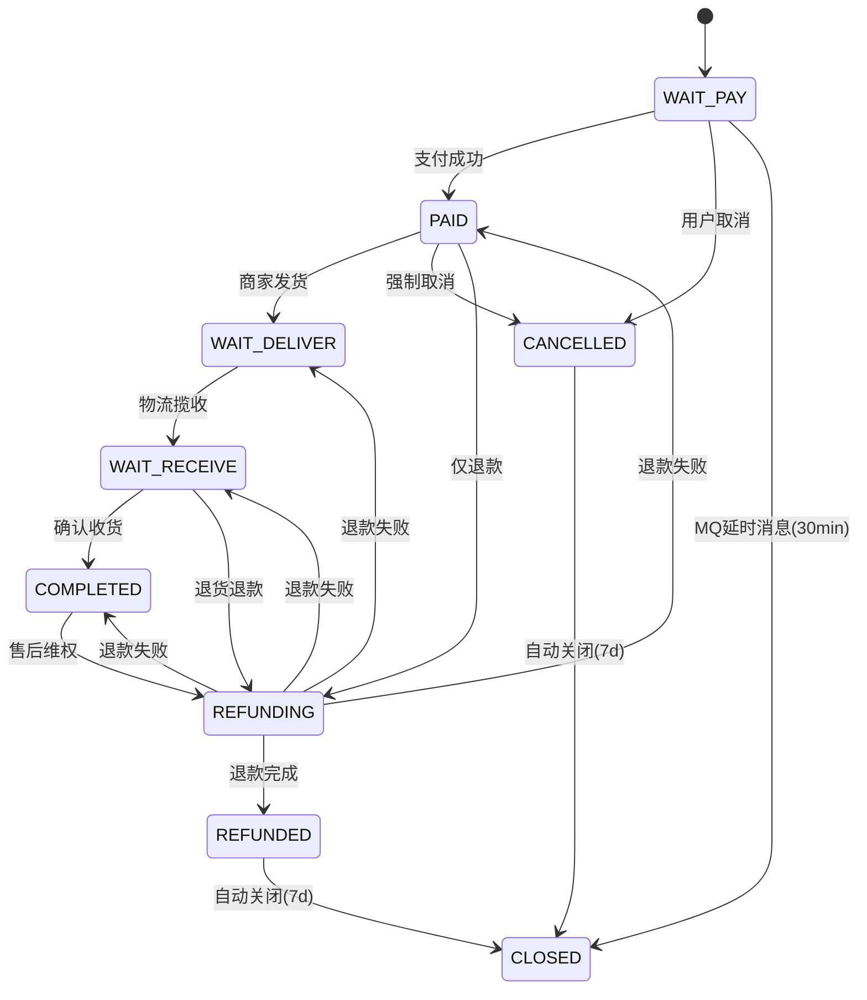
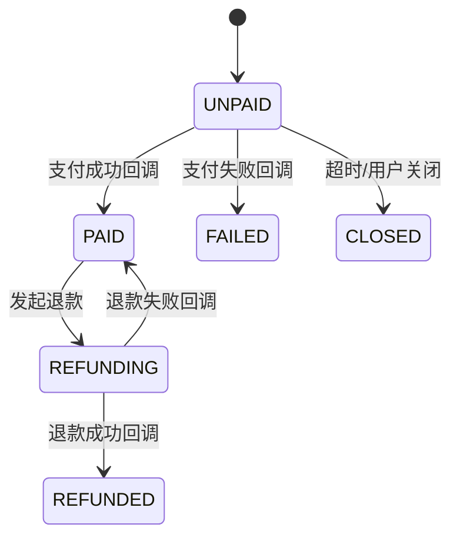
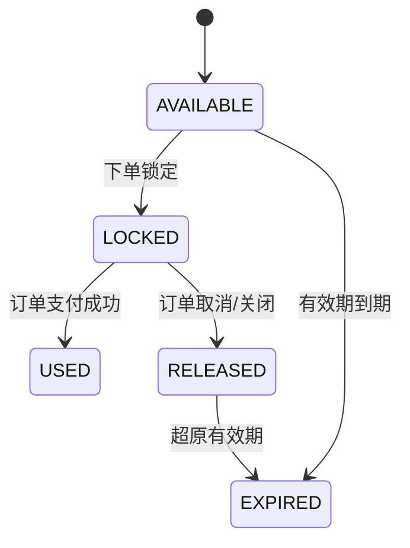

# JH-Store 系统详细设计

> 基于概要设计展开。概要设计见 `02_系统概要设计_补充.md`。

---

## 四、状态机详细设计

> 所有状态变更必须通过状态机方法完成，禁止直接 `update status` 字段。非法转移（如 WAIT_PAY → COMPLETED）被状态机拦截，返回 A0702（订单状态异常）。支付回调处理需幂等。

**超时与补偿汇总：**

| 场景 | 超时时间 | 补偿策略 |
| --- | --- | --- |
| 支付超时关闭 | 30 分钟 | Outbox 延时投递 → MQ Consumer 关单；ruoyi-job 日扫兜底 |
| 自动确认收货 | 发货后 15 天 | 定时任务扫描 WAIT_RECEIVE + delivery_time>15d，自动完成 |
| 售后关闭 | 退款完成后 7 天 | 定时任务扫描 REFUNDED，物理清理中间数据 |
| 状态不一致 | — | 补偿任务对比支付单和订单状态 |

### 4.1 订单状态机

| 当前状态 | 触发事件 | 事件源 | 目标状态 | 前置条件 | 后置动作 |
| --- | --- | :---: | --- | --- | --- |
| WAIT_PAY | 支付成功 | 回调 | PAID | 支付金额≥订单应付金额 | ①通知商家发货 ②发送 `mall:order:paid` 事件 |
| WAIT_PAY | 用户取消 | 用户 | CANCELLED | | ①恢复库存(outbox) ②释放优惠券(outbox) ③发送 `mall:order:cancelled` 事件 |
| WAIT_PAY | 支付超时 | MQ | CLOSED | Outbox 到期投递 → MQ Consumer 消费；消费端校验 `pay_expire_time < NOW()` 兜底 | 同用户取消 |
| PAID | 商家发货 | 管理端 | WAIT_DELIVER | 物流信息已填写 | ①记录物流单号 ②发送 `mall:order:delivered` 事件 |
| WAIT_DELIVER | 物流揽收 | 回调 | WAIT_RECEIVE | 快递已揽收 | ①更新物流状态 ②通知用户 |
| PAID | 强制取消 | 管理端 | CANCELLED | 客服审核，仅限已支付未发货且订单金额为 0 的异常订单（如支付通道测试订单）；正常订单需走 PAID→REFUNDING 退款流程 | ①原路退款 ②恢复库存 ③释放优惠券 |
| PAID | 仅退款售后 | 系统 | REFUNDING | 售后审核通过 | ①创建退款单 ②调支付服务退款 |
| WAIT_RECEIVE | 确认收货 | 用户 | COMPLETED | | ①赠送积分 ②赠送成长值 ③发送 `mall:order:completed` 事件 |
| WAIT_RECEIVE | 退货退款售后 | 系统 | REFUNDING | 售后审核通过 | 同 PAID→REFUNDING |
| COMPLETED | 申请售后 | 系统 | REFUNDING | 售后时效内 | 同 PAID→REFUNDING |
| REFUNDING | 退款成功回调 | 回调 | REFUNDED | 渠道退款完成 | ①发送 `mall:order:refunded` 事件 |
| REFUNDING | 退款失败回调 | 回调 | 原状态 | 渠道退款失败 | ①通知用户 ②标记人工介入 |
| CANCELLED | 自动关闭 | 系统 | CLOSED | 取消后满7天 | 清理中间数据 |
| REFUNDED | 自动关闭 | 系统 | CLOSED | 退款后满7天 | 清理中间数据 |

### 4.2 支付状态机

| 当前状态 | 触发事件 | 事件源 | 目标状态 | 前置条件 | 后置动作 |
| --- | --- | :---: | --- | --- | --- |
| UNPAID | 发起支付 | 用户 | UNPAID | 支付渠道参数就绪 | ①生成渠道交易号 ②保存渠道预支付参数 |
| UNPAID | 支付成功回调 | 回调 | PAID | 渠道验签通过、订单一致 | ①记录渠道回调结果 ②发送 `mall:payment:paid` 事件 |
| UNPAID | 支付失败回调 | 回调 | FAILED | 渠道返回明确失败 | ①记录失败原因 |
| UNPAID | 支付超时/关闭 | 用户/系统 | CLOSED | 超时或用户主动关闭 | |
| PAID | 发起退款 | 系统 | REFUNDING | 订单侧审核通过 | ①创建退款单 ②调渠道退款API |
| REFUNDING | 退款成功回调 | 回调 | REFUNDED | 渠道验签通过 | ①记录渠道回调结果 ②发送 `mall:refund:succeeded` 事件 |
| REFUNDING | 退款失败回调 | 回调 | PAID | 渠道返回明确失败 | ①记录失败原因 ②通知订单服务 |

### 4.3 优惠券记录状态机

| 当前状态 | 触发事件 | 事件源 | 目标状态 | 前置条件 | 后置动作 |
| --- | --- | :---: | --- | --- | --- |
| AVAILABLE | 下单锁定 | 系统 | LOCKED | 优惠试算通过、库存充足 | ①扣减优惠券库存(outbox) |
| LOCKED | 订单支付成功 | 系统 | USED | 订单变为 PAID | |
| LOCKED | 订单取消/关闭 | 系统 | RELEASED | 订单变为 CLOSED | ①恢复优惠券库存(outbox) |
| AVAILABLE | 有效期到期 | 系统 | EXPIRED | 超过 validEndTime | 定时任务批量扫描 |
| RELEASED | 原有效期到期 | 系统 | EXPIRED | 超过原 validEndTime | |
