# JH-Store 系统详细设计

> 基于概要设计展开。概要设计见 `02_系统概要设计_补充.md`。

---

## 五、核心业务详细流程

### 5.1 下单流程

#### 5.1.1 流程概述

下单是商城最核心的写链路，涉及 `mall-order`、`mall-product`、`mall-marketing` 三个服务的本地事务和 MQ 异步解耦。整体采用 **Try-Confirm 变体**：先锁定资源（库存+优惠券），再创建订单，最后异步投递订单已创建事件。

#### 5.1.2 参与服务与职责

| 服务 | 职责 |
| --- | --- |
| `mall-order` | 流程编排、幂等校验、订单创建、价格快照、事件发布 |
| `mall-product` | 库存锁定（可售→锁定） |
| `mall-marketing` | 优惠券锁定（可用→已锁定） |

#### 5.1.3 流程图

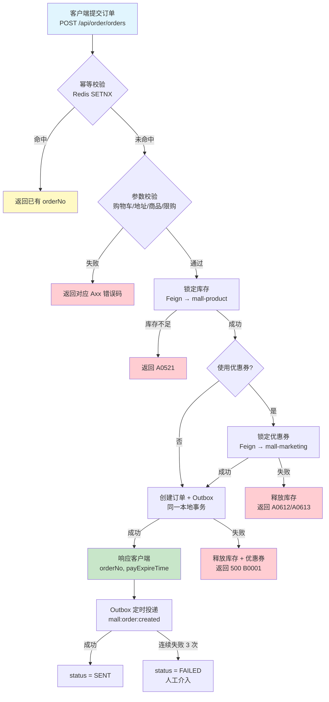

**关键说明：**

| 编号 | 步骤 | 关键约束 |
| --- | --- | --- |
| B | 幂等校验 | Idempotent-Key 为 UUID v4，Redis TTL 30 分钟；命中时直接返回已有结果 |
| D | 参数校验 | 含购物车空校验、地址归属校验、商品上架状态、限购数量（A0711） |
| F | 锁定库存 | `UPDATE sku SET locked_qty+=#{qty}, available_qty-=#{qty} WHERE available_qty>=#{qty}`，影响行数判断 |
| I | 锁定优惠券 | `UPDATE user_coupon SET status='LOCKED', locked_order_no=#{orderNo} WHERE status='AVAILABLE'` |
| J | 创建订单+Outbox | 计算金额（含运费和优惠分摊）、保存价格快照、初始状态 `WAIT_PAY`；Outbox topic `mall:order:created` |
| N | Outbox 投递 | 定时扫描 `status=NEW` 记录，成功后标记 `SENT`，连续 3 次失败标记 `FAILED` |

#### 5.1.4 时序图

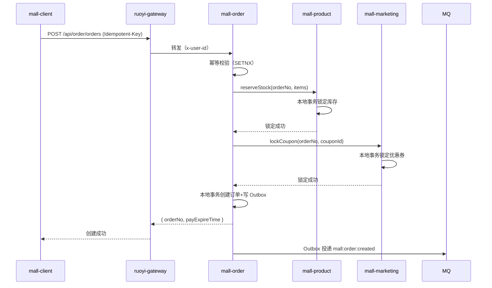

#### 5.1.5 失败处理矩阵

| 失败位置 | 处理动作 | 返回给客户端 |
| --- | --- | --- |
| 幂等校验超时 | 客户端重试（同 Idempotent-Key） | 500 + 自动重试 |
| 参数校验失败 | 不操作 | 对应 Axx 错误码 |
| 库存锁定失败 | 不操作 | A0521 库存不足 |
| 库存锁定成功，优惠锁定失败 | 释放库存（Feign 补偿） | A0612 优惠不可用 |
| 资源锁定成功，订单创建失败 | 释放库存 + 释放优惠（同步 Feign） | 500 B0001 |
| 订单创建成功，Outbox 写入失败 | 本地事务整体回滚，资源自动释放 | 500 B0001 |
| 网络超时（资源已锁但客户端未收到响应） | 客户端用同一幂等键重试，查询订单结果 | 幂等返回已有 orderNo |

#### 5.1.6 超时与自动取消

参见 5.4 订单超时关闭。

---

### 5.2 支付流程

#### 5.2.1 流程概述

支付链路涉及 `mall-order`、`mall-payment` 和外部支付平台三方。支付采用**异步回调模式**：客户端发起支付后立即返回支付参数（H5/JSAPI/小程序），支付平台在用户完成后异步通知结果，`mall-payment` 处理回调后通过 MQ 通知 `mall-order` 推进订单。

#### 5.2.2 参与服务与职责

| 服务 | 职责 |
| --- | --- |
| `mall-payment` | 支付单创建、第三方支付调用、回调处理、事件发布 |
| `mall-order` | 订单状态校验、支付成功后的状态推进 |
| 支付平台 | 资金划转、异步回调通知 |

#### 5.2.3 发起支付流程

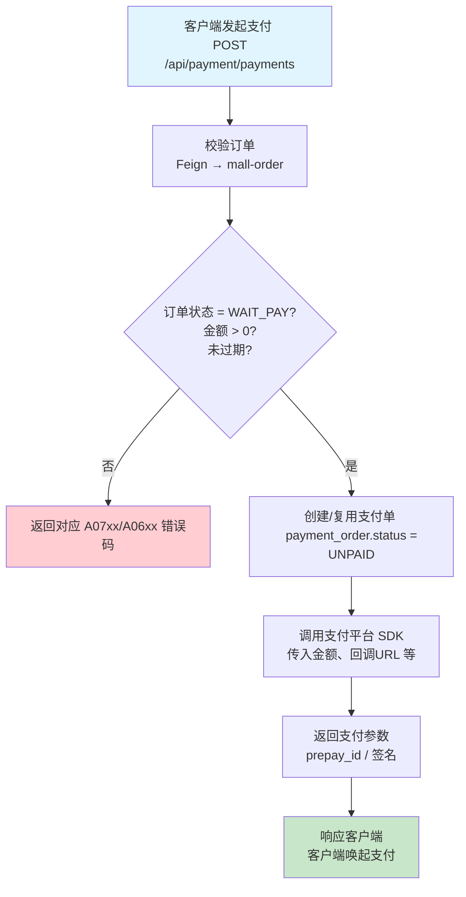

**关键说明：**

| 编号 | 步骤 | 关键约束 |
| --- | --- | --- |
| B | 校验订单 | 金额以订单快照为准，不重新计算；校验支付截止时间 |
| E | 创建支付单 | 同订单同渠道存在 UNPAID 支付单时复用（幂等）；`pay_expire_time` 同订单超时时间 |
| F | 调用支付平台 | 根据 `channel` 路由不同 SDK；JSAPI 需要传入用户 openid |
| H | 响应客户端 | 返回支付参数后，客户端轮询支付结果或等待用户操作 |

#### 5.2.4 支付回调流程

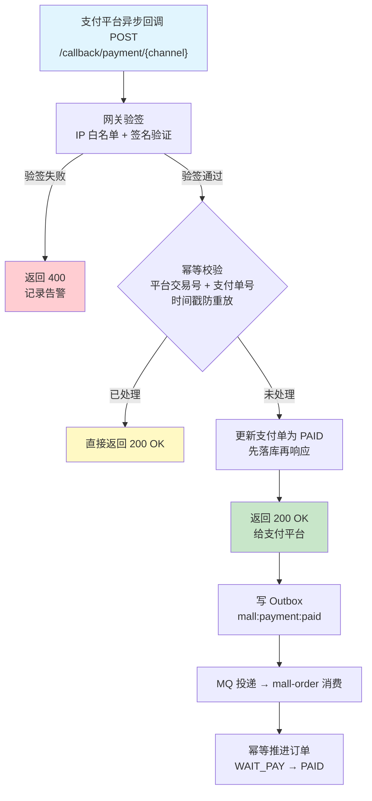

**关键说明：**

| 编号 | 步骤 | 关键约束 |
| --- | --- | --- |
| B | 网关验签 | 校验来源 IP 白名单 + 消息体签名（微信/支付宝各自验证方式） |
| D | 幂等校验 | 平台交易号 + 支付单号联合去重；回调时间戳偏差不超过 5 分钟防止重放 |
| F | 更新支付单 | `UPDATE payment_order SET status='PAID' WHERE status='UNPAID'`，影响 0 行说明已处理 |
| J | 订单推进 | `orderNo + 事件类型` 幂等去重；订单状态必须为 WAIT_PAY 才能推进到 PAID（状态机保证） |

#### 5.2.5 时序图

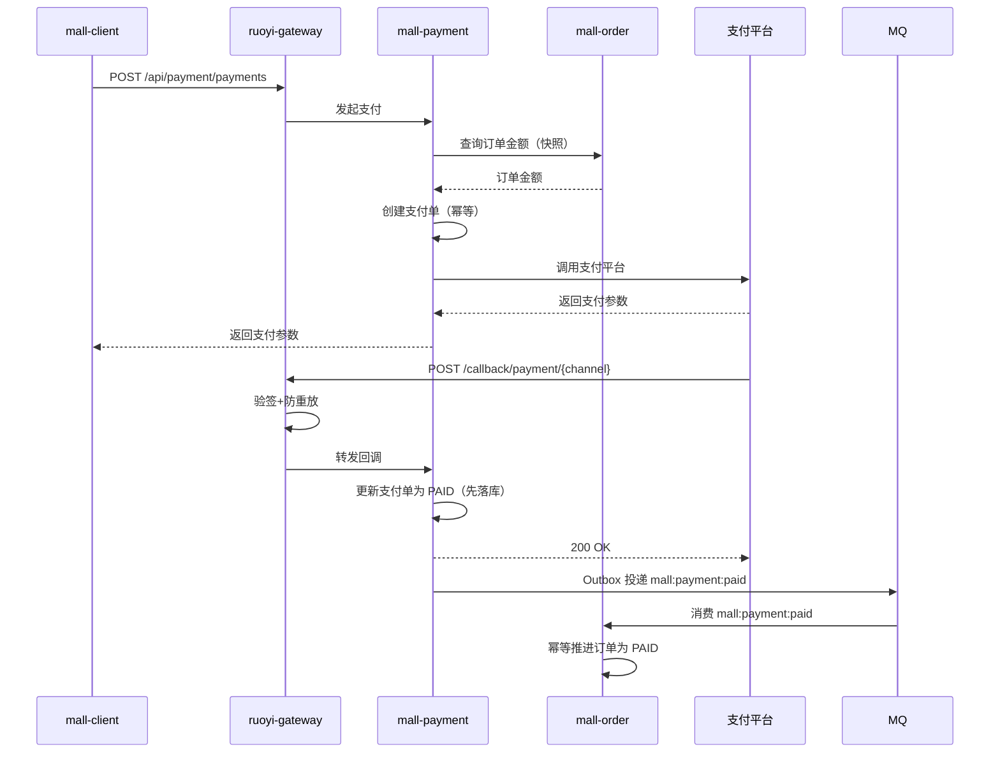

#### 5.2.6 补偿设计

| 场景 | 补偿机制 |
| --- | --- |
| 支付单成功但订单未推进 | 定时任务扫描 `payment_order.status=PAID` vs `mall_order.status=WAIT_PAY` 的不一致记录，重放 `mall:payment:paid` |
| 支付平台回调未收到 | 定时任务扫描创建时间超过 30 分钟且状态为 UNPAID 的支付单，调用支付平台主动查询交易状态 |
| 支付单创建后用户未支付（支付单滞留） | 随订单超时一起关闭（参见 4.4） |

---

### 5.3 退款流程

#### 5.3.1 流程概述

退款链路始于 `mall-order` 的售后/退款申请，经由 `mall-payment` 调用支付渠道执行退款，最终通过回调完成退款闭环。支持**仅退款**和**退货退款**两种模式。

#### 5.3.2 参与服务与职责

| 服务 | 职责 |
| --- | --- |
| `mall-order` | 售后单创建、订单状态校验、退款金额核算 |
| `mall-payment` | 退款单创建、第三方退款调用、回调处理、事件发布 |

#### 5.3.3 退款发起流程

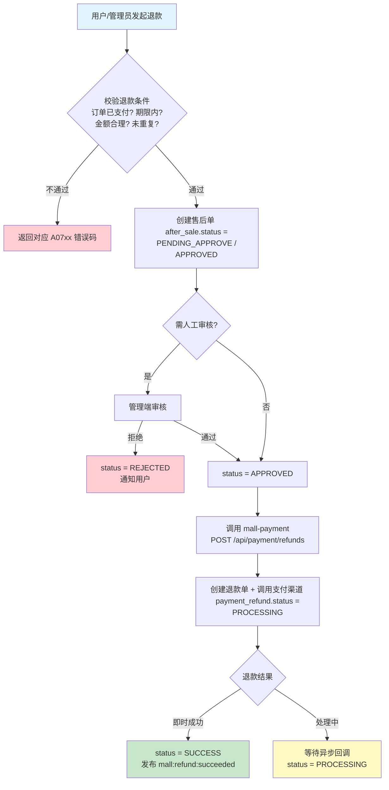

**关键说明：**

| 编号 | 步骤 | 关键约束 |
| --- | --- | --- |
| B | 校验退款条件 | 订单状态 PAID/已收货；退款金额 ≤ 已支付 - 已退款；收货后 7 天内；同一 SKU 不重复 |
| D | 创建售后单 | 自动审核规则：未发货且金额 ≤ 某阈值时自动 APPROVED，否则 PENDING_APPROVE |
| F | 管理端审核 | 调用 `PUT /mall-order/after_sales/{afterSaleId}/status` |
| J | 调用支付渠道 | 原路退回；微信/支付宝大部分情况即时返回；afterSaleId 防重复退款 |

#### 5.3.4 退款回调流程

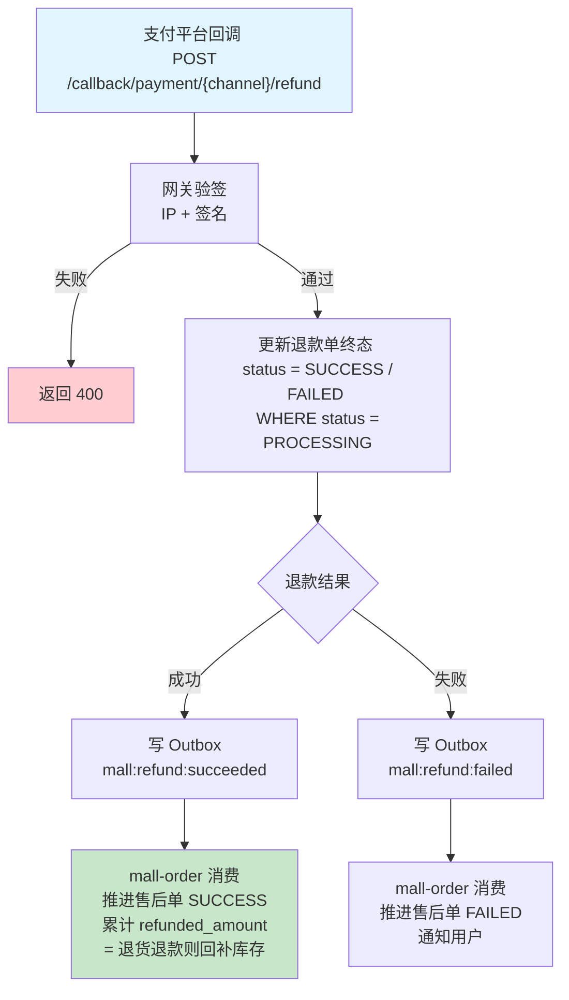

**关键说明：**

| 编号 | 步骤 | 关键约束 |
| --- | --- | --- |
| D | 更新退款单 | `UPDATE payment_refund SET status=? WHERE status='PROCESSING'`，影响 0 行说明已处理 |
| H | 库存回补 | 仅退货退款才回补；仅退款已发货不回补（参见 4.3.6 规则表） |

#### 5.3.5 时序图

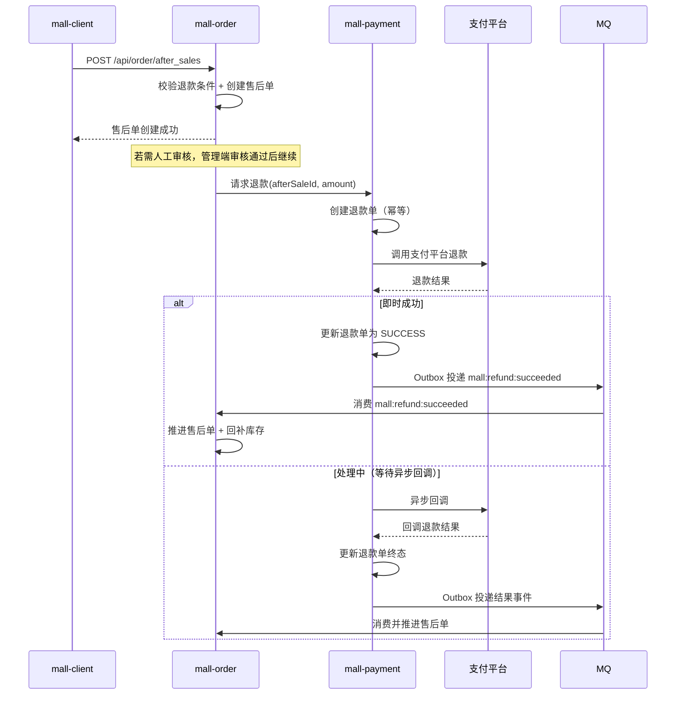

#### 5.3.6 退款后库存回补规则

| 退款类型 | 库存操作 |
| --- | --- |
| 仅退款（未发货） | 回补所有退款 SKU 的库存：`UPDATE sku SET available_qty = available_qty + #{qty}` |
| 仅退款（已发货） | 不回补库存（实物已发出，视为损耗） |
| 退货退款 | 收到退货后回补库存：`UPDATE sku SET available_qty = available_qty + #{qty}` |

---

### 5.4 订单超时关闭

#### 5.4.1 触发方式

订单超时关闭采用 **Outbox 延时投递 + MQ 消费 + ruoyi-job 日扫兜底** 的方式：

| 层级 | 触发方式 | 间隔 | 职责 |
| --- | --- | --- | --- |
| 主链路 | Outbox 调度器按 `scheduled_time` 到期投递 → MQ Consumer 关单 | 下单后 30 分钟触发 | 实时关单，释放库存和优惠券 |
| 兜底 | ruoyi-job 扫描 `status=WAIT_PAY AND pay_expire_time<NOW()` | 每日 02:00 | 防 MQ 丢失或 Outbox 调度失效 |

#### 5.4.2 流程图

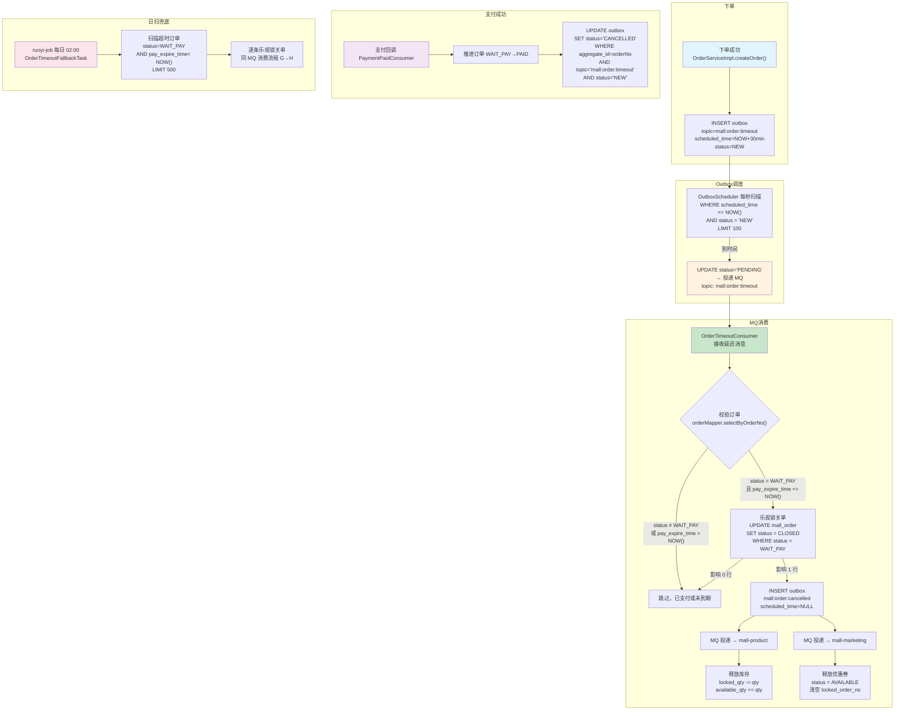

#### 5.4.3 关键说明

| 编号 | 步骤 | 关键约束 |
| --- | --- | --- |
| A1 | 延迟消息入 Outbox | `scheduled_time = NOW() + pay-expire-minutes`；topic=`mall:order:timeout` |
| C | 到期投递 | 调度器每秒扫 `(scheduled_time IS NULL OR scheduled_time <= NOW()) AND status='NEW'`；延迟消息走到期投递 |
| E | 消费幂等 | status≠WAIT_PAY 时直接 ACK 跳过（已支付/已取消/已关闭） |
| G | 乐观锁关单 | `WHERE status='WAIT_PAY'` 保证和支付回调/手动取消的并发安全 |
| P2 | 支付成功取消延迟消息 | 同步 UPDATE Outbox 状态为 `CANCELLED`，调度器不再投递该条 |
| N | 日扫兜底 | 每日凌晨低峰期跑，几乎无数据命中（MQ 正常时），DB 压力可忽略 |

#### 5.4.4 补偿保障

- **MQ 丢消息**：ruoyi-job 每日 02:00 兜底扫描，最多延迟 1 天释放库存
- **Outbox 调度异常**：调度器失败后走指数退避重试（同 §1.6 重试策略），3 次后标记 FAILED 人工介入
- **订单状态并发**：乐观锁 `WHERE status='WAIT_PAY'` 确保支付成功和超时关单互斥
- **支付成功撤销延迟消息**：在订单状态推进的同一事务中 UPDATE Outbox 状态为 `CANCELLED`，防止调度器继续投递

#### 5.4.5 配置项

| 配置项 | 默认值 | 说明 |
| --- | :---: | --- |
| `mall.order.pay-expire-minutes` | 30 | 下单后未支付，N 分钟后自动关闭 |
| `mall.order.timeout-topic` | `mall:order:timeout` | 超时关单延迟消息 topic |
| `mall.order.timeout-fallback-cron` | `0 0 2 * * ?` | 兜底定时任务 cron 表达式 |

---

### 5.5 搜索索引同步

#### 5.5.1 架构说明

商品搜索索引同步采用 **双通道策略** 确保数据最终一致性：

- **通道一（实时通道）**：管理端操作商品时，通过 Feign 直调 `mall-search` 同步索引
- **通道二（异步通道）**：商品变更后写 Outbox，MQ 异步投递到 `mall-search`
- **兜底通道（补偿任务）**：定时扫描不一致记录，回补同步

#### 5.5.2 增量同步流程图（双通道）

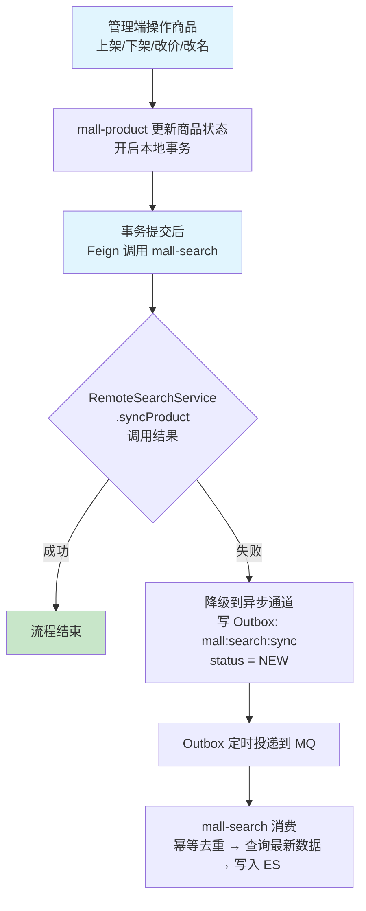

**双通道策略对比：**

| 特性 | 实时通道（Feign 直调） | 异步通道（Outbox + MQ） |
| --- | --- | --- |
| 触发方式 | 事务提交后同步调用 | 降级触发 or 仅用异步模式（可选） |
| 主流程依赖 | 不依赖（失败降级） | 不依赖（异步解耦） |
| 一致性级别 | 最终一致（因调用在事务外） | 最终一致（Outbox 保证必达） |
| 延迟 | 毫秒级 | 秒级 |
| 幂等 | 天然幂等（幂等写入 ES） | productId + operation 去重 |

#### 5.5.3 全量重建流程图

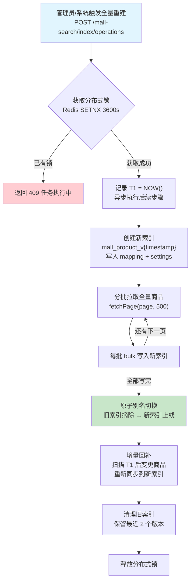

**关键说明：**

| 编号 | 步骤 | 关键约束 |
| --- | --- | --- |
| B | 分布式锁 | 3600s 自动过期防止死锁；全量重建期间禁止重复触发 |
| E | 创建新索引 | 独立索引名避免影响线上读写；mapping/settings 与当前生产索引一致 |
| H | 别名切换 | ES 原子 `_aliases` API，读写切换零停机 |
| I | 增量回补 | T1 时间的商品变更可能在分批阶段被漏掉，回补保证完整 |
| J | 清理旧索引 | 保留 2 个版本支持快速回滚 |

#### 5.5.5 时序图

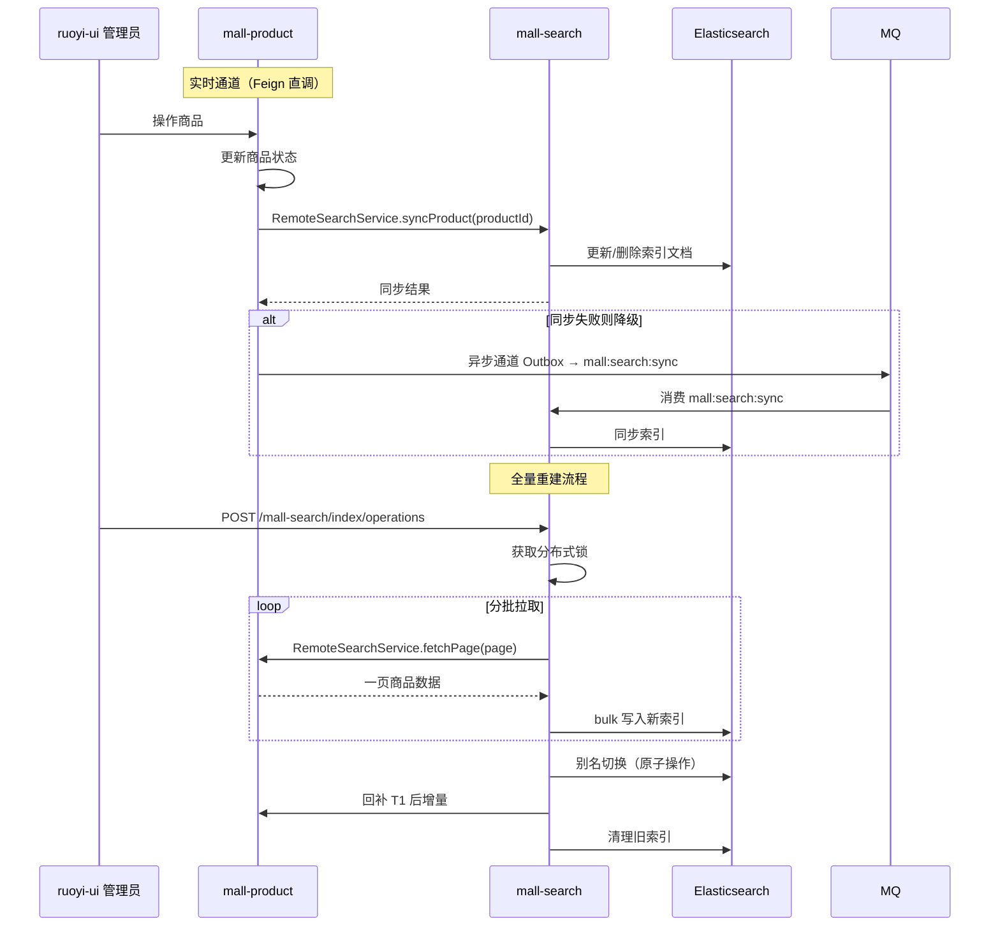

#### 5.5.6 补偿回补任务

| 配置项 | 值 |
| --- | --- |
| 任务名称 | 搜索索引同步回补 |
| 触发方式 | ruoyi-job 定时，每 5 分钟 |
| 扫描范围 | 最近 1 小时内更新的商品 |
| 处理逻辑 | 查询 ES 中文档 `updated_at` 与 DB 中 `updated_at` 不一致的记录，重新同步 |
| 幂等保证 | 以 ES 最终状态为准，重复执行仅多一次写入 |
