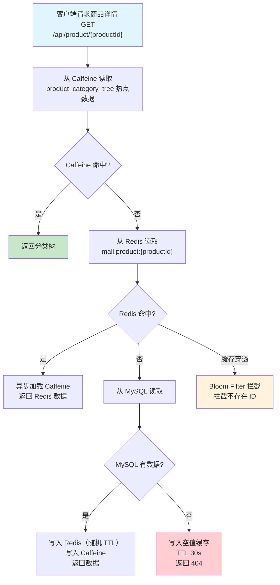
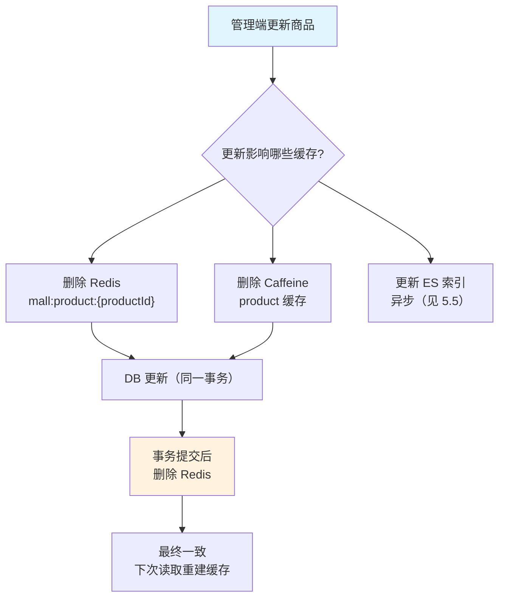
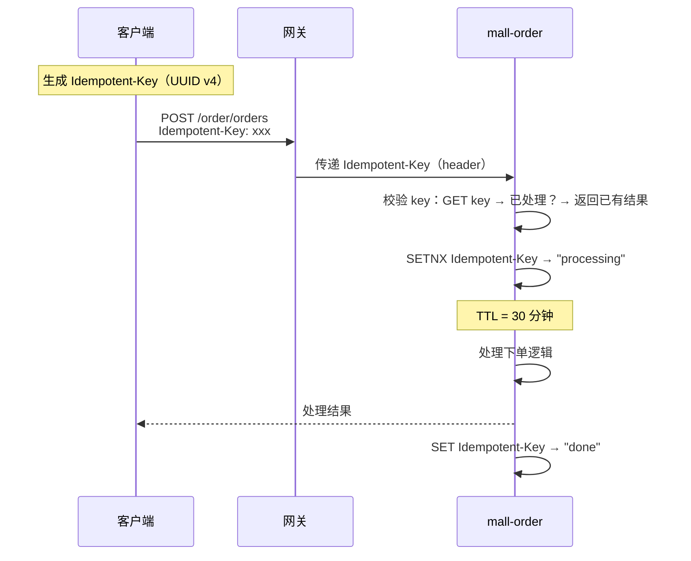
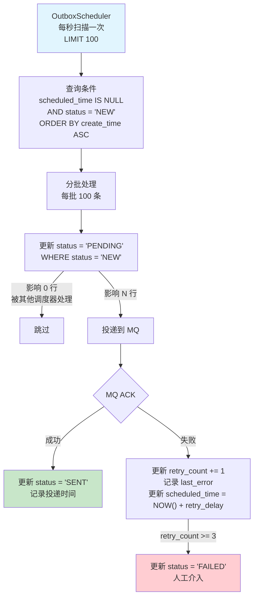

# JH-Store 系统详细设计

> 基于概要设计展开。概要设计见 `02_系统概要设计_补充.md`。

---

## 六、缓存与一致性设计

### 6.1 缓存策略总览

#### 6.1.1 缓存层级

| 层级 | 技术 | 用途 | TTL |
| --- | --- | --- | --- |
| 本地缓存（L1） | Caffeine | 热点商品/分类，读写分离高频读 | 5~30 min |
| 分布式缓存（L2） | Redis | 商品详情、库存、Session、锁 | 10 min ~ 2h |
| 搜索引擎 | Elasticsearch | 商品全文搜索、筛选、聚合 | — |

#### 6.1.2 Redis 数据结构选择

| 数据类型 | 适用场景 | 示例 |
| --- | --- | --- |
| String | 单值缓存、分布式锁、计数器 | SKU 库存 `mall:stock:{skuId}` |
| Hash | 对象缓存（字段级读写） | 商品详情 `mall:product:{productId}` |
| List | 消息队列、时间线 | 支付回调暂存 |
| Set | 标签、集合运算 | 用户收藏 ID 集合 |
| ZSet | 排行榜、延时队列 | 热度排行 |
| String（SETNX） | 分布式锁 | 幂等防重、全量重建锁 |
| String + LUA | 库存扣减 | `mall:stock:{skuId}` 原子扣减 |

#### 6.1.3 本地缓存（Caffeine）配置

| 缓存名称 | 最大容量 | 过期策略 | 用途 |
| --- | :---: | --- | --- |
| `productCategoryTree` | 1000 | 写入后 30 分钟 | 商品分类树 |
| `hotProduct` | 500 | 访问后 5 分钟 | 热点商品详情 |
| `dictData` | 200 | 写入后 1 小时 | 字典数据 |
| `regionData` | 500 | 写入后 2 小时 | 地区数据 |

#### 6.1.4 缓存使用原则

1. **读多写少**的数据使用缓存，写频繁的数据直读 DB
2. **缓存与 DB 最终一致**，业务侧接受短暂不一致（通常 < 1 秒）
3. **缓存穿透防护**：查不到的数据也缓存空值（TTL 较短，30~60 秒）
4. **缓存雪崩防护**：过期时间加随机偏移（基础 TTL ± 10%~30%）
5. **缓存击穿防护**：热点数据使用 Caffeine 本地缓存 + 分布式锁重建

---

### 6.2 商品缓存

#### 6.2.1 商品缓存读流程



#### 6.2.2 商品缓存写流程



**缓存写策略：删除缓存而不是更新缓存。** 原因：

| 策略 | 问题 |
| --- | --- |
| 更新缓存 | 并发更新导致缓存数据不一致；频繁更新写放大 |
| 先删缓存后更新 DB | 读线程在删缓存后写 DB 前读旧数据到缓存（脏读） |
| 先更新 DB 后删缓存 ✅ | 读线程在删缓存前读到旧缓存，可以接受短暂不一致；下一次读会重建新缓存 |

**并发安全**：`cache-aside pattern` + 惰性加载，天然适应最终一致性。

---

### 6.3 库存缓存

#### 6.3.1 库存缓存结构

```
Key: mall:stock:{skuId}
Value: {"available_qty": 100, "locked_qty": 0, "version": 1}
```

#### 6.3.2 库存扣减 LUA

```lua
-- KEYS[1]: mall:stock:{skuId}
-- ARGV[1]: 扣减数量

local stock = redis.call('HGETALL', KEYS[1])
if #stock == 0 then
    return {err = 'STOCK_NOT_EXISTS'}
end

local available = tonumber(stock[2])
if available < tonumber(ARGV[1]) then
    return {err = 'INSUFFICIENT_STOCK'}
end

redis.call('HINCRBY', KEYS[1], 'available_qty', -tonumber(ARGV[1]))
redis.call('HINCRBY', KEYS[1], 'locked_qty', tonumber(ARGV[1]))
return {ok = 'SUCCESS'}
```

#### 6.3.3 库存一致性问题

| 问题 | 方案 |
| --- | --- |
| Redis 库存与 MySQL 不一致 | 定时任务每 5 分钟比对 `sum(locked_qty)` + `sum(available_qty)` vs `sku.stock`，以 MySQL 为准校正 |
| Redis 宕机 | 熔断至直读 MySQL，恢复后逐步预热热点数据 |
| 超卖 | LUA 原子扣减 + MySQL 乐观锁 `WHERE available_qty >= #{qty}` 双重保障 |

**库存操作最终一致性时序：**

```
客户端 → LUA 扣 Redis 库存（预扣）
        ↓
    下单事务（MySQL）
        ↓
    事务提交 → 最终扣减生效
        ↓
    事务回滚 → 回补 Redis 库存（回滚补偿）
```

---

### 6.4 幂等设计

#### 6.4.1 幂等防重总览

| 场景 | 幂等键 | 存储位置 | TTL | 说明 |
| --- | --- | --- | --- | --- |
| 下单 | `Idempotent-Key`（UUID v4） | Redis String SETNX | 30 分钟 | 请求头携带，防重复下单 |
| 支付回调 | 平台交易号 + 支付单号 | Redis String SETNX + TX | 24 小时 | 防支付平台重复回调 |
| MQ 消费 | eventId + topic | Redis String SETNX | 7 天 | 防 MQ 重复投递 |
| 退款调用 | afterSaleId | DB unique constraint | — | 防重复调用退款接口 |
| MQ Outbox | outbox_id | DB primary key | — | Outbox 表主键保证唯一投递 |

#### 6.4.2 下单幂等（最典型）



**关键规则：**

| 校验点 | 处理 |
| --- | --- |
| SETNX 返回 1 | 首次请求，正常处理 |
| SETNX 返回 0 且为 `processing` | 请求正在处理中，客户端应轮询等待 |
| SETNX 返回 0 且为 `done` | 已处理完成，返回已有 orderNo |

#### 6.4.3 MQ 消费幂等

```java
// 消费时前置判断
String dedupKey = eventId + ":" + topic;
Boolean acquired = stringRedisTemplate.opsForValue()
    .setIfAbsent(dedupKey, "processed", Duration.ofDays(7));
if (Boolean.FALSE.equals(acquired)) {
    // 已处理过，直接 ACK
    return;
}
```

---

### 6.5 MQ 消息可靠性

#### 6.5.1 消息可靠性保障

| 阶段 | 保障措施 | 说明 |
| --- | --- | --- |
| 1. 生产端 | Outbox 模式 | 消息先写入本地 Outbox 表（与业务同事务），再由调度器投递 MQ |
| 2. 生产端 | 投递确认 + 重试 | 调度器确认 MQ broker 返回 ACK 后再标记 Outbox SENT |
| 3. MQ Broker | 持久化 Topic | 消息写入磁盘后才 ACK |
| 4. 消费端 | 手动 ACK | 消费方处理成功后才手动 ACK，失败则重回队列 |
| 5. 消费端 | 幂等消费 | eventId 去重，支持重复投递 |
| 6. 兜底 | 定时任务扫描 | 扫描 Outbox status=NEW 或 SENT 但未消费的记录，重新投递 |

#### 6.5.2 Outbox 调度器



**重试策略：**

| 重试次数 | 延迟 | 累计延迟 |
| :---: | :---: | :---: |
| 1 | 10 秒 | 10 秒 |
| 2 | 60 秒 | 70 秒 |
| 3 | 600 秒（10 分钟） | ~11 分钟 |
| ≥4 | 标记 FAILED，人工介入 | — |

#### 6.5.3 消息可靠性矩阵

| 故障场景 | 效果 |
| --- | --- |
| Outbox 调度器挂掉 | 消息不投递，不丢失；调度器恢复后继续投递 |
| MQ Broker 宕机 | 调度器重试直到 Broker 恢复 |
| 消费者宕机 | MQ 持久化消息，消费者恢复后重新消费 |
| 消费者处理失败 | NACK（重回队列）/ DLQ（死信队列） |
| 调度器重复投递 | 消费者幂等去重（参见 6.4.3） |
| DB 宕机（Outbox 不回滚） | 业务事务回滚 → MQ 消息不产生（Outbox 未写入） |

---

### 6.6 分布式锁

#### 6.6.1 锁使用场景

| 场景 | 锁 Key | TTL | 用途 |
| --- | --- | --- | --- |
| 全量重建索引 | `mall:search:reindex:lock` | 3600s | 防止并发全量重建 |
| 订单号生成 | `mall:order:id:gen` | 5s | 防止订单号重复 |
| 库存回补锁 | `mall:stock:release:{orderNo}` | 30s | 防止库存重复回补 |
| 支付回调去重 | `mall:payment:callback:{payOrderNo}` | 60s | 避免并发回调处理 |

#### 6.6.2 Redis 分布式锁实现

```java
// 获取锁
String lockKey = "mall:lock:" + bizKey;
Boolean locked = stringRedisTemplate.opsForValue()
    .setIfAbsent(lockKey, "holder:" + instanceId, Duration.ofSeconds(ttl));
if (Boolean.TRUE.equals(locked)) {
    try {
        // 执行业务逻辑
    } finally {
        // 使用 LUA 脚本释放锁（保证原子性）
        String luaScript = """
            if redis.call('get', KEYS[1]) == ARGV[1] then
                return redis.call('del', KEYS[1])
            else
                return 0
            end
            """;
        stringRedisTemplate.execute(
            new DefaultRedisScript<>(luaScript, Long.class),
            Collections.singletonList(lockKey), "holder:" + instanceId
        );
    }
}
```

#### 6.6.3 锁使用原则

1. **锁粒度最小化**：按业务 ID 拆分锁，避免全局锁
2. **锁超时自动释放**：必须设置 TTL，防止死锁
3. **只锁非原子操作**：Redis 单操作（如 INCR）无需锁
4. **优先使用 Redis 而不是 DB 锁**：Redis 性能更好且天然支持 TTL
5. **锁的 value 包含持有者标识**：防止释放别人的锁
6. **使用 LUA 脚本原子释放**：避免 DEL 被非持有者误调

---

### 6.7 并发控制

#### 6.7.1 并发控制场景与策略

| 场景 | 并发控制策略 | 说明 |
| --- | --- | --- |
| 订单状态推进 | 乐观锁 + 状态机 | `UPDATE mall_order SET status=? WHERE order_no=? AND status=?`，状态机禁止非法转移 |
| 库存扣减 | LUA + 乐观锁 | Redis LUA 原子扣减 + MySQL `WHERE available_qty>=?` 双重保证 |
| 支付回调处理 | 乐观锁 | `UPDATE payment_order SET status='PAID' WHERE status='UNPAID'` |
| 优惠券使用 | 乐观锁 | `UPDATE user_coupon SET status='USED' WHERE status='AVAILABLE'` |
| MQ 消费 | 幂等键去重 | Redis SETNX 或 DB unique constraint |
| 数据统计/计数 | Redis INCR 原子递增 | `INCR mall:stats:{bizKey}` |

#### 6.7.2 乐观锁 vs 悲观锁选择

| 场景 | 推荐 | 原因 |
| --- | --- | --- |
| 高并发读多写少 | 乐观锁 | 冲突概率低，乐观锁开销小 |
| 高并发写 skew 严重 | 悲观锁（或 LUA） | 乐观锁 CAS 重试频繁，反而降低吞吐 |
| 分布式环境 | Redis 分布式锁 | MySQL 行锁不跨实例 |
| 库存扣减 | LUA + 乐观锁 | Redis 原子操作避免分布式锁开销 |
| 订单状态推进 | 乐观锁 `WHERE status=?` | 状态推进具有确定性，无需悲观锁 |

