# JH-Store 系统详细设计

> 基于概要设计展开。概要设计见 `02_系统概要设计_补充.md`。

---

## 目录大纲

### 第一章 数据库详细设计

- 1.1 mall-user 表结构（用户表、会员等级表、用户会员表、地址表、积分账户表、积分流水表、成长值流水表）
- 1.2 mall-product 表结构（类目表、品牌表、SPU 表、SKU 表、库存表）
- 1.3 mall-order 表结构（购物车表、订单表、订单项表、价格快照表、售后申请表）
- 1.4 mall-payment 表结构（支付单表、退款单表、支付渠道配置表、回调记录表）
- 1.5 mall-marketing 表结构（优惠券定义表、用户优惠券记录表、活动表、促销规则表）
- 1.6 Outbox 表及各服务索引设计

### 第二章 错误码详细定义

- 2.1 通用规则
- 2.2 返回结构
- 2.3 错误码表

### 第三章 接口详细设计

- 3.1 mall-auth 认证接口
- 3.2 mall-user 接口
- 3.3 mall-product 接口
- 3.4 mall-order 接口
- 3.5 mall-payment 接口
- 3.6 mall-marketing 接口
- 3.7 mall-search 接口

### 第四章 状态机详细设计

- 4.1 订单状态机
- 4.2 支付状态机
- 4.3 优惠券记录状态机

### 第五章 核心业务详细流程

- 5.1 下单流程
- 5.2 支付流程
- 5.3 退款流程
- 5.4 订单超时关闭
- 5.5 搜索索引同步

### 第六章 缓存与一致性设计

- 6.1 Redis 缓存策略
- 6.2 幂等方案
- 6.3 Outbox 消息可靠投递
- 6.4 数据补偿任务

### 第七章 安全详细设计

- 7.1 数据加密
- 7.2 脱敏策略
- 7.3 内部请求头签名
- 7.4 网关安全链路

### 第八章 部署与配置

- 8.1 各服务配置清单
- 8.2 Nacos 配置项
- 8.3 Docker Compose 编排

---

---

## 一、数据库详细设计

### 1.1 mall-user 表结构

#### 1.1.1 `mall_user` — 用户账号表

| 字段                | 类型             | 约束            | 说明                                                                  |
| ------------------- | ---------------- | --------------- | --------------------------------------------------------------------- |
| id                  | bigint unsigned  | PK              | 主键，自增                                                            |
| phone               | varchar(20)      | UK `uk_phone` | 手机号（AES-256 加密存储）                                            |
| password            | varchar(256)     | NOT NULL        | 密码 BCrypt 哈希                                                      |
| nickname            | varchar(50)      |                 | 昵称                                                                  |
| avatar              | varchar(500)     |                 | 头像 URL                                                              |
| email               | varchar(100)     | UK `uk_email` | 邮箱（AES-256 加密存储）                                              |
| gender              | tinyint unsigned | DEFAULT 0       | 0=未知 1=男 2=女                                                      |
| birthday            | date             |                 | 生日                                                                  |
| user_status         | tinyint unsigned | DEFAULT 0       | 0=正常 1=冻结 2=注销                                                  |
| register_type       | varchar(20)      |                 | 注册方式：phone / wechat / email                                      |
| register_ip         | varchar(50)      |                 | 注册 IP                                                               |
| register_time       | datetime         |                 | 注册时间                                                              |
| last_login_time     | datetime         |                 | 最后登录时间                                                          |
| last_login_ip       | varchar(50)      |                 | 最后登录 IP                                                           |
| is_privacy_agreed   | tinyint unsigned | DEFAULT 0       | 是否同意隐私协议：1=同意 0=未同意                                     |
| privacy_agreed_time | datetime         |                 | 同意隐私协议时间                                                      |
| is_deleted          | tinyint unsigned | DEFAULT 0       | 逻辑删除标志：1=已删除 0=未删除，所有查询需加 `is_deleted = 0` 条件 |
| create_by           | varchar(64)      |                 | 创建人                                                                |
| update_by           | varchar(64)      |                 | 修改人                                                                |
| create_time         | datetime         | NOT NULL        | 创建时间，记录行首次插入的时间                                        |
| update_time         | datetime         | NOT NULL        | 修改时间，记录行最后一次被修改的时间                                  |
| version             | int unsigned     | DEFAULT 0       | 乐观锁版本号，防止并发修改                                            |
| remark              | varchar(500)     |                 | 备注                                                                  |

**索引：**

- `uk_phone` — phone（唯一）
- `uk_email` — email（唯一）
- `idx_user_status_register_time` — user_status, register_time
- `idx_nickname` — nickname(20)（指定前缀长度，区分度 > 90%）
- `idx_register_time` — register_time

---

#### 1.1.2 `mall_member_level` — 会员等级定义表

| 字段          | 类型             | 约束                  | 说明                                                       |
| ------------- | ---------------- | --------------------- | ---------------------------------------------------------- |
| id            | bigint unsigned  | PK                    | 主键，自增                                                 |
| level_name    | varchar(50)      | NOT NULL              | 等级名称，如"普通会员"、"银卡会员"、"金卡会员"、"钻石会员" |
| level_value   | tinyint unsigned | UK `uk_level_value` | 等级值，数值越大等级越高，用于会员升降级判断               |
| min_growth    | int unsigned     | NOT NULL              | 该等级所需的最低成长值                                     |
| max_growth    | int unsigned     | NOT NULL              | 该等级的最高成长值                                         |
| icon          | varchar(500)     |                       | 等级图标 URL，前端会员中心展示                             |
| benefits_json | text             |                       | 权益 JSON，如折扣率、免邮费等                              |

**索引：** `uk_level_value`

---

#### 1.1.3 `mall_user_member` — 用户会员信息表（与用户 1:1）

| 字段             | 类型             | 约束              | 说明                                                                  |
| ---------------- | ---------------- | ----------------- | --------------------------------------------------------------------- |
| id               | bigint unsigned  | PK                | 主键，自增                                                            |
| user_id          | bigint unsigned  | UK `uk_user_id` | 用户 ID，与 `mall_user` 一对一                                      |
| level_id         | bigint unsigned  |                   | 当前会员等级 ID，关联 `mall_member_level` 表                        |
| growth           | int unsigned     | DEFAULT 0         | 当前成长值，用于判断升降级                                            |
| total_growth     | int unsigned     | DEFAULT 0         | 累计获取成长值，仅增不减                                              |
| level_start_time | datetime         |                   | 最近一次等级生效时间                                                  |
| level_end_time   | datetime         |                   | 等级到期时间                                                          |
| become_time      | datetime         |                   | 首次成为会员时间                                                      |
| is_deleted       | tinyint unsigned | DEFAULT 0         | 逻辑删除标志：1=已删除 0=未删除，所有查询需加 `is_deleted = 0` 条件 |
| create_time      | datetime         | NOT NULL          | 创建时间，记录行首次插入的时间                                        |
| update_time      | datetime         | NOT NULL          | 修改时间，记录行最后一次被修改的时间                                  |

**索引：** `uk_user_id`(user_id)，`idx_level_id`(level_id)

---

#### 1.1.4 `mall_user_address` — 地址簿表

| 字段           | 类型             | 约束      | 说明                                                                  |
| -------------- | ---------------- | --------- | --------------------------------------------------------------------- |
| id             | bigint unsigned  | PK        | 主键，自增                                                            |
| user_id        | bigint unsigned  | NOT NULL  | 用户 ID，标识地址归属                                                 |
| receiver_name  | varchar(50)      | NOT NULL  | 收件人姓名                                                            |
| receiver_phone | varchar(20)      | NOT NULL  | 收件人手机号（AES-256 加密存储）                                      |
| province       | varchar(50)      |           | 省                                                                    |
| city           | varchar(50)      |           | 市                                                                    |
| district       | varchar(50)      |           | 区                                                                    |
| detail_address | varchar(200)     |           | 详细地址，街道门牌号                                                  |
| zip_code       | varchar(10)      |           | 邮编                                                                  |
| is_default     | tinyint unsigned | DEFAULT 0 | 是否默认地址：1=默认 0=非默认，下单时自动选中                         |
| label          | varchar(20)      |           | 地址标签：家 / 公司 / 学校                                            |
| is_deleted     | tinyint unsigned | DEFAULT 0 | 逻辑删除标志：1=已删除 0=未删除，所有查询需加 `is_deleted = 0` 条件 |
| create_time    | datetime         | NOT NULL  | 创建时间，记录行首次插入的时间                                        |
| update_time    | datetime         | NOT NULL  | 修改时间，记录行最后一次被修改的时间                                  |

**索引：** `idx_user_id`(user_id)，`idx_user_id_is_default`(user_id, is_default)

---

#### 1.1.5 `mall_points_account` — 积分账户表（与用户 1:1）

| 字段             | 类型             | 约束              | 说明                                                                  |
| ---------------- | ---------------- | ----------------- | --------------------------------------------------------------------- |
| id               | bigint unsigned  | PK                | 主键，自增                                                            |
| user_id          | bigint unsigned  | UK `uk_user_id` | 用户 ID，与用户一对一                                                 |
| total_points     | int unsigned     | DEFAULT 0         | 累计获取积分，仅增不减                                                |
| available_points | int unsigned     | DEFAULT 0         | 可用积分，当前可抵扣的积分余额                                        |
| used_points      | int unsigned     | DEFAULT 0         | 已使用积分，累计消耗的积分                                            |
| expired_points   | int unsigned     | DEFAULT 0         | 已过期积分，超过有效期自动失效的积分                                  |
| is_deleted       | tinyint unsigned | DEFAULT 0         | 逻辑删除标志：1=已删除 0=未删除，所有查询需加 `is_deleted = 0` 条件 |
| create_time      | datetime         | NOT NULL          | 创建时间，记录行首次插入的时间                                        |
| update_time      | datetime         | NOT NULL          | 修改时间，记录行最后一次被修改的时间                                  |

---

#### 1.1.6 `mall_points_log` — 积分流水表

| 字段          | 类型             | 约束      | 说明                                                                                 |
| ------------- | ---------------- | --------- | ------------------------------------------------------------------------------------ |
| id            | bigint unsigned  | PK        | 主键，自增                                                                           |
| user_id       | bigint unsigned  | NOT NULL  | 用户 ID                                                                              |
| biz_type      | varchar(50)      | NOT NULL  | 业务类型：order（下单赠送）/ signin（签到）/ refund（退款扣除）/ admin（管理员调整） |
| biz_no        | varchar(64)      |           | 业务单号，关联对应业务的单据号                                                       |
| change_type   | tinyint unsigned | NOT NULL  | 变动方向：1=增加（获取积分） 2=减少（消耗/过期）                                     |
| points        | int unsigned     | NOT NULL  | 本次变动积分值                                                                       |
| before_points | int unsigned     |           | 变动前积分余额                                                                       |
| after_points  | int unsigned     |           | 变动后积分余额                                                                       |
| remark        | varchar(200)     |           | 变动原因说明                                                                         |
| is_deleted    | tinyint unsigned | DEFAULT 0 | 逻辑删除标志：1=已删除 0=未删除，所有查询需加 `is_deleted = 0` 条件                |
| create_time   | datetime         | NOT NULL  | 创建时间，记录行首次插入的时间                                                       |
| update_time   | datetime         | NOT NULL  | 修改时间，记录行最后一次被修改的时间                                                 |

**索引：** `idx_user_id`(user_id)，`idx_user_id_biz_type`(user_id, biz_type)，`idx_biz_no`(biz_no)

---

#### 1.1.7 `mall_growth_log` — 成长值流水表

| 字段          | 类型             | 约束      | 说明                                                                                 |
| ------------- | ---------------- | --------- | ------------------------------------------------------------------------------------ |
| id            | bigint unsigned  | PK        | 主键，自增                                                                           |
| user_id       | bigint unsigned  | NOT NULL  | 用户 ID                                                                              |
| biz_type      | varchar(50)      | NOT NULL  | 业务类型：order（下单赠送）/ signin（签到）/ refund（退款扣除）/ admin（管理员调整） |
| biz_no        | varchar(64)      |           | 业务单号，关联对应业务的单据号                                                       |
| change_type   | tinyint unsigned | NOT NULL  | 变动方向：1=增加（获取成长值） 2=减少（退款扣除）                                    |
| growth        | int unsigned     | NOT NULL  | 本次变动成长值                                                                       |
| before_growth | int unsigned     |           | 变动前成长值余额                                                                     |
| after_growth  | int unsigned     |           | 变动后成长值余额                                                                     |
| remark        | varchar(200)     |           | 变动原因说明                                                                         |
| is_deleted    | tinyint unsigned | DEFAULT 0 | 逻辑删除标志：1=已删除 0=未删除，所有查询需加 `is_deleted = 0` 条件                |
| create_time   | datetime         | NOT NULL  | 创建时间，记录行首次插入的时间                                                       |
| update_time   | datetime         | NOT NULL  | 修改时间，记录行最后一次被修改的时间                                                 |

**索引：** `idx_user_id`(user_id)，`idx_user_id_biz_type`(user_id, biz_type)，`idx_biz_no`(biz_no)

---

### 1.2 mall-product 表结构

#### 1.2.1 `mall_category` — 商品类目表

| 字段        | 类型             | 约束               | 说明                                                                  |
| ----------- | ---------------- | ------------------ | --------------------------------------------------------------------- |
| id          | bigint unsigned  | PK                 | 主键，自增                                                            |
| parent_id   | bigint unsigned  | NOT NULL DEFAULT 0 | 父类目 ID，0 表示顶级类目，用于构建类目树形结构                       |
| name        | varchar(50)      | NOT NULL           | 类目名称，如"手机数码"、"女装"                                        |
| level       | tinyint unsigned | NOT NULL           | 类目层级：1=一级类目 2=二级类目 3=三级类目                            |
| icon        | varchar(500)     |                    | 类目标识图标 URL，前端类目导航展示                                    |
| sort_order  | int unsigned     | DEFAULT 0          | 排序值，数值越小越靠前，同级类目间排序                                |
| is_visible  | tinyint unsigned | DEFAULT 1          | 是否前端可见：1=可见 0=隐藏，隐藏后前端不展示该类目                   |
| path        | varchar(255)     |                    | 类目路径，格式如 `/1/10/100`，用于快速查询子类目和递归遍历          |
| is_deleted  | tinyint unsigned | DEFAULT 0          | 逻辑删除标志：1=已删除 0=未删除，所有查询需加 `is_deleted = 0` 条件 |
| create_time | datetime         | NOT NULL           | 创建时间，记录行首次插入的时间                                        |
| update_time | datetime         | NOT NULL           | 修改时间，记录行最后一次被修改的时间                                  |

**索引：** `idx_parent_id`(parent_id)，`idx_level`(level)，`idx_path`(path(100))

---

#### 1.2.2 `mall_brand` — 品牌表

| 字段        | 类型             | 约束      | 说明                                                                  |
| ----------- | ---------------- | --------- | --------------------------------------------------------------------- |
| id          | bigint unsigned  | PK        | 主键，自增                                                            |
| name        | varchar(100)     | NOT NULL  | 品牌名称，如"Apple"、"Nike"，全局唯一                                 |
| logo        | varchar(500)     |           | 品牌 Logo 图片 URL，前端品牌墙展示                                    |
| description | varchar(500)     |           | 品牌故事或简介，展示在品牌详情页                                      |
| sort_order  | int unsigned     | DEFAULT 0 | 排序值，推荐品牌靠前展示                                              |
| is_deleted  | tinyint unsigned | DEFAULT 0 | 逻辑删除标志：1=已删除 0=未删除，所有查询需加 `is_deleted = 0` 条件 |
| create_time | datetime         | NOT NULL  | 创建时间，记录行首次插入的时间                                        |
| update_time | datetime         | NOT NULL  | 修改时间，记录行最后一次被修改的时间                                  |

**索引：** `uk_name`(name(30)) — 品牌名唯一，指定前缀长度 30

---

#### 1.2.3 `mall_product_spu` — 商品 SPU 表

| 字段            | 类型             | 约束      | 说明                                                                  |
| --------------- | ---------------- | --------- | --------------------------------------------------------------------- |
| id              | bigint unsigned  | PK        | 主键，自增                                                            |
| category_id     | bigint unsigned  | NOT NULL  | 所属三级类目 ID，关联 `mall_category` 表                            |
| brand_id        | bigint unsigned  |           | 所属品牌 ID，关联 `mall_brand` 表，可为空                           |
| spu_name        | varchar(200)     | NOT NULL  | SPU 名称，商品标题，如"Apple iPhone 15 128GB"                         |
| spu_description | text             |           | 商品详情描述，支持富文本 HTML，如参数规格、包装清单                   |
| main_image      | varchar(500)     |           | 商品主图 URL，列表页和搜索页展示                                      |
| images_json     | text             |           | 商品轮播图列表，JSON 数组格式：["url1","url2","url3"]                 |
| price_min       | bigint unsigned  | DEFAULT 0 | 该 SPU 下所有 SKU 的最低销售价（单位：分），用于商品列表展示价格区间  |
| price_max       | bigint unsigned  | DEFAULT 0 | 该 SPU 下所有 SKU 的最高销售价（单位：分）                            |
| sales_count     | int unsigned     | DEFAULT 0 | 累计销量，用于列表页按销量排序和前端展示                              |
| review_count    | int unsigned     | DEFAULT 0 | 评价条数                                                              |
| publish_status  | tinyint unsigned | DEFAULT 0 | 上下架状态：0=下架（前端不可见）1=上架（前端可见可购买）              |
| verify_status   | tinyint unsigned | DEFAULT 0 | 审核状态：0=待审核 1=审核通过 2=审核驳回（驳回时需填写驳回原因）      |
| is_deleted      | tinyint unsigned | DEFAULT 0 | 逻辑删除标志：1=已删除 0=未删除，所有查询需加 `is_deleted = 0` 条件 |
| create_by       | varchar(64)      |           | 创建人，记录操作管理员                                                |
| update_by       | varchar(64)      |           | 修改人                                                                |
| create_time     | datetime         | NOT NULL  | 创建时间，记录行首次插入的时间                                        |
| update_time     | datetime         | NOT NULL  | 修改时间，记录行最后一次被修改的时间                                  |
| version         | int unsigned     | DEFAULT 0 | 乐观锁版本号，防止并发修改                                            |

**索引：** `idx_category_id`(category_id)，`idx_brand_id`(brand_id)，`idx_publish_status`(publish_status)，`idx_category_publish`(category_id, publish_status)

---

#### 1.2.4 `mall_product_sku` — SKU 表

| 字段         | 类型             | 约束               | 说明                                                                         |
| ------------ | ---------------- | ------------------ | ---------------------------------------------------------------------------- |
| id           | bigint unsigned  | PK                 | 主键，自增                                                                   |
| spu_id       | bigint unsigned  | NOT NULL           | 所属 SPU ID，一个 SPU 下有多个 SKU                                           |
| sku_code     | varchar(64)      | UK `uk_sku_code` | SKU 编码，全局唯一，如 "IP15-128-BLUE"，用于订单快照和库存管理               |
| sku_name     | varchar(200)     | NOT NULL           | SKU 销售名称，如 "iPhone 15 128GB 蓝色"，展示在订单和购物车                  |
| attrs_json   | text             |                    | 销售属性 JSON 数组，格式：[{"k":"颜色","v":"蓝色"},{"k":"存储","v":"128GB"}] |
| price        | bigint unsigned  | NOT NULL           | 销售价（单位：分），用户实际支付价格                                         |
| market_price | bigint unsigned  |                    | 市场价/划线价（单位：分），仅展示划线效果，不做计算依据                      |
| cost_price   | bigint unsigned  |                    | 成本价（单位：分），用于毛利计算，不对外展示                                 |
| image        | varchar(500)     |                    | SKU 级图片，当用户选择特定规格时切换展示                                     |
| weight       | int unsigned     | DEFAULT 0          | 商品重量（单位：克），用于运费计算                                           |
| sales_count  | int unsigned     | DEFAULT 0          | 该 SKU 累计销量                                                              |
| is_deleted   | tinyint unsigned | DEFAULT 0          | 逻辑删除标志：1=已删除 0=未删除，所有查询需加 `is_deleted = 0` 条件        |
| create_time  | datetime         | NOT NULL           | 创建时间，记录行首次插入的时间                                               |
| update_time  | datetime         | NOT NULL           | 修改时间，记录行最后一次被修改的时间                                         |

**索引：** `uk_sku_code`(sku_code)，`idx_spu_id`(spu_id)，`idx_spu_price`(spu_id, price)

---

#### 1.2.5 `mall_sku_stock` — SKU 库存表（与 SKU 1:1）

| 字段            | 类型             | 约束             | 说明                                                                  |
| --------------- | ---------------- | ---------------- | --------------------------------------------------------------------- |
| id              | bigint unsigned  | PK               | 主键，自增                                                            |
| sku_id          | bigint unsigned  | UK `uk_sku_id` | SKU ID，与 SKU 一对一关系                                             |
| total_stock     | int unsigned     | DEFAULT 0        | 总库存 = 可用 + 锁定 + 已售 + 冻结，库存初始化时设置                  |
| available_stock | int unsigned     | DEFAULT 0        | 可用库存：当前可下单购买的数量                                        |
| locked_stock    | int unsigned     | DEFAULT 0        | 锁定库存：用户已下单但未支付时锁定，支付后转为已售，取消后释放回可用  |
| sold_stock      | int unsigned     | DEFAULT 0        | 已售库存：已支付完成的累计销量                                        |
| frozen_stock    | int unsigned     | DEFAULT 0        | 冻结库存：售后申请中的商品暂冻，售后完成后再扣减或归还                |
| is_deleted      | tinyint unsigned | DEFAULT 0        | 逻辑删除标志：1=已删除 0=未删除，所有查询需加 `is_deleted = 0` 条件 |
| create_time     | datetime         | NOT NULL         | 创建时间，记录行首次插入的时间                                        |
| update_time     | datetime         | NOT NULL         | 修改时间，记录行最后一次被修改的时间                                  |
| version         | int unsigned     | DEFAULT 0        | 乐观锁版本号，库存扣减使用乐观锁防止超卖                              |

**业务约束：** `available_stock + locked_stock + sold_stock + frozen_stock = total_stock`

**库存流转逻辑：**

| 操作         | 可用 | 锁定 | 已售       | 冻结 |
| ------------ | ---- | ---- | ---------- | ---- |
| 初始化库存   | +N   |      |            |      |
| 下单锁库存   | -N   | +N   |            |      |
| 支付完成     |      | -N   | +N         |      |
| 取消订单     | +N   | -N   |            |      |
| 售后申请     |      |      | -N（或+N） | +N   |
| 售后完成退款 |      |      |            | -N   |
| 售后拒绝     |      |      | +N（或-N） | -N   |

---

### 1.3 mall-order 表结构

#### 1.3.1 `mall_cart` — 购物车表

| 字段        | 类型             | 约束               | 说明                                                              |
| ----------- | ---------------- | ------------------ | ----------------------------------------------------------------- |
| id          | bigint unsigned  | PK                 | 主键，自增                                                        |
| user_id     | bigint unsigned  | NOT NULL           | 用户 ID，标识购物车归属                                           |
| sku_id      | bigint unsigned  | NOT NULL           | SKU ID，关联 `mall_product_sku` 表                              |
| spu_id      | bigint unsigned  | NOT NULL           | SPU ID，关联 `mall_product_spu` 表，用于聚合同一 SPU 的不同 SKU |
| sku_code    | varchar(64)      | NOT NULL           | SKU 编码，冗余字段，用于快速展示和下单时校验                      |
| sku_name    | varchar(200)     |                    | SKU 销售名称，冗余展示用，减少查询                                |
| main_image  | varchar(500)     |                    | 商品主图 URL，冗余展示用，减少查询                                |
| price       | bigint unsigned  | NOT NULL           | 当前销售价（单位：分），加入购物车时的实时价格快照                |
| quantity    | int unsigned     | NOT NULL DEFAULT 1 | 加入数量                                                          |
| is_selected | tinyint unsigned | DEFAULT 1          | 是否选中：1=选中 0=未选中，用于批量下单时过滤                     |
| is_deleted  | tinyint unsigned | DEFAULT 0          | 逻辑删除标志：1=已删除 0=未删除，删除购物车项为逻辑删除           |
| create_time | datetime         | NOT NULL           | 创建时间，记录首次加入购物车的时间                                |
| update_time | datetime         | NOT NULL           | 修改时间，记录数量变更或价格刷新的时间                            |

**索引：** `idx_user_id`(user_id)，`uk_user_sku`(user_id, sku_id) — 同一用户同一 SKU 只能有一条购物车记录

---

#### 1.3.2 `mall_order` — 订单表

| 字段            | 类型             | 约束                     | 说明                                                                                                             |
| --------------- | ---------------- | ------------------------ | ---------------------------------------------------------------------------------------------------------------- |
| id              | bigint unsigned  | PK                       | 主键，自增                                                                                                       |
| order_no        | varchar(32)      | UK `uk_order_no`       | 订单号，业务唯一标识，格式如 `JH` + 时间戳 + 随机数，前端展示和售后关联使用                                    |
| user_id         | bigint unsigned  | NOT NULL                 | 用户 ID，订单归属用户                                                                                            |
| order_status    | tinyint unsigned | NOT NULL                 | 订单状态：1=待支付 2=已支付/待发货 3=已发货/履约中 4=已完成 5=已取消 6=已关闭 7=退款中 8=已退款，详见 3.1 状态机 |
| total_amount    | bigint unsigned  | NOT NULL                 | 商品总金额（单位：分），∑(SKU 单价 × 数量)                                                                     |
| discount_amount | bigint unsigned  | DEFAULT 0                | 优惠总金额（单位：分），含优惠券 + 活动满减 + 积分抵扣                                                           |
| freight_amount  | bigint unsigned  | DEFAULT 0                | 运费金额（单位：分）                                                                                             |
| pay_amount      | bigint unsigned  | NOT NULL                 | 实付金额（单位：分）= total_amount - discount_amount + freight_amount                                            |
| pay_time        | datetime         |                          | 支付成功时间，订单状态转为"已支付"时记录                                                                         |
| delivery_time   | datetime         |                          | 发货时间                                                                                                         |
| complete_time   | datetime         |                          | 交易完成时间                                                                                                     |
| cancel_time     | datetime         |                          | 取消时间                                                                                                         |
| cancel_type     | varchar(20)      |                          | 取消类型：user_cancel（用户主动取消）/ timeout_cancel（超时自动取消）/ admin_cancel（管理员取消）                |
| cancel_reason   | varchar(200)     |                          | 取消原因，用户取消时填写的理由                                                                                   |
| pay_expire_time | datetime         | NOT NULL                 | 支付过期时间，超过此时间未支付自动取消，通常创建订单后 30 分钟                                                   |
| remark          | varchar(200)     |                          | 买家备注，下单时用户填写的备注信息                                                                               |
| idempotent_key  | varchar(64)      | UK `uk_idempotent_key` | 幂等键，格式 `userId_clientRequestNo`，防止重复下单                                                            |
| is_deleted      | tinyint unsigned | DEFAULT 0                | 逻辑删除标志：1=已删除 0=未删除，所有查询需加 `is_deleted = 0` 条件                                            |
| create_by       | varchar(64)      |                          | 创建人（管理员后台代下单时记录）                                                                                 |
| update_by       | varchar(64)      |                          | 修改人                                                                                                           |
| create_time     | datetime         | NOT NULL                 | 创建时间                                                                                                         |
| update_time     | datetime         | NOT NULL                 | 修改时间                                                                                                         |
| version         | int unsigned     | DEFAULT 0                | 乐观锁版本号，防止并发状态推进                                                                                   |

**索引：** `uk_order_no`(order_no)，`uk_idempotent_key`(idempotent_key)，`idx_user_id`(user_id)，`idx_user_id_order_status`(user_id, order_status)，`idx_create_time`(create_time)，`idx_order_status_pay_expire`(order_status, pay_expire_time) — 定时任务扫描超时未支付订单

---

#### 1.3.3 `mall_order_item` — 订单项表

| 字段        | 类型             | 约束      | 说明                                                                  |
| ----------- | ---------------- | --------- | --------------------------------------------------------------------- |
| id          | bigint unsigned  | PK        | 主键，自增                                                            |
| order_id    | bigint unsigned  | NOT NULL  | 订单 ID，关联 `mall_order` 表                                       |
| spu_id      | bigint unsigned  | NOT NULL  | SPU ID，冗余用于售后关联                                              |
| sku_id      | bigint unsigned  | NOT NULL  | SKU ID，冗余用于售后关联                                              |
| sku_code    | varchar(64)      | NOT NULL  | SKU 编码，从商品服务快照到订单，不随商品修改而变化                    |
| sku_name    | varchar(200)     | NOT NULL  | SKU 名称，下单时的名称快照，后续商品改名不影响历史订单展示            |
| spu_name    | varchar(200)     | NOT NULL  | SPU 名称，下单时的名称快照                                            |
| main_image  | varchar(500)     |           | 商品主图快照 URL，历史订单详情页展示                                  |
| attrs_json  | text             |           | 销售属性 JSON 快照，如 [{"k":"颜色","v":"蓝色"}]                      |
| quantity    | int unsigned     | NOT NULL  | 购买数量                                                              |
| price       | bigint unsigned  | NOT NULL  | 成交单价（单位：分），下单时锁定的价格                                |
| total_price | bigint unsigned  | NOT NULL  | 单项总价（单位：分）= price × quantity                               |
| is_deleted  | tinyint unsigned | DEFAULT 0 | 逻辑删除标志：1=已删除 0=未删除，所有查询需加 `is_deleted = 0` 条件 |
| create_time | datetime         | NOT NULL  | 创建时间                                                              |
| update_time | datetime         | NOT NULL  | 修改时间                                                              |

**索引：** `idx_order_id`(order_id)，`idx_sku_id`(sku_id)

---

#### 1.3.4 `mall_order_amount` — 订单金额快照表

| 字段                    | 类型             | 约束               | 说明                                                                             |
| ----------------------- | ---------------- | ------------------ | -------------------------------------------------------------------------------- |
| id                      | bigint unsigned  | PK                 | 主键，自增                                                                       |
| order_id                | bigint unsigned  | UK `uk_order_id` | 订单 ID，与订单一对一关系                                                        |
| items_json              | text             | NOT NULL           | 商品明细快照 JSON，包含每项的 SKU 编码、名称、单价、数量、小计，用于售后退款计算 |
| coupon_snapshot_json    | text             |                    | 优惠券使用快照 JSON，含优惠券 ID、名称、优惠类型（满减/折扣）、优惠金额          |
| promotion_snapshot_json | text             |                    | 活动优惠快照 JSON，含活动 ID、活动名称、优惠类型、优惠金额                       |
| points_discount         | bigint unsigned  | DEFAULT 0          | 积分抵扣金额（单位：分）                                                         |
| total_amount            | bigint unsigned  | NOT NULL           | 商品总金额（单位：分），与 order 表冗余                                          |
| discount_amount         | bigint unsigned  | NOT NULL           | 优惠总金额（单位：分）                                                           |
| freight_amount          | bigint unsigned  | NOT NULL           | 运费（单位：分）                                                                 |
| pay_amount              | bigint unsigned  | NOT NULL           | 实付金额（单位：分）                                                             |
| is_deleted              | tinyint unsigned | DEFAULT 0          | 逻辑删除标志：1=已删除 0=未删除，所有查询需加 `is_deleted = 0` 条件            |
| create_time             | datetime         | NOT NULL           | 创建时间                                                                         |
| update_time             | datetime         | NOT NULL           | 修改时间                                                                         |

**索引：** `uk_order_id`(order_id)

---

#### 1.3.5 `mall_after_sale` — 售后申请表

| 字段                   | 类型             | 约束                    | 说明                                                                                            |
| ---------------------- | ---------------- | ----------------------- | ----------------------------------------------------------------------------------------------- |
| id                     | bigint unsigned  | PK                      | 主键，自增                                                                                      |
| after_sale_no          | varchar(32)      | UK `uk_after_sale_no` | 售后单号，业务唯一标识                                                                          |
| order_id               | bigint unsigned  | NOT NULL                | 关联订单 ID                                                                                     |
| order_item_id          | bigint unsigned  |                         | 关联订单项 ID，为空表示整单退款                                                                 |
| user_id                | bigint unsigned  | NOT NULL                | 申请人用户 ID                                                                                   |
| after_sale_type        | tinyint unsigned | NOT NULL                | 售后类型：1=仅退款 2=退货退款 3=换货                                                            |
| reason                 | varchar(200)     |                         | 退款原因，用户填写的售后理由                                                                    |
| amount                 | bigint unsigned  |                         | 退款金额（单位：分），不超过该订单项实付金额                                                    |
| after_sale_status      | tinyint unsigned | NOT NULL DEFAULT 0      | 售后状态：0=待审核 1=审核通过 2=审核驳回 3=买家已退货 4=商家已收货 5=退款中 6=退款完成 7=已关闭 |
| apply_time             | datetime         | NOT NULL                | 申请时间                                                                                        |
| approve_time           | datetime         |                         | 审核时间                                                                                        |
| approve_remark         | varchar(200)     |                         | 审核意见，管理员驳回时填写原因                                                                  |
| return_express_company | varchar(50)      |                         | 退货物流公司，买家退货时填写                                                                    |
| return_express_no      | varchar(50)      |                         | 退货物流单号                                                                                    |
| receipt_time           | datetime         |                         | 商家确认收货时间                                                                                |
| is_deleted             | tinyint unsigned | DEFAULT 0               | 逻辑删除标志：1=已删除 0=未删除，所有查询需加 `is_deleted = 0` 条件                           |
| create_by              | varchar(64)      |                         | 创建人                                                                                          |
| update_by              | varchar(64)      |                         | 修改人                                                                                          |
| create_time            | datetime         | NOT NULL                | 创建时间                                                                                        |
| update_time            | datetime         | NOT NULL                | 修改时间                                                                                        |

**索引：** `uk_after_sale_no`(after_sale_no)，`idx_order_id`(order_id)，`idx_user_id`(user_id)

---

### 1.4 mall-payment 表结构

#### 1.4.1 `mall_payment` — 支付单表

| 字段               | 类型             | 约束                     | 说明                                                                                   |
| ------------------ | ---------------- | ------------------------ | -------------------------------------------------------------------------------------- |
| id                 | bigint unsigned  | PK                       | 主键，自增                                                                             |
| payment_no         | varchar(32)      | UK `uk_payment_no`     | 支付单号，业务唯一标识，格式如 `PAY` + 时间戳 + 随机数                               |
| order_no           | varchar(32)      | NOT NULL                 | 关联订单号，一个订单可以有多条支付记录（如首次失败后重新支付）                         |
| user_id            | bigint unsigned  | NOT NULL                 | 付款用户 ID                                                                            |
| pay_amount         | bigint unsigned  | NOT NULL                 | 支付金额（单位：分），以订单快照金额为准                                               |
| channel_code       | varchar(20)      | NOT NULL                 | 支付渠道编码：`wechat` / `alipay`                                                  |
| channel_payment_no | varchar(128)     |                          | 渠道侧支付单号（微信/支付宝交易号），对账用                                            |
| channel_pay_status | varchar(20)      |                          | 渠道侧支付状态：SUCCESS / REFUND / NOTPAY / CLOSED                                     |
| payment_status     | tinyint unsigned | NOT NULL DEFAULT 0       | 支付单状态：0=初始化 1=支付中 2=支付成功 3=支付失败 4=已关闭 5=已退款，详见 3.2 状态机 |
| pay_success_time   | datetime         |                          | 支付成功时间                                                                           |
| expire_time        | datetime         | NOT NULL                 | 支付过期时间，超过此时间未支付标记为已关闭                                             |
| notify_url         | varchar(500)     |                          | 异步通知地址，支付平台回调时使用                                                       |
| idempotent_key     | varchar(64)      | UK `uk_idempotent_key` | 幂等键，格式 `userId_orderNo_channelCode`，防止同一订单对同一渠道重复发起支付        |
| is_deleted         | tinyint unsigned | DEFAULT 0                | 逻辑删除标志：1=已删除 0=未删除，所有查询需加 `is_deleted = 0` 条件                  |
| create_by          | varchar(64)      |                          | 创建人                                                                                 |
| update_by          | varchar(64)      |                          | 修改人                                                                                 |
| create_time        | datetime         | NOT NULL                 | 创建时间                                                                               |
| update_time        | datetime         | NOT NULL                 | 修改时间                                                                               |
| version            | int unsigned     | DEFAULT 0                | 乐观锁版本号，防止并发处理回调                                                         |

**索引：** `uk_payment_no`(payment_no)，`uk_idempotent_key`(idempotent_key)，`idx_order_no`(order_no)，`idx_user_id`(user_id)，`idx_channel_payment_no`(channel_payment_no(64))，`idx_payment_status_expire`(payment_status, expire_time)

---

#### 1.4.2 `mall_refund` — 退款单表

| 字段                  | 类型             | 约束                     | 说明                                                                  |
| --------------------- | ---------------- | ------------------------ | --------------------------------------------------------------------- |
| id                    | bigint unsigned  | PK                       | 主键，自增                                                            |
| refund_no             | varchar(32)      | UK `uk_refund_no`      | 退款单号，业务唯一标识，格式如 `REF` + 时间戳 + 随机数              |
| payment_id            | bigint unsigned  | NOT NULL                 | 关联支付单 ID，退款必须指向一笔已成功的支付单                         |
| order_no              | varchar(32)      | NOT NULL                 | 关联订单号                                                            |
| after_sale_no         | varchar(32)      |                          | 关联售后单号，由 mall-order 发起退款时传入                            |
| user_id               | bigint unsigned  | NOT NULL                 | 退款用户 ID                                                           |
| refund_amount         | bigint unsigned  | NOT NULL                 | 退款金额（单位：分），不超过该支付单的已支付金额                      |
| refund_reason         | varchar(200)     |                          | 退款原因，用户或管理员填写的理由                                      |
| channel_code          | varchar(20)      | NOT NULL                 | 退款渠道编码，必须与原始支付渠道一致                                  |
| channel_refund_no     | varchar(128)     |                          | 渠道侧退款单号（微信/支付宝退款单号），对账用                         |
| channel_refund_status | varchar(20)      |                          | 渠道侧退款状态：SUCCESS / PROCESSING / FAILED                         |
| refund_status         | tinyint unsigned | NOT NULL DEFAULT 0       | 退款单状态：0=待退款 1=退款中 2=退款成功 3=退款失败                   |
| refund_success_time   | datetime         |                          | 退款成功时间                                                          |
| idempotent_key        | varchar(64)      | UK `uk_idempotent_key` | 幂等键，格式 `afterSaleNo_channelCode`，防止同一售后单重复退款      |
| is_deleted            | tinyint unsigned | DEFAULT 0                | 逻辑删除标志：1=已删除 0=未删除，所有查询需加 `is_deleted = 0` 条件 |
| create_by             | varchar(64)      |                          | 创建人                                                                |
| update_by             | varchar(64)      |                          | 修改人                                                                |
| create_time           | datetime         | NOT NULL                 | 创建时间                                                              |
| update_time           | datetime         | NOT NULL                 | 修改时间                                                              |
| version               | int unsigned     | DEFAULT 0                | 乐观锁版本号                                                          |

**索引：** `uk_refund_no`(refund_no)，`uk_idempotent_key`(idempotent_key)，`idx_payment_id`(payment_id)，`idx_order_no`(order_no)，`idx_after_sale_no`(after_sale_no)

---

#### 1.4.3 `mall_payment_channel` — 支付渠道配置表

| 字段         | 类型             | 约束                   | 说明                                                                         |
| ------------ | ---------------- | ---------------------- | ---------------------------------------------------------------------------- |
| id           | bigint unsigned  | PK                     | 主键，自增                                                                   |
| channel_code | varchar(20)      | UK `uk_channel_code` | 渠道编码：`wechat`（微信支付）/ `alipay`（支付宝）                       |
| channel_name | varchar(50)      | NOT NULL               | 渠道展示名称，如"微信支付"、"支付宝"                                         |
| channel_type | tinyint unsigned | NOT NULL               | 渠道类型：1=支付 2=退款                                                      |
| config_json  | text             | NOT NULL               | 渠道配置 JSON，含 appId、商户号、公钥/证书、回调地址等敏感配置，存储时需加密 |
| is_enabled   | tinyint unsigned | DEFAULT 1              | 是否启用：1=启用 0=禁用，禁用后前端不展示该支付方式                          |
| sort_order   | int unsigned     | DEFAULT 0              | 排序值，前端支付方式列表排序                                                 |
| is_deleted   | tinyint unsigned | DEFAULT 0              | 逻辑删除标志：1=已删除 0=未删除，所有查询需加 `is_deleted = 0` 条件        |
| create_by    | varchar(64)      |                        | 创建人                                                                       |
| update_by    | varchar(64)      |                        | 修改人                                                                       |
| create_time  | datetime         | NOT NULL               | 创建时间                                                                     |
| update_time  | datetime         | NOT NULL               | 修改时间                                                                     |

**索引：** `uk_channel_code`(channel_code)，`idx_is_enabled`(is_enabled)

---

#### 1.4.4 `mall_payment_callback_log` — 支付回调记录表

| 字段           | 类型             | 约束            | 说明                                                                  |
| -------------- | ---------------- | --------------- | --------------------------------------------------------------------- |
| id             | bigint unsigned  | PK              | 主键，自增                                                            |
| payment_no     | varchar(32)      |                 | 关联支付单号                                                          |
| refund_no      | varchar(32)      |                 | 关联退款单号（回调类型为 refund 时填写）                              |
| channel_code   | varchar(20)      | NOT NULL        | 渠道编码：wechat / alipay                                             |
| callback_type  | varchar(20)      | NOT NULL        | 回调类型：`pay`（支付回调）/ `refund`（退款回调）                 |
| raw_body       | text             | NOT NULL        | 原始回调报文 JSON，完整保留用于对账和问题排查                         |
| is_verified    | tinyint unsigned | DEFAULT 0       | 验签结果：0=未验签 1=验签通过 2=验签失败                              |
| process_status | tinyint unsigned | DEFAULT 0       | 处理状态：0=待处理 1=处理成功 2=处理失败 3=重复回调已忽略             |
| process_time   | datetime         |                 | 处理完成时间                                                          |
| process_result | varchar(200)     |                 | 处理结果说明，失败时记录错误原因                                      |
| nonce          | varchar(64)      | UK `uk_nonce` | 回调防重放 nonce，支付平台回调时携带，保证同一回调不被重复处理        |
| is_deleted     | tinyint unsigned | DEFAULT 0       | 逻辑删除标志：1=已删除 0=未删除，所有查询需加 `is_deleted = 0` 条件 |
| create_time    | datetime         | NOT NULL        | 创建时间，记录回调到达时间                                            |
| update_time    | datetime         | NOT NULL        | 修改时间                                                              |

**索引：** `uk_nonce`(nonce(64))，`idx_payment_no`(payment_no)，`idx_refund_no`(refund_no)，`idx_process_status`(process_status) — 用于扫描待处理的回调记录

---

### 1.5 mall-marketing 表结构

#### 1.5.1 `mall_coupon` — 优惠券定义表（商家创建的券模板）

| 字段             | 类型             | 约束               | 说明                                                                    |
| ---------------- | ---------------- | ------------------ | ----------------------------------------------------------------------- |
| id               | bigint unsigned  | PK                 | 主键，自增                                                              |
| coupon_name      | varchar(100)     | NOT NULL           | 优惠券名称，如"满 100 减 20"、"8 折优惠券"，前端展示用                  |
| coupon_type      | tinyint unsigned | NOT NULL           | 优惠券类型：1=满减券 2=折扣券 3=无门槛券                                |
| face_value       | bigint unsigned  | NOT NULL           | 优惠面值（单位：分），满减券/无门槛券时表示减免金额，折扣券时为 0       |
| discount_rate    | tinyint unsigned |                    | 折扣率（百分比），折扣券专用，如 80 表示 8 折，满减券/无门槛券时为 NULL |
| discount_limit   | bigint unsigned  |                    | 折扣上限（单位：分），折扣券专用，如 8 折最高减 50 元则填 5000          |
| min_order_amount | bigint unsigned  | DEFAULT 0          | 最低订单金额门槛（单位：分），0 表示无门槛                              |
| total_count      | int unsigned     | NOT NULL           | 发行总量，0 表示不限量                                                  |
| remain_count     | int unsigned     | NOT NULL           | 剩余可领取数量，每次用户领取后减 1                                      |
| per_user_limit   | int unsigned     | DEFAULT 1          | 每人限领数量，防刷                                                      |
| use_start_time   | datetime         | NOT NULL           | 优惠券有效期开始时间                                                    |
| use_end_time     | datetime         | NOT NULL           | 优惠券有效期截止时间，超过此时间自动过期                                |
| coupon_status    | tinyint unsigned | NOT NULL DEFAULT 0 | 优惠券状态：0=未发布 1=已发布（可领取）2=已结束 3=已废弃                |
| is_deleted       | tinyint unsigned | DEFAULT 0          | 逻辑删除标志：1=已删除 0=未删除，所有查询需加 `is_deleted = 0` 条件   |
| create_by        | varchar(64)      |                    | 创建人，记录创建优惠券的管理员                                          |
| update_by        | varchar(64)      |                    | 修改人                                                                  |
| create_time      | datetime         | NOT NULL           | 创建时间                                                                |
| update_time      | datetime         | NOT NULL           | 修改时间                                                                |
| version          | int unsigned     | DEFAULT 0          | 乐观锁版本号，控制并发领取时 remain_count 的扣减                        |

**索引：** `idx_coupon_status`(coupon_status)，`idx_use_time`(use_start_time, use_end_time)

---

#### 1.5.2 `mall_coupon_record` — 用户优惠券记录表（用户领到的券，含锁定/核销）

| 字段          | 类型             | 约束                  | 说明                                                                                                   |
| ------------- | ---------------- | --------------------- | ------------------------------------------------------------------------------------------------------ |
| id            | bigint unsigned  | PK                    | 主键，自增                                                                                             |
| coupon_id     | bigint unsigned  | NOT NULL              | 关联优惠券定义 ID                                                                                      |
| user_id       | bigint unsigned  | NOT NULL              | 领取用户 ID                                                                                            |
| coupon_code   | varchar(64)      | UK `uk_coupon_code` | 优惠券编码，每张券唯一，格式如 `CPN` + 时间戳 + 随机数                                               |
| record_status | tinyint unsigned | NOT NULL DEFAULT 0    | 记录状态：1=AVAILABLE 可用 2=LOCKED 已锁定（下单占用）3=USED 已使用 4=RELEASED 已释放 5=EXPIRED 已过期 |
| order_no      | varchar(32)      |                       | 使用/锁定的订单号，关联 `mall_order` 表                                                              |
| face_value    | bigint unsigned  | NOT NULL              | 领取时的券面值快照（单位：分），从 coupon 冗余过来，防止优惠券定义修改后历史数据不准                   |
| lock_time     | datetime         |                       | 锁定时间，下单锁券时记录                                                                               |
| use_time      | datetime         |                       | 使用（核销）时间                                                                                       |
| release_time  | datetime         |                       | 释放时间，订单取消解锁时记录                                                                           |
| expire_time   | datetime         | NOT NULL              | 过期时间，从 coupon 的 use_end_time 冗余                                                               |
| is_deleted    | tinyint unsigned | DEFAULT 0             | 逻辑删除标志：1=已删除 0=未删除，所有查询需加 `is_deleted = 0` 条件                                  |
| create_time   | datetime         | NOT NULL              | 创建时间，即领券时间                                                                                   |
| update_time   | datetime         | NOT NULL              | 修改时间                                                                                               |

**索引：** `uk_coupon_code`(coupon_code)，`idx_user_id`(user_id)，`idx_user_id_status`(user_id, record_status)，`idx_coupon_id`(coupon_id)，`idx_order_no`(order_no)，`idx_status_expire`(record_status, expire_time) — 定时任务扫描已过期券

---

#### 1.5.3 `mall_promotion` — 活动表

| 字段             | 类型             | 约束               | 说明                                                                  |
| ---------------- | ---------------- | ------------------ | --------------------------------------------------------------------- |
| id               | bigint unsigned  | PK                 | 主键，自增                                                            |
| promotion_name   | varchar(100)     | NOT NULL           | 活动名称，如"618 年中大促"、"双 11 满减"                              |
| promotion_type   | tinyint unsigned | NOT NULL           | 活动类型：1=满减 2=满折 3=包邮 4=秒杀                                 |
| start_time       | datetime         | NOT NULL           | 活动开始时间                                                          |
| end_time         | datetime         | NOT NULL           | 活动结束时间                                                          |
| promotion_status | tinyint unsigned | NOT NULL DEFAULT 0 | 活动状态：0=未开始 1=进行中 2=已结束 3=已关闭                         |
| description      | varchar(500)     |                    | 活动描述，前端活动页展示文案                                          |
| banner_image     | varchar(500)     |                    | 活动 Banner 图 URL                                                    |
| sort_order       | int unsigned     | DEFAULT 0          | 排序值，首页活动展示排序                                              |
| is_deleted       | tinyint unsigned | DEFAULT 0          | 逻辑删除标志：1=已删除 0=未删除，所有查询需加 `is_deleted = 0` 条件 |
| create_by        | varchar(64)      |                    | 创建人                                                                |
| update_by        | varchar(64)      |                    | 修改人                                                                |
| create_time      | datetime         | NOT NULL           | 创建时间                                                              |
| update_time      | datetime         | NOT NULL           | 修改时间                                                              |

**索引：** `idx_promotion_status`(promotion_status)，`idx_start_end_time`(start_time, end_time)

---

#### 1.5.4 `mall_promotion_rule` — 促销规则表（一个活动可以有多条规则）

| 字段             | 类型             | 约束      | 说明                                                                  |
| ---------------- | ---------------- | --------- | --------------------------------------------------------------------- |
| id               | bigint unsigned  | PK        | 主键，自增                                                            |
| promotion_id     | bigint unsigned  | NOT NULL  | 关联活动 ID                                                           |
| rule_type        | tinyint unsigned | NOT NULL  | 规则类型：1=满减 2=满折 3=包邮                                        |
| threshold_amount | bigint unsigned  | NOT NULL  | 门槛金额（单位：分），订单满多少元可享受此优惠                        |
| benefit_amount   | bigint unsigned  |           | 优惠金额（单位：分），满减专用，如满 200 减 30 则填 3000              |
| benefit_rate     | tinyint unsigned |           | 折扣率，满折专用，如 80 表示 8 折                                     |
| is_exclusive     | tinyint unsigned | DEFAULT 0 | 是否互斥：1=互斥（不可与其它优惠叠加）0=可叠加                        |
| sort_order       | int unsigned     | DEFAULT 0 | 优先级，数值越小越优先匹配                                            |
| is_deleted       | tinyint unsigned | DEFAULT 0 | 逻辑删除标志：1=已删除 0=未删除，所有查询需加 `is_deleted = 0` 条件 |
| create_time      | datetime         | NOT NULL  | 创建时间                                                              |
| update_time      | datetime         | NOT NULL  | 修改时间                                                              |

**索引：** `idx_promotion_id`(promotion_id)，`idx_promotion_sort`(promotion_id, sort_order)

---

### 1.6 Outbox 表

#### 1.6.1 `mall_outbox` — Outbox 消息表（每个需要发消息的服务各自维护本地 Outbox 表）

| 字段            | 类型         | 约束                   | 说明                                                     |
| --------------- | ------------ | ---------------------- | -------------------------------------------------------- |
| id              | bigint       | PK                     | 主键，雪花 ID                                            |
| message_id      | varchar(64)  | UK `uk_message_id`   | 消息全局唯一 ID（雪花 ID），消费方用于幂等去重           |
| topic           | varchar(128) | NOT NULL               | 消息主题，如 `mall:order:created`，详见概要设计 12.4   |
| event_type      | varchar(64)  | NOT NULL               | 事件类型，如 `OrderCreatedEvent`，用于消费方反序列化   |
| aggregate_type  | varchar(64)  | NOT NULL               | 聚合类型，如 `order`，标识事件归属的业务聚合           |
| aggregate_id    | varchar(64)  | NOT NULL               | 聚合 ID，如订单号，用于按业务维度追溯事件                |
| payload         | text         | NOT NULL               | 消息体 JSON，使用稳定 DTO 序列化，不直接序列化数据库实体 |
| status          | varchar(16)  | NOT NULL DEFAULT 'NEW' | 投递状态：NEW / PENDING / SENT / FAILED                  |
| retry_count     | int          | DEFAULT 0              | 已重试次数，超过 3 次标记 FAILED                         |
| next_retry_time | datetime     |                        | 下次重试时间，用于定时任务按指数退避扫描                 |
| create_time     | datetime     | NOT NULL               | 创建时间，即业务事件产生时间                             |
| update_time     | datetime     | NOT NULL               | 修改时间                                                 |

**索引：** `uk_message_id`(message_id)，`idx_status_next_retry`(status, next_retry_time) — 投递器按状态和重试时间扫描，`idx_aggregate`(aggregate_type, aggregate_id)，`idx_create_time`(create_time)

**投递逻辑：**

1. 业务本地事务中插入 Outbox 记录（status=NEW）
2. 各服务内置定时任务按分页 + 乐观锁抢占待投递记录（`UPDATE SET status='PENDING' LIMIT 100`）
3. 投递 MQ，成功则标记 SENT，失败则递增 retry_count 并计算 next_retry_time
4. retry_count >= 3 标记 FAILED，由补偿任务或人工介入
5. PENDING 超 60s 的记录由定时任务回滚到 NEW
6. 已成功投递超过 7 天的记录由清理任务删除

---

## 二、错误码详细定义

遵循阿里巴巴 Java 开发手册（嵩山版）错误码规约。

### 2.1 通用规则

- 成功码：`"00000"`
- 错误码格式：`来源字母 + 四位数字编号`，共 5 位，字符串类型
- 来源含义：**A**=用户端错误，**B**=系统执行出错，**C**=调用第三方服务出错
- 所有错误码通过追加方式扩展，已确定的编号永久固定

### 2.2 返回结构

```json
{
  "errorCode": "00000",
  "errorMessage": "操作成功",
  "userTip": "",
  "data": {},
  "requestId": "..."
}
```

### 2.3 错误码表

| 错误码          | 分类                     | 归属服务                      | 说明                     |
| --------------- | ------------------------ | ----------------------------- | ------------------------ |
| **A01xx** | **用户注册错误**   | **auth**                |                          |
| A0101           | 用户未同意隐私协议       | auth                          |                          |
| A0111           | 用户名已存在             | auth                          |                          |
| A0121           | 密码长度不够             | auth                          |                          |
| A0131           | 短信验证码输入错误       | auth                          |                          |
| A0132           | 验证码已过期             | auth                          |                          |
| A0151           | 手机号已被注册           | auth                          |                          |
| A0152           | 手机号格式校验失败       | auth                          |                          |
| A0153           | 邮箱格式校验失败         | auth                          |                          |
| A0154           | 邮箱已被注册             | auth                          |                          |
| **A02xx** | **用户登录异常**   | **auth**                |                          |
| A0201           | 用户账户不存在           | auth                          |                          |
| A0202           | 用户账户被冻结           | auth                          |                          |
| A0203           | 用户账户已注销           | auth                          |                          |
| A0210           | 用户密码错误             | auth                          |                          |
| A0211           | 密码连续错误次数过多     | auth                          |                          |
| A0230           | 用户登录已过期           | auth                          |                          |
| A0231           | Token 已失效             | auth                          |                          |
| A0240           | 验证码错误               | auth                          |                          |
| A0241           | 验证码尝试次数超限       | auth                          |                          |
| **A03xx** | **访问权限异常**   | **auth / common**       |                          |
| A0301           | 访问未授权               | auth                          | 需登录但未携带有效 token |
| A0310           | Token 非法（篡改/伪造）  | auth                          |                          |
| A0320           | 无操作权限               | auth                          | token 有效但权限不足     |
| **A04xx** | **请求验证错误**   | **common**              |                          |
| A0401           | 必填参数为空             | common                        |                          |
| A0402           | 参数格式错误             | common                        |                          |
| A0410           | 请求频率过高             | common                        |                          |
| A0420           | 请求体格式错误           | common                        |                          |
| **A05xx** | **资源处理异常**   | **user / product**      |                          |
| A0501           | 资源不存在               | user / product                |                          |
| A0502           | 资源已存在（重复创建）   | user / product                |                          |
| A0503           | 资源状态异常             | user / product                |                          |
| A0511           | 地址数量已达上限         | user                          |                          |
| A0520           | 商品已下架               | product                       |                          |
| A0521           | 商品库存不足             | product                       |                          |
| **A06xx** | **金额及优惠处理** | **payment / marketing** |                          |
| A0601           | 余额不足                 | payment                       |                          |
| A0602           | 金额超出限制             | payment                       |                          |
| A0610           | 优惠券已过期             | marketing                     |                          |
| A0611           | 优惠券已被领完           | marketing                     |                          |
| A0612           | 不满足优惠券使用条件     | marketing                     |                          |
| A0613           | 优惠券已使用             | marketing                     |                          |
| **A07xx** | **订单处理异常**   | **order**               |                          |
| A0701           | 订单不存在               | order                         |                          |
| A0702           | 订单状态异常             | order                         |                          |
| A0703           | 订单状态不允许当前操作   | order                         |                          |
| A0710           | 购物车为空               | order                         |                          |
| A0711           | 超出购买数量限制         | order                         |                          |
| **A08xx** | **搜索处理异常**   | **search**              |                          |
| A0801           | 搜索参数输入有误         | search                        |                          |
| A0802           | 搜索结果超出限制         | search                        |                          |
| **Bxxxx** | **系统执行出错**   | **common**              |                          |
| B0001           | 系统执行出错             | common                        | 兜底异常                 |
| B0100           | 系统执行超时             | common                        |                          |
| B0200           | 系统执行容量不足         | common                        |                          |
| B0300           | 系统内部错误             | common                        | 空指针等未预期异常       |
| **Cxxxx** | **第三方服务出错** | **common**              |                          |
| C0001           | 调用第三方服务出错       | common                        | 兜底                     |
| C0110           | Redis 服务出错           | common                        |                          |
| C0120           | MySQL 服务出错           | common                        |                          |
| C0130           | MQ 消息服务出错          | common                        |                          |
| C0210           | 支付服务调用失败         | payment                       |                          |
| C0211           | 退款服务调用失败         | payment                       |                          |
| C0220           | 短信服务调用失败         | auth                          |                          |
| C0230           | 微信登录服务调用失败     | auth                          |                          |
| C0240           | 文件存储服务调用失败     | common                        |                          |

> 注：上表为初始定义，随业务扩展按追加方式补充。编号一旦确定即永久固定，不得复用废弃编号。

---

## 三、接口详细设计

> 本章列出各个服务对外提供的接口，按服务划分小节。每个接口包含路径、方法、请求参数、响应参数、错误码。
> 网关层路由规则见概要设计 8.1 路由前缀。

### 3.1 mall-auth 认证接口

mall-auth 是 C 端用户专属认证中心（9210 端口），独立于管理端 `ruoyi-auth`（9200）。Token 体系使用 JWT，与管理端完全隔离（不同 issuer、secret、Redis key 前缀），支持多端共存（手机 + PC + Pad 可同时在线，每端独立 token）。

**通用约束：**

- 协议：生产环境使用 HTTPS
- 响应体统一结构：

  ```json
  {
    "errorCode": "00000",
    "errorMessage": "操作成功",
    "userTip": "",
    "data": {},
    "requestId": "..."
  }
  ```
- HTTP 状态码：200（成功）、400（参数错误）、401（未登录）、403（无权限）、429（频率限制）、500（系统错误）
- JSON key 统一使用 lowerCamelCase
- 时间格式统一为 `"yyyy-MM-dd HH:mm:ss"`
- 超大整数（如用户 ID）以 String 类型返回
- 错误码遵循阿里规范 A/B/C 格式，详见第二章错误码表

**接口清单：**

| #  | 方法   | 路径                               | 说明                                   | 需登录 | 审计日志 |
| -- | ------ | ---------------------------------- | -------------------------------------- | :----: | :------: |
| 1  | POST   | `/api/auth/users`                | 手机号注册（验证码+密码+隐私协议同意） |   否   |          |
| 2  | POST   | `/api/auth/sms_codes`            | 发送短信验证码                         |   否   |          |
| 3  | POST   | `/api/auth/sessions`             | 手机号+密码登录（创建会话）            |   否   |    ✓    |
| 4  | POST   | `/api/auth/sessions/sms`         | 短信验证码登录                         |   否   |    ✓    |
| 5  | POST   | `/api/auth/sessions/refresh`     | 刷新 access_token                      |   否   |          |
| 6  | DELETE | `/api/auth/sessions/current`     | 退出登录（删除当前会话）               |   是   |    ✓    |
| 7  | POST   | `/api/auth/wechat/sessions`      | 微信授权登录（小程序 code 换 token）   |   否   |    ✓    |
| 8  | POST   | `/api/auth/wechat/phone_binding` | 微信用户绑定手机号                     |   是   |    ✓    |
| 9  | PUT    | `/api/auth/phone`                | 换绑手机号                             |   是   |    ✓    |
| 10 | PUT    | `/api/auth/password`             | 通过验证码重置密码                     |   否   |          |
| 11 | PUT    | `/api/auth/password`             | 通过旧密码修改密码                     |   是   |    ✓    |
| 12 | DELETE | `/api/auth/account`              | 注销账号                               |   是   |    ✓    |
| 13 | GET    | `/api/auth/sessions/current`     | 校验 token 有效性                      |   是   |          |

**错误码：** 详见第二章错误码表，auth 域涉及 A01xx（注册）、A02xx（登录）、A03xx（权限）、C0220（短信服务）、C0230（微信服务）

---

#### 3.1.1 POST /api/auth/users — 手机号注册

**功能说明：** 新用户通过手机号+验证码注册，同时设置密码并同意隐私协议。注册成功后自动登录，返回 token。

**请求体：**

| 字段            | 类型    | 必填 | 说明                                 |
| --------------- | ------- | :--: | ------------------------------------ |
| phone           | String  |  是  | 手机号                               |
| password        | String  |  是  | 密码，长度 8~32 位，需包含字母和数字 |
| smsCode         | String  |  是  | 短信验证码，6 位数字                 |
| isPrivacyAgreed | Integer |  是  | 是否同意隐私协议，必须为 1           |

**成功响应（errorCode=00000）：**

```json
{
  "errorCode": "00000",
  "errorMessage": "注册成功",
  "userTip": "",
  "data": {
    "userId": "1723984712345678",
    "accessToken": "eyJhbGciOiJIUzI1NiJ9...",
    "refreshToken": "eyJhbGciOiJIUzI1NiJ9...",
    "tokenType": "Bearer",
    "expiresIn": 1800
  },
  "requestId": "a1b2c3d4-..."
}
```

| 返回字段     | 类型    | 说明                            |
| ------------ | ------- | ------------------------------- |
| userId       | String  | 用户 ID，超大整数以 String 返回 |
| accessToken  | String  | 访问令牌，有效期 30 分钟        |
| refreshToken | String  | 刷新令牌，有效期 7 天           |
| tokenType    | String  | 固定值 `Bearer`               |
| expiresIn    | Integer | 过期秒数，1800 秒 = 30 分钟     |

**错误码：**

| errorCode | 触发条件                               |
| --------- | -------------------------------------- |
| A0101     | 未同意隐私协议（isPrivacyAgreed != 1） |
| A0151     | 手机号已被注册                         |
| A0152     | 手机号格式校验失败                     |
| A0121     | 密码长度不够或不符合复杂度要求         |
| A0131     | 短信验证码错误                         |
| A0132     | 短信验证码已过期                       |
| A0401     | 必填参数为空                           |

---

#### 3.1.2 POST /api/auth/sms_codes — 发送短信验证码

**功能说明：** 向指定手机号发送 6 位短信验证码。需防刷（同一手机号 60 秒内不可重复发送，同一 IP 每日上限）。

**请求体：**

| 字段  | 类型   | 必填 | 说明                                                                                        |
| ----- | ------ | :--: | ------------------------------------------------------------------------------------------- |
| phone | String |  是  | 手机号                                                                                      |
| scene | String |  是  | 使用场景：`register` / `login` / `reset_password` / `change_phone` / `bind_phone` |

**成功响应（errorCode=00000）：**

```json
{
  "errorCode": "00000",
  "errorMessage": "验证码已发送",
  "userTip": "",
  "data": {
    "expireIn": 300
  },
  "requestId": "..."
}
```

| 返回字段 | 类型    | 说明                            |
| -------- | ------- | ------------------------------- |
| expireIn | Integer | 验证码有效秒数，300 秒 = 5 分钟 |

**错误码：**

| errorCode | 触发条件                                                   |
| --------- | ---------------------------------------------------------- |
| A0152     | 手机号格式校验失败                                         |
| A0410     | 请求频率过高（同一手机号 60 秒内重复发送，或同一 IP 超限） |
| A0401     | 必填参数为空                                               |

---

#### 3.1.3 POST /api/auth/sessions — 手机号+密码登录

**功能说明：** 用户通过手机号和密码登录，验证成功后创建会话，返回 token。

**请求体：**

| 字段     | 类型   | 必填 | 说明   |
| -------- | ------ | :--: | ------ |
| phone    | String |  是  | 手机号 |
| password | String |  是  | 密码   |

**成功响应（errorCode=00000）：**

```json
{
  "errorCode": "00000",
  "errorMessage": "登录成功",
  "userTip": "",
  "data": {
    "userId": "1723984712345678",
    "accessToken": "eyJhbGciOiJIUzI1NiJ9...",
    "refreshToken": "eyJhbGciOiJIUzI1NiJ9...",
    "tokenType": "Bearer",
    "expiresIn": 1800
  },
  "requestId": "..."
}
```

响应字段同 2.1.1（userId、accessToken、refreshToken、tokenType、expiresIn）。

**错误码：**

| errorCode | 触发条件                             |
| --------- | ------------------------------------ |
| A0201     | 用户账户不存在                       |
| A0202     | 用户账户被冻结                       |
| A0203     | 用户账户已注销                       |
| A0210     | 用户密码错误                         |
| A0211     | 密码连续错误次数过多（触发临时锁定） |
| A0152     | 手机号格式校验失败                   |
| A0401     | 必填参数为空                         |

---

#### 3.1.4 POST /api/auth/sessions/sms — 短信验证码登录

**功能说明：** 用户通过手机号+短信验证码快捷登录。若手机号未注册则自动注册并登录。

**请求体：**

| 字段    | 类型   | 必填 | 说明                 |
| ------- | ------ | :--: | -------------------- |
| phone   | String |  是  | 手机号               |
| smsCode | String |  是  | 短信验证码，6 位数字 |

**成功响应（errorCode=00000）：**

```json
{
  "errorCode": "00000",
  "errorMessage": "登录成功",
  "userTip": "",
  "data": {
    "userId": "1723984712345678",
    "isNewUser": false,
    "accessToken": "eyJhbGciOiJIUzI1NiJ9...",
    "refreshToken": "eyJhbGciOiJIUzI1NiJ9...",
    "tokenType": "Bearer",
    "expiresIn": 1800
  },
  "requestId": "..."
}
```

| 返回字段  | 类型     | 说明                                                    |
| --------- | -------- | ------------------------------------------------------- |
| isNewUser | Boolean  | `true`=本次自动注册的新用户，`false`=已有用户       |
| 其余字段  | 同 2.1.1 | userId、accessToken、refreshToken、tokenType、expiresIn |

**错误码：**

| errorCode | 触发条件                     |
| --------- | ---------------------------- |
| A0202     | 用户账户被冻结（仅已有用户） |
| A0203     | 用户账户已注销（仅已有用户） |
| A0131     | 短信验证码错误               |
| A0132     | 短信验证码已过期             |
| A0152     | 手机号格式校验失败           |
| A0401     | 必填参数为空                 |

---

#### 3.1.5 POST /api/auth/sessions/refresh — 刷新 access_token

**功能说明：** 使用 refresh_token 换取新的 access_token。refresh_token 一次性使用，每次刷新同时下发新的 refresh_token。

**请求体：**

| 字段         | 类型   | 必填 | 说明                     |
| ------------ | ------ | :--: | ------------------------ |
| refreshToken | String |  是  | 之前下发的 refresh_token |

**成功响应（errorCode=00000）：**

```json
{
  "errorCode": "00000",
  "errorMessage": "令牌刷新成功",
  "userTip": "",
  "data": {
    "accessToken": "eyJhbGciOiJIUzI1NiJ9...",
    "refreshToken": "eyJhbGciOiJIUzI1NiJ9...",
    "tokenType": "Bearer",
    "expiresIn": 1800
  },
  "requestId": "..."
}
```

**错误码：**

| errorCode | 触发条件                        |
| --------- | ------------------------------- |
| A0231     | refresh_token 已失效或已过期    |
| A0310     | refresh_token 非法（篡改/伪造） |
| A0401     | 必填参数为空                    |

---

#### 3.1.6 DELETE /api/auth/sessions/current — 退出登录

**功能说明：** 使当前 access_token 和 refresh_token 立即失效，清除 Redis 缓存，记录审计日志。

**请求头：**

| 字段          | 必填 | 说明                     |
| ------------- | :--: | ------------------------ |
| Authorization |  是  | `Bearer <accessToken>` |

**成功响应（errorCode=00000）：** `data` 为空。

**错误码：**

| errorCode | 触发条件                |
| --------- | ----------------------- |
| A0301     | 未携带有效 token        |
| A0310     | token 非法（篡改/伪造） |

---

#### 3.1.7 POST /api/auth/wechat/sessions — 微信授权登录

**功能说明：** 使用微信小程序临时 code 或公众号 OAuth2 code 换取 token。首次授权自动创建用户。

**请求体：**

| 字段       | 类型   | 必填 | 说明                                                      |
| ---------- | ------ | :--: | --------------------------------------------------------- |
| wechatCode | String |  是  | 微信临时 code（小程序 `wx.login` 或公众号 OAuth2 获取） |
| scene      | String |  是  | 场景：`miniapp` / `mp`                                |

**成功响应（errorCode=00000）：** 结构同 2.1.1，额外返回 `isNewUser`（同 2.1.4）。

**错误码：**

| errorCode | 触发条件                                        |
| --------- | ----------------------------------------------- |
| C0230     | 微信登录服务调用失败（code 无效或微信接口异常） |
| A0401     | 必填参数为空                                    |

---

#### 3.1.8 POST /api/auth/wechat/phone_binding — 微信用户绑定手机号

**功能说明：** 微信登录用户绑定手机号。需已通过微信登录获取 token，前端通过微信小程序 `open-type=getPhoneNumber` 获取加密数据。

**请求体：**

| 字段          | 类型   | 必填 | 说明                           |
| ------------- | ------ | :--: | ------------------------------ |
| encryptedData | String |  是  | 微信小程序加密数据（含手机号） |
| iv            | String |  是  | 加密算法的初始向量             |

**成功响应（errorCode=00000）：** `data` 为空。

**错误码：**

| errorCode | 触发条件               |
| --------- | ---------------------- |
| A0151     | 手机号已被其他账号绑定 |
| C0230     | 微信解密失败           |
| A0301     | 未登录                 |

---

#### 3.1.9 PUT /api/auth/phone — 换绑手机号

**功能说明：** 已绑定手机号的用户更换手机号。需原手机号和新手机号分别验证。

**请求体：**

| 字段       | 类型   | 必填 | 说明                 |
| ---------- | ------ | :--: | -------------------- |
| oldPhone   | String |  是  | 原手机号             |
| oldSmsCode | String |  是  | 原手机号收到的验证码 |
| newPhone   | String |  是  | 新手机号             |
| newSmsCode | String |  是  | 新手机号收到的验证码 |

**成功响应（errorCode=00000）：** `data` 为空。

**错误码：**

| errorCode | 触发条件         |
| --------- | ---------------- |
| A0152     | 手机号格式错误   |
| A0131     | 验证码错误       |
| A0132     | 验证码已过期     |
| A0151     | 新手机号已被注册 |
| A0301     | 未登录           |

---

#### 3.1.10 PUT /api/auth/password — 通过验证码重置密码

**功能说明：** 用户忘记密码时通过短信验证码重置密码。无需登录。

**请求体：**

| 字段        | 类型   | 必填 | 说明                                   |
| ----------- | ------ | :--: | -------------------------------------- |
| phone       | String |  是  | 手机号                                 |
| smsCode     | String |  是  | 短信验证码，6 位数字                   |
| newPassword | String |  是  | 新密码，长度 8~32 位，需包含字母和数字 |

**成功响应（errorCode=00000）：** `data` 为空。

**错误码：**

| errorCode | 触发条件                         |
| --------- | -------------------------------- |
| A0201     | 账户不存在                       |
| A0131     | 验证码错误                       |
| A0132     | 验证码已过期                     |
| A0121     | 新密码长度不够或不符合复杂度要求 |
| A0401     | 必填参数为空                     |

---

#### 3.1.11 PUT /api/auth/password — 通过旧密码修改密码

**功能说明：** 已登录用户通过旧密码修改密码。需携带 token。

**请求体：**

| 字段        | 类型   | 必填 | 说明                                   |
| ----------- | ------ | :--: | -------------------------------------- |
| oldPassword | String |  是  | 旧密码                                 |
| newPassword | String |  是  | 新密码，长度 8~32 位，需包含字母和数字 |

**成功响应（errorCode=00000）：** `data` 为空。

**错误码：**

| errorCode | 触发条件                         |
| --------- | -------------------------------- |
| A0210     | 旧密码错误                       |
| A0121     | 新密码长度不够或不符合复杂度要求 |
| A0301     | 未登录                           |
| A0401     | 必填参数为空                     |

---

#### 3.1.12 DELETE /api/auth/account — 注销账号

**功能说明：** 注销当前用户账号。需先验证短信验证码确保本人操作。注销后用户状态变为 `user_status=2`（已注销）。

**请求体：**

| 字段    | 类型   | 必填 | 说明                 |
| ------- | ------ | :--: | -------------------- |
| phone   | String |  是  | 手机号               |
| smsCode | String |  是  | 短信验证码，6 位数字 |

**成功响应（errorCode=00000）：** `data` 为空，`userTip` 提示"账号已注销"。

**错误码：**

| errorCode | 触发条件     |
| --------- | ------------ |
| A0201     | 账户不存在   |
| A0131     | 验证码错误   |
| A0132     | 验证码已过期 |
| A0301     | 未登录       |
| A0401     | 必填参数为空 |

---

#### 3.1.13 GET /api/auth/sessions/current — 校验 token 有效性

**功能说明：** 校验当前 access_token 是否有效，返回会话所属用户基本信息。常用于前端鉴权或网关健康检查。

**请求头：**

| 字段          | 必填 | 说明                     |
| ------------- | :--: | ------------------------ |
| Authorization |  是  | `Bearer <accessToken>` |

**成功响应（errorCode=00000）：**

```json
{
  "errorCode": "00000",
  "errorMessage": "token 有效",
  "userTip": "",
  "data": {
    "userId": "1723984712345678",
    "phone": "138****1219"
  },
  "requestId": "..."
}
```

| 返回字段 | 类型   | 说明                                    |
| -------- | ------ | --------------------------------------- |
| userId   | String | 当前会话用户 ID，超大整数以 String 返回 |
| phone    | String | 手机号，已脱敏显示                      |

**错误码：**

| errorCode | 触发条件                |
| --------- | ----------------------- |
| A0301     | 未携带 token            |
| A0231     | token 已过期            |
| A0310     | token 非法（篡改/伪造） |

---

### 3.2 mall-user 接口

mall-user 合并了**用户资料**、**地址簿**、**会员等级**、**积分**和**成长值**五个子领域，统一为 9301 端口。网关路由分两套：`/api/user/**`（C 端）和 `/admin/mall/user/**`（管理端）。通用约束（协议、响应体结构、时间格式等）同 2.1。

**C 端接口清单：**

| #  | 方法   | 路径                                        | 说明                                | 需登录 |
| -- | ------ | ------------------------------------------- | ----------------------------------- | :----: |
| 1  | GET    | `/api/user/profile`                       | 获取当前用户个人资料                |   是   |
| 2  | PUT    | `/api/user/profile`                       | 修改个人资料（昵称/头像/性别/生日） |   是   |
| 3  | GET    | `/api/user/addresses`                     | 地址列表                            |   是   |
| 4  | POST   | `/api/user/addresses`                     | 新增地址                            |   是   |
| 5  | PUT    | `/api/user/addresses/{addressId}`         | 修改地址                            |   是   |
| 6  | DELETE | `/api/user/addresses/{addressId}`         | 删除地址                            |   是   |
| 7  | PUT    | `/api/user/addresses/{addressId}/default` | 设为默认地址                        |   是   |
| 8  | GET    | `/api/user/membership`                    | 获取当前会员等级及权益              |   是   |
| 9  | GET    | `/api/user/points`                        | 积分账户信息（含余额）              |   是   |
| 10 | GET    | `/api/user/points/records`                | 积分流水                            |   是   |
| 11 | GET    | `/api/user/growth`                        | 成长值信息                          |   是   |
| 12 | GET    | `/api/user/growth/records`                | 成长值流水                          |   是   |

**管理端接口清单：**

| #  | 方法   | 路径                                       | 说明                 | 权限码                 |
| -- | ------ | ------------------------------------------ | -------------------- | ---------------------- |
| 13 | GET    | `/admin/mall/user/users`                 | 用户列表（分页）     | `mall:user:list`     |
| 14 | GET    | `/admin/mall/user/users/{userId}`        | 用户详情             | `mall:user:detail`   |
| 15 | PUT    | `/admin/mall/user/users/{userId}/status` | 冻结/解冻用户        | `mall:user:freeze`   |
| 16 | GET    | `/admin/mall/user/members`               | 会员等级列表         | `mall:member:list`   |
| 17 | POST   | `/admin/mall/user/members`               | 新增会员等级         | `mall:member:create` |
| 18 | PUT    | `/admin/mall/user/members/{memberId}`    | 修改会员等级         | `mall:member:update` |
| 19 | DELETE | `/admin/mall/user/members/{memberId}`    | 删除会员等级         | `mall:member:delete` |
| 20 | POST   | `/admin/mall/user/points/transactions`   | 积分调整（运营操作） | `mall:points:adjust` |

**错误码：** 详见第二章错误码表，user 域涉及 A05xx（资源处理）、A06xx（积分/金额）

---

#### 3.2.1 GET /api/user/profile — 获取当前用户个人资料

**功能说明：** 从 token 解析当前用户 ID，返回用户完整个人资料。

**成功响应（errorCode=00000）：**

```json
{
  "errorCode": "00000",
  "data": {
    "userId": "1723984712345678",
    "phone": "138****1219",
    "nickname": "张三",
    "avatar": "https://cdn.example.com/avatars/xxx.jpg",
    "email": "z***@example.com",
    "gender": 1,
    "birthday": "1996-05-20",
    "memberLevel": "黄金会员",
    "pointsBalance": 12800,
    "growthValue": 4500
  }
}
```

**错误码：** A0301（未登录）、A0231（token 过期）

---

#### 3.2.2 PUT /api/user/profile — 修改个人资料

**功能说明：** 修改当前用户昵称、头像、性别、生日等资料。全部字段可选，仅传需要修改的字段。

**请求体：**

| 字段     | 类型    | 必填 | 说明                      |
| -------- | ------- | :--: | ------------------------- |
| nickname | String  |  否  | 昵称，2~20 字符           |
| avatar   | String  |  否  | 头像 URL                  |
| gender   | Integer |  否  | 0=未知 1=男 2=女          |
| birthday | String  |  否  | 生日，格式 `yyyy-MM-dd` |

**成功响应（errorCode=00000）：** `data` 为空。

**错误码：** A0301（未登录）、A0401（参数校验失败）

---

#### 3.2.3 GET /api/user/addresses — 地址列表

**功能说明：** 返回当前用户所有收货地址，默认地址排在首位。

**成功响应（errorCode=00000）：**

```json
{
  "errorCode": "00000",
  "data": [
    {
      "addressId": 1001,
      "receiverName": "张三",
      "receiverPhone": "138****1219",
      "province": "广东省",
      "city": "深圳市",
      "district": "南山区",
      "detailAddress": "科技园南路 1 号",
      "postalCode": "518000",
      "isDefault": true
    }
  ]
}
```

**错误码：** A0301（未登录）

---

#### 3.2.4 POST /api/user/addresses — 新增地址

**功能说明：** 新增收货地址。若当前地址数已达上限（20 条）则拒绝。

**请求体：**

| 字段          | 类型    | 必填 | 说明                             |
| ------------- | ------- | :--: | -------------------------------- |
| receiverName  | String  |  是  | 收货人姓名                       |
| receiverPhone | String  |  是  | 收货人手机号                     |
| province      | String  |  是  | 省                               |
| city          | String  |  是  | 市                               |
| district      | String  |  是  | 区                               |
| detailAddress | String  |  是  | 详细地址                         |
| postalCode    | String  |  否  | 邮编                             |
| isDefault     | Boolean |  否  | 是否设为默认地址，默认 `false` |

**成功响应（errorCode=00000）：** `data` 返回 `{ "addressId": 1002 }`。

**错误码：** A0511（地址数量已达上限 20 条）、A0401（必填参数为空）、A0301（未登录）

---

#### 3.2.5 PUT /api/user/addresses/ — 修改地址

**功能说明：** 修改指定收货地址。字段同 2.2.4，全部可选。

**请求体：** 同 2.2.4，全部字段可选。

**成功响应（errorCode=00000）：** `data` 为空。

**错误码：** A0501（地址不存在）、A0301（未登录）

---

#### 3.2.6 DELETE /api/user/addresses/ — 删除地址

**功能说明：** 删除指定收货地址。若删除的是默认地址，系统自动指定剩余地址中创建时间最早的一条为默认。

**成功响应（errorCode=00000）：** `data` 为空。

**错误码：** A0501（地址不存在）、A0301（未登录）

---

#### 3.2.7 PUT /api/user/addresses//default — 设为默认地址

**功能说明：** 将指定地址设为默认收货地址。原默认地址自动取消默认标记。

**成功响应（errorCode=00000）：** `data` 为空。

**错误码：** A0501（地址不存在）、A0301（未登录）

---

#### 3.2.8 GET /api/user/membership — 获取当前会员等级及权益

**功能说明：** 返回当前会员等级详情以及对应权益（折扣率、包邮、积分倍数等）。

**成功响应（errorCode=00000）：**

```json
{
  "errorCode": "00000",
  "data": {
    "levelName": "黄金会员",
    "level": 2,
    "minGrowth": 3000,
    "maxGrowth": 8999,
    "currentGrowth": 4500,
    "benefits": {
      "discountRate": 95,
      "freeShipping": true,
      "pointsMultiplier": 1.2
    }
  }
}
```

**错误码：** A0301（未登录）

---

#### 3.2.9 GET /api/user/points — 积分账户信息

**功能说明：** 查询当前用户积分总余额、冻结金额、累计获得/消费积分。

**成功响应（errorCode=00000）：**

```json
{
  "errorCode": "00000",
  "data": {
    "balance": 12800,
    "frozenAmount": 200,
    "totalEarned": 50000,
    "totalConsumed": 37000
  }
}
```

**错误码：** A0301（未登录）

---

#### 3.2.10 GET /api/user/points/records — 积分流水

**功能说明：** 分页查询当前用户积分流水记录，支持按类型和时间范围筛选。

**查询参数：**

| 参数      | 类型    | 必填 | 说明                                          |
| --------- | ------- | :--: | --------------------------------------------- |
| page      | Integer |  否  | 页码，默认 1                                  |
| size      | Integer |  否  | 每页条数，默认 20                             |
| type      | String  |  否  | 类型过滤：`earn` / `consume` / `expire` |
| startTime | String  |  否  | 开始时间 `yyyy-MM-dd HH:mm:ss`              |
| endTime   | String  |  否  | 结束时间 `yyyy-MM-dd HH:mm:ss`              |

**成功响应（errorCode=00000）：**

```json
{
  "errorCode": "00000",
  "data": {
    "total": 156,
    "page": 1,
    "size": 20,
    "records": [
      {
        "recordId": 50001,
        "type": "earn",
        "amount": 500,
        "balanceAfter": 12800,
        "source": "order_123456",
        "remark": "订单完成赠送",
        "createTime": "2026-05-15 14:30:00"
      }
    ]
  }
}
```

**错误码：** A0301（未登录）

---

#### 3.2.11 GET /api/user/growth — 成长值信息

**功能说明：** 查询当前用户成长值、所属等级及下一级进度。

**成功响应（errorCode=00000）：**

```json
{
  "errorCode": "00000",
  "data": {
    "currentGrowth": 4500,
    "totalEarned": 8000,
    "levelName": "黄金会员",
    "nextLevelName": "钻石会员",
    "nextLevelGrowth": 9000,
    "progress": 50
  }
}
```

**错误码：** A0301（未登录）

---

#### 3.2.12 GET /api/user/growth/records — 成长值流水

**功能说明：** 分页查询成长值流水。分页参数同 2.2.10。`type` 可选值：`earn` / `expire`。

**错误码：** A0301（未登录）

---

#### 3.2.13 GET /admin/mall/user/users — 用户列表（分页）

**功能说明：** 管理端分页查询用户列表，支持按手机号、昵称、状态和时间范围筛选。

**查询参数：**

| 参数       | 类型    | 必填 | 说明                                 |
| ---------- | ------- | :--: | ------------------------------------ |
| page       | Integer |  否  | 页码，默认 1                         |
| size       | Integer |  否  | 每页条数，默认 20，最大不超过 100    |
| phone      | String  |  否  | 按手机号模糊搜索                     |
| nickname   | String  |  否  | 按昵称模糊搜索                       |
| userStatus | Integer |  否  | 按状态过滤：0=正常 1=冻结 2=注销     |
| startTime  | String  |  否  | 注册开始时间 `yyyy-MM-dd HH:mm:ss` |
| endTime    | String  |  否  | 注册结束时间 `yyyy-MM-dd HH:mm:ss` |

**成功响应（errorCode=00000）：** 分页结构，`records` 列表包含用户 ID（String）、手机号（脱敏）、昵称、会员等级、状态、注册时间等。

**错误码：** A0301（未登录）、A0320（无权限）、A0402（参数格式错误）

---

#### 3.2.14 GET /admin/mall/user/users/ — 用户详情

**功能说明：** 管理端查看指定用户的完整信息（含积分、成长值、会员等级、地址列表等）。

**成功响应（errorCode=00000）：** `data` 返回用户完整信息。

**错误码：** A0501（用户不存在）、A0301（未登录）、A0320（无权限）

---

#### 3.2.15 PUT /admin/mall/user/users//status — 冻结/解冻用户

**功能说明：** 管理端操作指定用户的账号状态（正常或冻结）。已注销用户不可操作。

**请求体：**

| 字段       | 类型    | 必填 | 说明                    |
| ---------- | ------- | :--: | ----------------------- |
| userStatus | Integer |  是  | 目标状态：0=正常 1=冻结 |

**成功响应（errorCode=00000）：** `data` 为空。审计日志记录操作人。

**错误码：** A0501（用户不存在）、A0503（用户已注销不可操作）、A0301（未登录）、A0320（无权限）

---

#### 3.2.16 GET /admin/mall/user/members — 会员等级列表

**功能说明：** 分页返回所有会员等级定义。

**成功响应（errorCode=00000）：** 分页结构，每条记录含 `memberId`、`levelName`、`level`、`minGrowth`、`maxGrowth`、`discountRate`、`freeShipping`、`pointsMultiplier`、`createTime`。

**错误码：** A0301（未登录）、A0320（无权限）

---

#### 3.2.17 POST /admin/mall/user/members — 新增会员等级

**功能说明：** 新增一个会员等级定义。

**请求体：**

| 字段             | 类型    | 必填 | 说明                             |
| ---------------- | ------- | :--: | -------------------------------- |
| levelName        | String  |  是  | 等级名称，如"黄金会员"           |
| level            | Integer |  是  | 等级数值，值越大等级越高，需唯一 |
| minGrowth        | Integer |  是  | 成长值区间下限                   |
| maxGrowth        | Integer |  是  | 成长值区间上限                   |
| discountRate     | Integer |  否  | 折扣率，如 95 表示 95 折         |
| freeShipping     | Boolean |  否  | 是否包邮                         |
| pointsMultiplier | Double  |  否  | 积分倍数，如 1.2                 |

**成功响应（errorCode=00000）：** `data` 返回 `{ "memberId": 5 }`。

**错误码：** A0502（等级数值已存在）、A0401（必填参数为空）、A0301（未登录）、A0320（无权限）

---

#### 3.2.18 PUT /admin/mall/user/members/ — 修改会员等级

**功能说明：** 修改指定会员等级的配置。字段同 2.2.17，全部可选。

**请求体：** 同 2.2.17，全部字段可选。

**成功响应（errorCode=00000）：** `data` 为空。

**错误码：** A0501（会员等级不存在）、A0301（未登录）、A0320（无权限）

---

#### 3.2.19 DELETE /admin/mall/user/members/ — 删除会员等级

**功能说明：** 删除指定会员等级。若该等级已被用户引用，则拒绝删除。

**成功响应（errorCode=00000）：** `data` 为空。

**错误码：** A0501（会员等级不存在）、A0503（等级已被用户引用，不可删除）、A0301（未登录）、A0320（无权限）

---

#### 3.2.20 POST /admin/mall/user/points/transactions — 积分调整（运营操作）

**功能说明：** 运营人员手动调整用户积分（增加或扣除），需记录调整原因。

**请求体：**

| 字段   | 类型    | 必填 | 说明                                       |
| ------ | ------- | :--: | ------------------------------------------ |
| userId | String  |  是  | 目标用户 ID                                |
| amount | Integer |  是  | 调整数量，正数=增加，负数=扣除（单位：分） |
| reason | String  |  是  | 调整原因，如"活动奖励补发"、"违规扣除"     |

**成功响应（errorCode=00000）：** `data` 为空。审计日志记录操作人和原因。

**错误码：** A0501（用户不存在）、A0601（扣除后余额不足）、A0301（未登录）、A0320（无权限）

---

### 3.3 mall-product 接口

mall-product 涵盖**类目**、**品牌**、**SPU**、**SKU**、**库存**五个子领域，统一为 9302 端口。网关路由分两套：`/api/product/**`（可匿名或 C 端 token）和 `/admin/mall/product/**`（管理端 token + 权限码）。通用约束同 2.1。

**C 端接口清单：**

| # | 方法 | 路径                                     | 说明                                | 需登录 |
| - | ---- | ---------------------------------------- | ----------------------------------- | :----: |
| 1 | GET  | `/api/product/categories`              | 类目树                              |   否   |
| 2 | GET  | `/api/product/categories/{categoryId}` | 类目详情                            |   否   |
| 3 | GET  | `/api/product/brands`                  | 品牌列表                            |   否   |
| 4 | GET  | `/api/product/spus`                    | SPU 列表（分页）                    |   否   |
| 5 | GET  | `/api/product/spus/{spuId}`            | SPU 详情（含 SKU 列表）             |   否   |
| 6 | GET  | `/api/product/skus/{skuId}`            | SKU 详情（含库存）                  |   否   |
| 7 | GET  | `/api/product/search/fallback`         | 搜索降级兜底（分页+关键词模糊匹配） |   否   |

**管理端接口清单：**

| #  | 方法   | 路径                                            | 说明                    | 权限码                  |
| -- | ------ | ----------------------------------------------- | ----------------------- | ----------------------- |
| 8  | POST   | `/admin/mall/product/categories`              | 新增类目                | `mall:product:create` |
| 9  | PUT    | `/admin/mall/product/categories/{categoryId}` | 修改类目                | `mall:product:update` |
| 10 | DELETE | `/admin/mall/product/categories/{categoryId}` | 删除类目                | `mall:product:delete` |
| 11 | POST   | `/admin/mall/product/brands`                  | 新增品牌                | `mall:product:create` |
| 12 | PUT    | `/admin/mall/product/brands/{brandId}`        | 修改品牌                | `mall:product:update` |
| 13 | DELETE | `/admin/mall/product/brands/{brandId}`        | 删除品牌                | `mall:product:delete` |
| 14 | GET    | `/admin/mall/product/spus`                    | SPU 列表（管理端分页）  | `mall:product:list`   |
| 15 | GET    | `/admin/mall/product/spus/{spuId}`            | SPU 详情（管理端）      | `mall:product:detail` |
| 16 | POST   | `/admin/mall/product/spus`                    | 新增 SPU（含 SKU）      | `mall:product:create` |
| 17 | PUT    | `/admin/mall/product/spus/{spuId}`            | 修改 SPU                | `mall:product:update` |
| 18 | PUT    | `/admin/mall/product/spus/{spuId}/status`     | 上下架                  | `mall:product:update` |
| 19 | GET    | `/admin/mall/product/skus`                    | SKU 列表（按 SPU 查询） | `mall:product:list`   |
| 20 | PUT    | `/admin/mall/product/skus/{skuId}`            | 修改 SKU                | `mall:product:update` |
| 21 | GET    | `/admin/mall/product/stock/{skuId}`           | 查询 SKU 库存           | `mall:product:list`   |
| 22 | PUT    | `/admin/mall/product/stock/{skuId}`           | 调整 SKU 库存           | `mall:product:update` |

**错误码：** 详见第二章错误码表，product 域涉及 A05xx（商品资源处理）

---

#### 3.3.1 GET /api/product/categories — 类目树

**功能说明：** 获取全部分类树形结构，按 sortOrder 排序。无需登录。

**成功响应（errorCode=00000）：**

```json
{
  "errorCode": "00000",
  "data": [
    {
      "categoryId": 1,
      "name": "数码产品",
      "icon": "https://cdn.example.com/icons/digital.png",
      "sortOrder": 1,
      "children": [
        {
          "categoryId": 11,
          "name": "手机",
          "icon": "",
          "sortOrder": 1,
          "children": []
        }
      ]
    }
  ]
}
```

**错误码：** 无业务错误码

---

#### 3.3.2 GET /api/product/categories/ — 类目详情

**功能说明：** 查询指定类目的详细信息。

**成功响应（errorCode=00000）：** 返回 `categoryId`、`name`、`icon`、`sortOrder`、`parentId`。

**错误码：** A0501（类目不存在）

---

#### 3.3.3 GET /api/product/brands — 品牌列表

**功能说明：** 查询品牌列表，可选按类目筛选。无需登录。

**查询参数：**

| 参数       | 类型    | 必填 | 说明           |
| ---------- | ------- | :--: | -------------- |
| categoryId | Integer |  否  | 按所属类目筛选 |

**成功响应（errorCode=00000）：** 品牌列表，每条含 `brandId`、`name`、`logo`、`sortOrder`。

**错误码：** 无业务错误码

---

#### 3.3.4 GET /api/product/spus — SPU 列表（分页）

**功能说明：** C 端商品列表，仅返回已上架商品。无需登录。

**查询参数：**

| 参数       | 类型    | 必填 | 说明                                                                |
| ---------- | ------- | :--: | ------------------------------------------------------------------- |
| page       | Integer |  否  | 默认 1                                                              |
| size       | Integer |  否  | 默认 20，最大 100                                                   |
| categoryId | Integer |  否  | 所属类目                                                            |
| brandId    | Integer |  否  | 所属品牌                                                            |
| keyword    | String  |  否  | 商品名称模糊搜索                                                    |
| sort       | String  |  否  | 排序：`default` / `price_asc` / `price_desc` / `sales_desc` |

**成功响应（errorCode=00000）：** 分页结构，`records` 每条含 `spuId`、`name`、`mainImage`、`minPrice`（分）、`salesCount`、`rating`。

**错误码：** 无业务错误码

---

#### 3.3.5 GET /api/product/spus/ — SPU 详情（含 SKU 列表）

**功能说明：** 查询商品详情及其下所有 SKU 信息。无需登录。

**成功响应（errorCode=00000）：**

```json
{
  "errorCode": "00000",
  "data": {
    "spuId": 1001,
    "name": "iPhone 15 Pro",
    "categoryId": 11,
    "brandId": 2,
    "mainImage": "https://cdn.example.com/spu/1001/main.jpg",
    "images": ["https://cdn.example.com/spu/1001/1.jpg"],
    "description": "商品详情 HTML",
    "salesCount": 12345,
    "publishStatus": 1,
    "skus": [
      {
        "skuId": 100101,
        "specs": "{\"颜色\":\"深空黑\"，\"存储\":\"256GB\"}",
        "price": 899900,
        "stock": 500,
        "image": "https://cdn.example.com/sku/100101.jpg"
      }
    ]
  }
}
```

**错误码：** A0501（SPU 不存在）、A0520（商品已下架）

---

#### 3.3.6 GET /api/product/skus/ — SKU 详情（含库存）

**功能说明：** 查询指定 SKU 的详细信息及实时库存。无需登录。

**成功响应（errorCode=00000）：** 返回 `skuId`、`spuId`、`specs`（JSON）、`price`、`stock`、`image`。

**错误码：** A0501（SKU 不存在）

---

#### 3.3.7 GET /api/product/search/fallback — 搜索降级兜底

**功能说明：** ES 不可用时直接查询数据库兜底。分页 + 关键词模糊匹配商品名称。

**查询参数：**

| 参数    | 类型    | 必填 | 说明       |
| ------- | ------- | :--: | ---------- |
| keyword | String  |  是  | 搜索关键词 |
| page    | Integer |  否  | 默认 1     |
| size    | Integer |  否  | 默认 20    |

**成功响应（errorCode=00000）：** 分页结构同 2.3.4。

**错误码：** A0401（keyword 为空）、A0802（搜索结果超出限制）

---

#### 3.3.8 POST /admin/mall/product/categories — 新增类目

**请求体：**

| 字段      | 类型    | 必填 | 说明                        |
| --------- | ------- | :--: | --------------------------- |
| name      | String  |  是  | 类目名称                    |
| parentId  | Integer |  否  | 父类目 ID，为空则为一级类目 |
| icon      | String  |  否  | 图标 URL                    |
| sortOrder | Integer |  否  | 排序值，默认 0              |

**成功响应（errorCode=00000）：** `data` 返回 `{ "categoryId": 20 }`。

**错误码：** A0501（父类目不存在）、A0301（未登录）、A0320（无权限）

---

#### 3.3.9 PUT /admin/mall/product/categories/ — 修改类目

**功能说明：** 修改类目名称、图标、排序等。字段同 2.3.8，全部可选。

**错误码：** A0501（类目不存在）、A0301（未登录）、A0320（无权限）

---

#### 3.3.10 DELETE /admin/mall/product/categories/ — 删除类目

**功能说明：** 删除类目。若该类目下有子类目或关联 SPU，则拒绝删除。

**错误码：** A0501（类目不存在）、A0503（类目非空不可删除）、A0301（未登录）、A0320（无权限）

---

#### 3.3.11 POST /admin/mall/product/brands — 新增品牌

**请求体：**

| 字段       | 类型    | 必填 | 说明           |
| ---------- | ------- | :--: | -------------- |
| name       | String  |  是  | 品牌名称       |
| logo       | String  |  是  | 品牌 Logo URL  |
| categoryId | Integer |  否  | 关联类目       |
| sortOrder  | Integer |  否  | 排序值，默认 0 |

**成功响应（errorCode=00000）：** `data` 返回 `{ "brandId": 10 }`。

**错误码：** A0301（未登录）、A0320（无权限）

---

#### 3.3.12 PUT /admin/mall/product/brands/ — 修改品牌

**功能说明：** 修改品牌名称、Logo 等。字段同 2.3.11，全部可选。

**错误码：** A0501（品牌不存在）、A0301（未登录）、A0320（无权限）

---

#### 3.3.13 DELETE /admin/mall/product/brands/ — 删除品牌

**功能说明：** 删除品牌。若品牌下有 SPU 引用则拒绝。

**错误码：** A0501（品牌不存在）、A0503（品牌被 SPU 引用不可删除）、A0301（未登录）、A0320（无权限）

---

#### 3.3.14 GET /admin/mall/product/spus — SPU 列表（管理端分页）

**功能说明：** 管理端分页查询全部 SPU（含已下架和未发布），支持按状态筛选。

**查询参数：** 同 2.3.4，额外支持 `publishStatus`（0=下架 1=上架）筛选。

**错误码：** A0301（未登录）、A0320（无权限）

---

#### 3.3.15 GET /admin/mall/product/spus/ — SPU 详情（管理端）

**功能说明：** 管理端查看 SPU 完整信息（含已下架商品和后台字段）。

**错误码：** A0501（SPU 不存在）、A0301（未登录）、A0320（无权限）

---

#### 3.3.16 POST /admin/mall/product/spus — 新增 SPU（含 SKU）

**功能说明：** 新增商品，同时创建其下的所有 SKU。至少需要一个 SKU。

**请求体：**

| 字段        | 类型    | 必填 | 说明               |
| ----------- | ------- | :--: | ------------------ |
| name        | String  |  是  | SPU 名称           |
| categoryId  | Integer |  是  | 所属类目           |
| brandId     | Integer |  否  | 所属品牌           |
| mainImage   | String  |  是  | 主图 URL           |
| images      | Array   |  否  | 图片列表           |
| description | String  |  否  | 详情 HTML          |
| skus        | Array   |  是  | SKU 数组，至少一项 |

**SKU 元素：**

| 字段  | 类型    | 必填 | 说明                                         |
| ----- | ------- | :--: | -------------------------------------------- |
| specs | String  |  是  | 规格 JSON，如 `{"颜色":"黑色","尺寸":"M"}` |
| price | Integer |  是  | 售价，单位：分                               |
| stock | Integer |  是  | 初始库存                                     |
| image | String  |  否  | SKU 专属图片                                 |

**成功响应（errorCode=00000）：** `data` 返回 `{ "spuId": 1002 }`。

**错误码：** A0501（类目/品牌不存在）、A0301（未登录）、A0320（无权限）

---

#### 3.3.17 PUT /admin/mall/product/spus/ — 修改 SPU

**功能说明：** 修改 SPU 基础信息。字段同 2.3.16 中 SPU 部分，全部可选（不含 skus）。

**错误码：** A0501（SPU 不存在）、A0301（未登录）、A0320（无权限）

---

#### 3.3.18 PUT /admin/mall/product/spus//status — 上下架

**功能说明：** 对 SPU 进行上架或下架操作，审计日志记录操作人。

**请求体：**

| 字段          | 类型    | 必填 | 说明          |
| ------------- | ------- | :--: | ------------- |
| publishStatus | Integer |  是  | 0=下架 1=上架 |

**成功响应（errorCode=00000）：** `data` 为空。

**错误码：** A0501（SPU 不存在）、A0503（状态异常，如已删除的 SPU）、A0301（未登录）、A0320（无权限）

---

#### 3.3.19 GET /admin/mall/product/skus — SKU 列表

**功能说明：** 查询指定 SPU 下的所有 SKU 详细信息（含 price、stock、salesCount）。

**查询参数：**

| 参数  | 类型    | 必填 | 说明     |
| ----- | ------- | :--: | -------- |
| spuId | Integer |  是  | 所属 SPU |

**成功响应（errorCode=00000）：** 返回 SKU 列表。

**错误码：** A0301（未登录）、A0320（无权限）

---

#### 3.3.20 PUT /admin/mall/product/skus/ — 修改 SKU

**功能说明：** 修改指定 SKU 的价格、图片或规格。

**请求体：**

| 字段  | 类型    | 必填 | 说明           |
| ----- | ------- | :--: | -------------- |
| price | Integer |  否  | 售价，单位：分 |
| image | String  |  否  | SKU 图片 URL   |
| specs | String  |  否  | 规格 JSON      |

**错误码：** A0501（SKU 不存在）、A0301（未登录）、A0320（无权限）

---

#### 3.3.21 GET /admin/mall/product/stock/ — 查询 SKU 库存

**功能说明：** 查询指定 SKU 的实时库存信息（含锁定库存）。

**成功响应（errorCode=00000）：** 返回 `{ "skuId": 100101, "stock": 500, "lockedStock": 20, "availableStock": 480 }`。

**错误码：** A0501（SKU 不存在）、A0301（未登录）、A0320（无权限）

---

#### 3.3.22 PUT /admin/mall/product/stock/ — 调整 SKU 库存

**功能说明：** 管理端手动调整库存（如盘盈/盘亏），审计日志记录操作人。

**请求体：**

| 字段   | 类型    | 必填 | 说明                     |
| ------ | ------- | :--: | ------------------------ |
| stock  | Integer |  是  | 调整后库存数量，不能为负 |
| reason | String  |  是  | 调整原因                 |

**成功响应（errorCode=00000）：** `data` 为空。

**错误码：** A0501（SKU 不存在）、A0401（库存不能为负）、A0301（未登录）、A0320（无权限）

---

### 3.4 mall-order 接口

mall-order 覆盖**购物车**、**订单**、**售后**三个子领域，统一为 9303 端口。网关路由分两套：`/api/order/**`（C 端 token）和 `/admin/mall/order/**`（管理端 token + 权限码）。通用约束同 2.1。

**C 端接口清单：**

| #  | 方法   | 路径                                         | 说明                 | 需登录 |
| -- | ------ | -------------------------------------------- | -------------------- | :----: |
| 1  | GET    | `/api/order/cart/items`                    | 购物车商品列表       |   是   |
| 2  | POST   | `/api/order/cart/items`                    | 添加商品到购物车     |   是   |
| 3  | PUT    | `/api/order/cart/items/{cartItemId}`       | 修改购物车项数量     |   是   |
| 4  | DELETE | `/api/order/cart/items/{cartItemId}`       | 删除购物车项         |   是   |
| 5  | DELETE | `/api/order/cart/items`                    | 清空购物车           |   是   |
| 6  | POST   | `/api/order/orders`                        | 创建订单             |   是   |
| 7  | GET    | `/api/order/orders`                        | 订单列表（分页）     |   是   |
| 8  | GET    | `/api/order/orders/{orderId}`              | 订单详情             |   是   |
| 9  | POST   | `/api/order/orders/{orderId}/cancellation` | 取消订单             |   是   |
| 10 | PUT    | `/api/order/orders/{orderId}/receipt`      | 确认收货             |   是   |
| 11 | DELETE | `/api/order/orders/{orderId}`              | 删除订单（逻辑删除） |   是   |
| 12 | POST   | `/api/order/after_sales`                   | 提交售后申请         |   是   |
| 13 | GET    | `/api/order/after_sales`                   | 售后申请列表         |   是   |
| 14 | GET    | `/api/order/after_sales/{afterSaleId}`     | 售后申请详情         |   是   |

**管理端接口清单：**

| #  | 方法 | 路径                                                   | 说明                   | 权限码                  |
| -- | ---- | ------------------------------------------------------ | ---------------------- | ----------------------- |
| 15 | GET  | `/admin/mall/order/orders`                           | 订单列表（管理端分页） | `mall:order:list`     |
| 16 | GET  | `/admin/mall/order/orders/{orderId}`                 | 订单详情               | `mall:order:detail`   |
| 17 | PUT  | `/admin/mall/order/orders/{orderId}/delivery`        | 订单发货（填写物流）   | `mall:order:delivery` |
| 18 | POST | `/admin/mall/order/orders/{orderId}/cancellation`    | 强制取消订单           | `mall:order:cancel`   |
| 19 | GET  | `/admin/mall/order/after_sales`                      | 售后申请列表           | `mall:order:refund`   |
| 20 | GET  | `/admin/mall/order/after_sales/{afterSaleId}`        | 售后详情               | `mall:order:refund`   |
| 21 | PUT  | `/admin/mall/order/after_sales/{afterSaleId}/status` | 审核售后               | `mall:order:refund`   |

**错误码：** 详见第二章错误码表，order 域涉及 A07xx（订单处理异常）

---

#### 3.4.1 GET /api/order/cart/items — 购物车商品列表

**功能说明：** 获取当前用户购物车中的全部商品项，按添加时间倒序。

**成功响应：**

```json
{
  "errorCode": "00000",
  "data": [
    {
      "cartItemId": 5001,
      "skuId": 100101,
      "spuName": "iPhone 15 Pro",
      "skuSpecs": "{\"颜色\":\"深空黑\"，\"存储\":\"256GB\"}",
      "price": 899900,
      "quantity": 1,
      "image": "https://cdn.example.com/sku/100101.jpg",
      "stock": 500,
      "selected": true,
      "createTime": "2026-05-16 10:30:00"
    }
  ]
}
```

**错误码：** A0301（未登录）

---

#### 3.4.2 POST /api/order/cart/items — 添加商品到购物车

**功能说明：** 将指定 SKU 加入当前用户购物车。若该 SKU 已在购物车中则合并数量。

**请求体：**

| 字段     | 类型    | 必填 | 说明         |
| -------- | ------- | :--: | ------------ |
| skuId    | Integer |  是  | SKU ID       |
| quantity | Integer |  是  | 数量，至少 1 |

**成功响应：** `data` 返回 `{ "cartItemId": 5002 }`。

**错误码：** A0501（SKU 不存在）、A0520（商品已下架）、A0521（库存不足）、A0301（未登录）

---

#### 3.4.3 PUT /api/order/cart/items/ — 修改购物车项数量

**功能说明：** 修改指定购物车项的商品数量。

**请求体：**

| 字段     | 类型    | 必填 | 说明           |
| -------- | ------- | :--: | -------------- |
| quantity | Integer |  是  | 新数量，至少 1 |

**成功响应：** `data` 为空。

**错误码：** A0501（购物车项不存在）、A0521（库存不足）、A0301（未登录）

---

#### 3.4.4 DELETE /api/order/cart/items/ — 删除购物车项

**功能说明：** 从购物车中移除指定商品项。

**成功响应：** `data` 为空。

**错误码：** A0501（购物车项不存在）、A0301（未登录）

---

#### 3.4.5 DELETE /api/order/cart/items — 清空购物车

**功能说明：** 清空当前用户购物车中所有商品项。

**成功响应：** `data` 为空。

**错误码：** A0301（未登录）

---

#### 3.4.6 POST /api/order/orders — 创建订单

**功能说明：** 从购物车已选商品创建订单，或直接购买（buy_now）。创建后订单状态为 `WAIT_PAY`。

**请求体：**

| 字段        | 类型    | 必填 | 说明                                            |
| ----------- | ------- | :--: | ----------------------------------------------- |
| addressId   | Integer |  是  | 收货地址 ID                                     |
| source      | String  |  否  | 下单来源：`cart` / `buy_now`，默认 `cart` |
| cartItemIds | Array   |  否  | 购物车项 ID 列表，`cart` 来源时必填           |
| skuId       | Integer |  否  | SKU ID，`buy_now` 来源时必填                  |
| quantity    | Integer |  否  | 数量，`buy_now` 来源时必填                    |
| couponId    | Integer |  否  | 使用的优惠券 ID                                 |
| remark      | String  |  否  | 买家备注                                        |

**成功响应：**

```json
{
  "errorCode": "00000",
  "data": {
    "orderId": "2026051612340001"
  }
}
```

**错误码：** A0501（地址/优惠券不存在）、A0521（库存不足）、A0711（超出购买数量限制）、A0710（购物车为空）、A0301（未登录）

---

#### 3.4.7 GET /api/order/orders — 订单列表（分页）

**功能说明：** 分页查询当前用户的订单，支持按状态筛选。

**查询参数：**

| 参数   | 类型    | 必填 | 说明                                                                                         |
| ------ | ------- | :--: | -------------------------------------------------------------------------------------------- |
| page   | Integer |  否  | 默认 1                                                                                       |
| size   | Integer |  否  | 默认 20                                                                                      |
| status | String  |  否  | 订单状态：`WAIT_PAY` / `WAIT_DELIVER` / `WAIT_RECEIVE` / `COMPLETED` / `CANCELLED` |

**成功响应：** 分页结构，`records` 每条含 `orderId`（String）、`totalAmount`、`payAmount`、`status`、`itemCount`、`createTime`、`orderItems`（简略）。

**错误码：** A0301（未登录）

---

#### 3.4.8 GET /api/order/orders/ — 订单详情

**功能说明：** 查询订单完整信息（含订单项、价格快照、收货地址、物流信息、操作日志）。

**成功响应：** 返回订单完整信息，含 `orderId`、`totalAmount`、`freightAmount`、`discountAmount`、`payAmount`、`status`、`orderItems`、`address`、`delivery`、`logs`。

**错误码：** A0701（订单不存在）、A0301（未登录）

---

#### 3.4.9 POST /api/order/orders//cancellation — 取消订单

**功能说明：** 用户主动取消订单。仅 `WAIT_PAY`（未付款）或 `WAIT_DELIVER`（未发货）状态的订单可取消。

**请求体：**

| 字段   | 类型   | 必填 | 说明     |
| ------ | ------ | :--: | -------- |
| reason | String |  否  | 取消原因 |

**成功响应：** `data` 为空。

**错误码：** A0701（订单不存在）、A0702（订单状态不允许取消）、A0301（未登录）

---

#### 3.4.10 PUT /api/order/orders//receipt — 确认收货

**功能说明：** 用户确认收到商品。仅 `WAIT_RECEIVE` 状态可操作。确认后状态变更为 `COMPLETED`。

**成功响应：** `data` 为空。

**错误码：** A0701（订单不存在）、A0702（状态异常）、A0301（未登录）

---

#### 3.4.11 DELETE /api/order/orders/ — 删除订单（逻辑删除）

**功能说明：** 逻辑删除订单（`is_deleted=1`）。仅 `COMPLETED` 或 `CANCELLED` 状态的订单可删除。

**成功响应：** `data` 为空。

**错误码：** A0701（订单不存在）、A0703（订单未关闭不可删除）、A0301（未登录）

---

#### 3.4.12 POST /api/order/after_sales — 提交售后申请

**功能说明：** 用户提交售后申请（仅退款/退货退款/换货）。提交后状态为 `PENDING`。

**请求体：**

| 字段          | 类型    | 必填 | 说明                               |
| ------------- | ------- | :--: | ---------------------------------- |
| orderId       | String  |  是  | 订单 ID                            |
| orderItemId   | Integer |  是  | 订单项 ID                          |
| afterSaleType | Integer |  是  | 类型：1=仅退款 2=退货退款 3=换货   |
| reason        | String  |  是  | 申请原因                           |
| amount        | Integer |  否  | 退款金额，单位：分。仅退款类型必填 |
| description   | String  |  否  | 问题描述                           |
| images        | Array   |  否  | 凭证图片 URL 列表                  |

**成功响应：** `data` 返回 `{ "afterSaleId": 3001 }`。

**错误码：** A0701（订单不存在）、A0702（订单状态不允许售后）、A0301（未登录）

---

#### 3.4.13 GET /api/order/after_sales — 售后申请列表

**功能说明：** 分页查询当前用户的售后申请，支持按状态筛选。

**查询参数：**

| 参数   | 类型    | 必填 | 说明                                                                           |
| ------ | ------- | :--: | ------------------------------------------------------------------------------ |
| page   | Integer |  否  | 默认 1                                                                         |
| size   | Integer |  否  | 默认 20                                                                        |
| status | String  |  否  | 状态：`PENDING` / `APPROVED` / `REJECTED` / `REFUNDING` / `REFUNDED` |

**成功响应：** 分页结构。

**错误码：** A0301（未登录）

---

#### 3.4.14 GET /api/order/after_sales/ — 售后申请详情

**功能说明：** 查询售后申请的完整信息。

**成功响应：** 返回 `afterSaleId`、`orderId`、`type`、`status`、`reason`、`amount`、`auditLog`、`createTime`。

**错误码：** A0501（售后申请不存在）、A0301（未登录）

---

#### 3.4.15 GET /admin/mall/order/orders — 订单列表（管理端分页）

**功能说明：** 管理端查询全部订单，支持按订单号、用户手机号、状态、时间范围筛选。

**查询参数：** page、size、orderId、phone、status、startTime、endTime。

**错误码：** A0301、A0320

---

#### 3.4.16 GET /admin/mall/order/orders/ — 订单详情

**功能说明：** 管理端查看订单完整信息（含后台操作日志）。**错误码：** A0701、A0301、A0320

---

#### 3.4.17 PUT /admin/mall/order/orders//delivery — 订单发货

**功能说明：** 商家填写物流信息并发货。仅 `WAIT_DELIVER` 状态可操作。发货后状态变更为 `WAIT_RECEIVE`。

**请求体：**

| 字段             | 类型   | 必填 | 说明         |
| ---------------- | ------ | :--: | ------------ |
| logisticsCompany | String |  是  | 物流公司名称 |
| logisticsNo      | String |  是  | 物流单号     |

**成功响应：** `data` 为空，审计日志记录操作人。

**错误码：** A0701（订单不存在）、A0702（状态异常）、A0301、A0320

---

#### 3.4.18 POST /admin/mall/order/orders//cancellation — 强制取消订单

**功能说明：** 管理端强制取消订单。`WAIT_PAY` / `WAIT_DELIVER` / `WAIT_RECEIVE` 均可取消。

**请求体：**

| 字段   | 类型   | 必填 | 说明     |
| ------ | ------ | :--: | -------- |
| reason | String |  是  | 取消原因 |

**成功响应：** `data` 为空，审计日志记录操作人。

**错误码：** A0701、A0702、A0301、A0320

---

#### 3.4.19 GET /admin/mall/order/after_sales — 售后申请列表（管理端）

**功能说明：** 管理端查询全部售后申请。**查询参数：** page、size、status、startTime、endTime。**错误码：** A0301、A0320

---

#### 3.4.20 GET /admin/mall/order/after_sales/ — 售后详情

**功能说明：** 管理端查看售后申请完整信息。**错误码：** A0501、A0301、A0320

---

#### 3.4.21 PUT /admin/mall/order/after_sales//status — 审核售后

**功能说明：** 商家审核售后申请。仅 `PENDING` 状态可审核。审核通过后自动触发退款流程。

**请求体：**

| 字段         | 类型    | 必填 | 说明                      |
| ------------ | ------- | :--: | ------------------------- |
| status       | Integer |  是  | 审核结果：2=通过 3=拒绝   |
| rejectReason | String  |  否  | 拒绝原因，status=3 时必填 |

**成功响应：** `data` 为空，审计日志记录操作人。

**错误码：** A0501（售后申请不存在）、A0503（状态异常）、A0301、A0320

---

### 3.5 mall-payment 接口

mall-payment 覆盖**支付单**、**退款单**、**支付渠道配置**、**回调处理**，统一为 9304 端口。网关路由分三套：`/api/payment/**`（C 端 token）、`/admin/mall/payment/**`（管理端 token + 权限码）、`/callback/payment/**`（支付平台验签，无需 token）。通用约束同 2.1。

**C 端接口清单：**

| # | 方法 | 路径                                  | 说明                           | 需登录 |
| - | ---- | ------------------------------------- | ------------------------------ | :----: |
| 1 | POST | `/api/payment/payments`             | 发起支付                       |   是   |
| 2 | GET  | `/api/payment/payments/{paymentId}` | 查询支付单状态                 |   是   |
| 3 | POST | `/api/payment/refunds`              | 创建退款单（订单服务内部调用） |   是   |

**管理端接口清单：**

| # | 方法 | 路径                                         | 说明             | 权限码                  |
| - | ---- | -------------------------------------------- | ---------------- | ----------------------- |
| 4 | GET  | `/admin/mall/payment/payments`             | 支付单列表       | `mall:payment:list`   |
| 5 | GET  | `/admin/mall/payment/payments/{paymentId}` | 支付单详情       | `mall:payment:detail` |
| 6 | GET  | `/admin/mall/payment/refunds`              | 退款单列表       | `mall:payment:list`   |
| 7 | GET  | `/admin/mall/payment/refunds/{refundId}`   | 退款单详情       | `mall:payment:detail` |
| 8 | GET  | `/admin/mall/payment/channels`             | 支付渠道配置列表 | `mall:payment:config` |
| 9 | PUT  | `/admin/mall/payment/channels/{channelId}` | 修改支付渠道配置 | `mall:payment:config` |

**回调接口（/callback/payment/，无需认证）：**

| #  | 方法 | 路径                                   | 说明     |
| -- | ---- | -------------------------------------- | -------- |
| 10 | POST | `/callback/payment/{channel}`        | 支付回调 |
| 11 | POST | `/callback/payment/{channel}/refund` | 退款回调 |

**错误码：** 详见第二章错误码表，payment 域涉及 A06xx（金额处理）、C0210（支付服务调用失败）、C0211（退款服务调用失败）

---

#### 3.5.1 POST /api/payment/payments — 发起支付

**功能说明：** 创建支付单并发起支付，返回支付网关所需参数。仅 `WAIT_PAY` 状态的订单可发起。

**请求体：**

| 字段      | 类型   | 必填 | 说明                                                      |
| --------- | ------ | :--: | --------------------------------------------------------- |
| orderId   | String |  是  | 订单 ID                                                   |
| channel   | String |  是  | 支付渠道：`wechat_miniapp` / `wechat_mp` / `alipay` |
| returnUrl | String |  否  | 支付完成后前端跳转地址                                    |

**成功响应：**

```json
{
  "errorCode": "00000",
  "data": {
    "paymentId": 8001,
    "payParams": {
      "appId": "wx...",
      "timeStamp": "1715846400",
      "nonceStr": "abc123",
      "package": "prepay_id=wx...",
      "signType": "RSA",
      "paySign": "..."
    }
  }
}
```

**错误码：** A0701（订单不存在）、A0702（订单状态不允许支付）、A0301（未登录）

---

#### 3.5.2 GET /api/payment/payments/ — 查询支付单状态

**成功响应：** 返回 `paymentId`、`orderId`、`channel`、`amount`（分）、`paymentStatus`（0=待支付 1=支付中 2=成功 3=失败 4=已退款）、`paidTime`。

**错误码：** A0501（支付单不存在）、A0301（未登录）

---

#### 3.5.3 POST /api/payment/refunds — 创建退款单

**功能说明：** 订单服务审核售后通过后调用此接口创建退款单，触发退款流程。

**请求体：**

| 字段         | 类型    | 必填 | 说明               |
| ------------ | ------- | :--: | ------------------ |
| paymentId    | Integer |  是  | 原支付单 ID        |
| afterSaleId  | Integer |  是  | 售后申请 ID        |
| refundAmount | Integer |  是  | 退款金额，单位：分 |
| reason       | String  |  否  | 退款原因           |

**成功响应：** `data` 返回 `{ "refundId": 9001 }`。

**错误码：** A0501（支付单不存在）、A0602（退款金额超出限制）

---

#### 3.5.4 GET /admin/mall/payment/payments — 支付单列表

**查询参数：** page、size、orderId、channel、paymentStatus、startTime、endTime。**错误码：** A0301、A0320

---

#### 3.5.5 GET /admin/mall/payment/payments/ — 支付单详情

**错误码：** A0501、A0301、A0320

---

#### 3.5.6 GET /admin/mall/payment/refunds — 退款单列表

**查询参数：** page、size、paymentId、refundStatus、startTime、endTime。**错误码：** A0301、A0320

---

#### 3.5.7 GET /admin/mall/payment/refunds/ — 退款单详情

**错误码：** A0501、A0301、A0320

---

#### 3.5.8 GET /admin/mall/payment/channels — 支付渠道配置列表

**错误码：** A0301、A0320

---

#### 3.5.9 PUT /admin/mall/payment/channels/ — 修改支付渠道配置

**请求体：**

| 字段    | 类型    | 必填 | 说明                                 |
| ------- | ------- | :--: | ------------------------------------ |
| appId   | String  |  否  | 渠道 AppId                           |
| mchId   | String  |  否  | 商户号                               |
| apiKey  | String  |  否  | API 密钥（加密存储，响应不返回明文） |
| enabled | Boolean |  否  | 是否启用                             |

**错误码：** A0501（渠道不存在）、A0301、A0320

---

#### 3.5.10 POST /callback/payment/ — 支付回调

**功能说明：** 支付渠道异步通知支付结果。`{channel}` 取值 `wechat` / `alipay`。成功后更新支付单状态并通知订单服务推进订单状态。

**请求体：** 支付渠道原始回调数据。**响应：** 返回渠道要求的成功应答。**错误码：** 无业务错误码（签名验证失败返回 400）。

---

#### 3.5.11 POST /callback/payment//refund — 退款回调

**功能说明：** 支付渠道异步通知退款结果。成功后更新退款单状态并通知订单服务推进售后状态。

**请求体/响应：** 同 2.5.10。**错误码：** 无业务错误码（签名验证失败返回 400）。

---

### 3.6 mall-marketing 接口

mall-marketing 覆盖**优惠券**、**活动**、**促销规则**、**优惠试算**，统一为 9305 端口。网关路由 `/api/marketing/**`（C 端 token）和 `/admin/mall/marketing/**`（管理端 token）。通用约束同 2.1。

**C 端接口清单：**

| # | 方法 | 路径                                            | 说明                   | 需登录 |
| - | ---- | ----------------------------------------------- | ---------------------- | :----: |
| 1 | GET  | `/api/marketing/coupons`                      | 可领取优惠券列表       |   否   |
| 2 | POST | `/api/marketing/coupons/{couponDefId}/claims` | 领取优惠券             |   是   |
| 3 | GET  | `/api/marketing/coupons/claims`               | 我的优惠券列表         |   是   |
| 4 | GET  | `/api/marketing/promotions`                   | 当前活动列表           |   否   |
| 5 | POST | `/api/marketing/calculations`                 | 优惠试算（下单时调用） |   是   |

**管理端接口清单：**

| #  | 方法   | 路径                                                              | 说明           | 权限码                              |
| -- | ------ | ----------------------------------------------------------------- | -------------- | ----------------------------------- |
| 6  | GET    | `/admin/mall/marketing/coupons`                                 | 优惠券定义列表 | `mall:marketing:coupon:list`      |
| 7  | POST   | `/admin/mall/marketing/coupons`                                 | 新增优惠券定义 | `mall:marketing:coupon:create`    |
| 8  | PUT    | `/admin/mall/marketing/coupons/{couponDefId}`                   | 修改优惠券定义 | `mall:marketing:coupon:update`    |
| 9  | DELETE | `/admin/mall/marketing/coupons/{couponDefId}`                   | 删除优惠券定义 | `mall:marketing:coupon:delete`    |
| 10 | GET    | `/admin/mall/marketing/coupons/{couponDefId}/claims`            | 优惠券领取记录 | `mall:marketing:coupon:list`      |
| 11 | GET    | `/admin/mall/marketing/promotions`                              | 活动列表       | `mall:marketing:promotion:list`   |
| 12 | POST   | `/admin/mall/marketing/promotions`                              | 新增活动       | `mall:marketing:promotion:create` |
| 13 | PUT    | `/admin/mall/marketing/promotions/{promotionId}`                | 修改活动       | `mall:marketing:promotion:update` |
| 14 | DELETE | `/admin/mall/marketing/promotions/{promotionId}`                | 删除活动       | `mall:marketing:promotion:delete` |
| 15 | GET    | `/admin/mall/marketing/promotions/{promotionId}/rules`          | 促销规则列表   | `mall:marketing:promotion:list`   |
| 16 | POST   | `/admin/mall/marketing/promotions/{promotionId}/rules`          | 新增促销规则   | `mall:marketing:promotion:create` |
| 17 | PUT    | `/admin/mall/marketing/promotions/{promotionId}/rules/{ruleId}` | 修改促销规则   | `mall:marketing:promotion:update` |
| 18 | DELETE | `/admin/mall/marketing/promotions/{promotionId}/rules/{ruleId}` | 删除促销规则   | `mall:marketing:promotion:delete` |

**错误码：** 详见第二章错误码表，marketing 域涉及 A06xx（优惠处理）

---

#### 3.6.1 GET /api/marketing/coupons — 可领取优惠券列表

**功能说明：** 查询当前可领取的优惠券（含总量和剩余量）。无需登录。

**查询参数：** page、size（默认 20）。

**成功响应：** 分页结构，每条含 `couponDefId`、`name`、`type`（1=满减 2=折扣）、`thresholdAmount`（分）、`benefitAmount`、`benefitRate`、`totalCount`、`remainingCount`、`validStartTime`、`validEndTime`。

**错误码：** 无业务错误码

---

#### 3.6.2 POST /api/marketing/coupons//claims — 领取优惠券

**功能说明：** 用户领取指定优惠券。需检查限领数量、库存和有效期。

**成功响应：** `data` 返回 `{ "claimId": 2001 }`。

**错误码：** A0610（优惠券已过期）、A0611（已被领完）、A0502（已达限领数量）、A0301（未登录）

---

#### 3.6.3 GET /api/marketing/coupons/claims — 我的优惠券列表

**查询参数：** page、size、status（`UNUSED` / `USED` / `EXPIRED`）。

**成功响应：** 分页结构，每条含 `claimId`、`couponDefId`、`name`、`thresholdAmount`、`benefitAmount`、`status`、`claimTime`、`validEndTime`。

**错误码：** A0301（未登录）

---

#### 3.6.4 GET /api/marketing/promotions — 当前活动列表

**功能说明：** 查询进行中的促销活动列表。无需登录。

**成功响应：** 活动列表，每条含 `promotionId`、`name`、`type`、`startTime`、`endTime`、`rules`（简略）。

**错误码：** 无业务错误码

---

#### 3.6.5 POST /api/marketing/calculations — 优惠试算

**功能说明：** 下单前计算可用优惠（优惠券+促销）。`mall-order` 调用，不锁定优惠。

**请求体：**

| 字段          | 类型    | 必填 | 说明                      |
| ------------- | ------- | :--: | ------------------------- |
| userId        | String  |  是  | 用户 ID                   |
| skuId         | Integer |  是  | SKU ID                    |
| quantity      | Integer |  是  | 数量                      |
| couponClaimId | Integer |  否  | 要使用的优惠券领用记录 ID |

**成功响应：**

```json
{
  "errorCode": "00000",
  "data": {
    "originalAmount": 899900,
    "promotionDiscount": 5000,
    "couponDiscount": 3000,
    "finalAmount": 891900
  }
}
```

**错误码：** A0612（不满足优惠券使用条件）、A0613（优惠券已使用）

---

#### 3.6.6 GET /admin/mall/marketing/coupons — 优惠券定义列表

**查询参数：** page、size、name、type、status。**错误码：** A0301、A0320

---

#### 3.6.7 POST /admin/mall/marketing/coupons — 新增优惠券定义

**请求体：**

| 字段            | 类型    | 必填 | 说明                     |
| --------------- | ------- | :--: | ------------------------ |
| name            | String  |  是  | 优惠券名称               |
| type            | Integer |  是  | 1=满减 2=折扣            |
| thresholdAmount | Integer |  是  | 门槛金额（分）           |
| benefitAmount   | Integer |  否  | 优惠金额（分），满减专用 |
| benefitRate     | Integer |  否  | 折扣率，如 80=8 折       |
| totalCount      | Integer |  是  | 发行总量                 |
| limitPerUser    | Integer |  否  | 每人限领，默认 1         |
| validStartTime  | String  |  是  | 有效期开始               |
| validEndTime    | String  |  是  | 有效期结束               |

**成功响应：** `data` 返回 `{ "couponDefId": 10 }`。**错误码：** A0301、A0320

---

#### 3.6.8 PUT /admin/mall/marketing/coupons/ — 修改优惠券定义

字段同 2.6.7，全部可选。**错误码：** A0501、A0301、A0320

---

#### 3.6.9 DELETE /admin/mall/marketing/coupons/ — 删除优惠券定义

**错误码：** A0501、A0503（已被领取不可删除）、A0301、A0320

---

#### 3.6.10 GET /admin/mall/marketing/coupons//claims — 优惠券领取记录

**查询参数：** page、size、status。**错误码：** A0301、A0320

---

#### 3.6.11 GET /admin/mall/marketing/promotions — 活动列表

**查询参数：** page、size、status（`UPCOMING` / `ACTIVE` / `ENDED`）。**错误码：** A0301、A0320

---

#### 3.6.12 POST /admin/mall/marketing/promotions — 新增活动

**请求体：**

| 字段      | 类型    | 必填 | 说明                 |
| --------- | ------- | :--: | -------------------- |
| name      | String  |  是  | 活动名称             |
| type      | Integer |  是  | 1=满减 2=满折 3=包邮 |
| startTime | String  |  是  | 开始时间             |
| endTime   | String  |  是  | 结束时间             |
| rules     | Array   |  否  | 促销规则列表         |

**rule 元素：**

| 字段            | 类型    | 必填 | 说明                     |
| --------------- | ------- | :--: | ------------------------ |
| thresholdAmount | Integer |  是  | 门槛金额（分）           |
| benefitAmount   | Integer |  否  | 优惠金额（分），满减专用 |
| benefitRate     | Integer |  否  | 折扣率，满折专用         |
| isExclusive     | Integer |  否  | 是否互斥                 |

**成功响应：** `data` 返回 `{ "promotionId": 5 }`。**错误码：** A0301、A0320

---

#### 3.6.13 PUT /admin/mall/marketing/promotions/ — 修改活动

**错误码：** A0501、A0301、A0320

---

#### 3.6.14 DELETE /admin/mall/marketing/promotions/ — 删除活动

**错误码：** A0501、A0503（活动中不可删除）、A0301、A0320

---

#### 3.6.15 GET /admin/mall/marketing/promotions//rules — 促销规则列表

**错误码：** A0301、A0320

---

#### 3.6.16 POST /admin/mall/marketing/promotions//rules — 新增促销规则

字段同 2.6.12 rule 元素。**错误码：** A0301、A0320

---

#### 3.6.17 PUT /admin/mall/marketing/promotions//rules/ — 修改促销规则

**错误码：** A0501（规则不存在）、A0301、A0320

---

#### 3.6.18 DELETE /admin/mall/marketing/promotions//rules/ — 删除促销规则

**错误码：** A0501、A0301、A0320

---

### 3.7 mall-search 接口

mall-search 覆盖商品**搜索引擎**，统一为 9306 端口。网关路由 `/api/search/**`（可匿名或 C 端 token）和 `/admin/mall/search/**`（管理端 token）。通用约束同 2.1。

**C 端接口清单（可匿名）：**

| # | 方法 | 路径                         | 说明                 |
| - | ---- | ---------------------------- | -------------------- |
| 1 | GET  | `/api/search`              | 商品全文搜索         |
| 2 | GET  | `/api/search/suggestions`  | 搜索建议（自动补全） |
| 3 | GET  | `/api/search/hot_keywords` | 热门搜索词           |

**管理端接口清单：**

| # | 方法 | 路径                                    | 说明                          | 权限码                        |
| - | ---- | --------------------------------------- | ----------------------------- | ----------------------------- |
| 4 | POST | `/admin/mall/search/index/operations` | 索引操作（全量重建/增量同步） | `mall:search:index:rebuild` |
| 5 | GET  | `/admin/mall/search/index/status`     | 索引状态查询                  | `mall:search:index:sync`    |

**错误码：** 详见第二章错误码表，search 域涉及 A08xx（搜索处理异常）

---

#### 3.7.1 GET /api/search — 商品全文搜索

**功能说明：** 基于 ES 的商品全文搜索。可匿名访问。

**查询参数：**

| 参数       | 类型    | 必填 | 说明                                                          |
| ---------- | ------- | :--: | ------------------------------------------------------------- |
| keyword    | String  |  是  | 搜索关键词                                                    |
| page       | Integer |  否  | 默认 1                                                        |
| size       | Integer |  否  | 默认 20，最大 100                                             |
| categoryId | Integer |  否  | 类目筛选                                                      |
| brandId    | Integer |  否  | 品牌筛选                                                      |
| minPrice   | Integer |  否  | 最低价（分）                                                  |
| maxPrice   | Integer |  否  | 最高价（分）                                                  |
| sort       | String  |  否  | `default` / `price_asc` / `price_desc` / `sales_desc` |

**成功响应：** 分页结构，`records` 每条含 `spuId`、`name`、`mainImage`、`minPrice`、`salesCount`、`rating`。

**错误码：** A0801（搜索参数输入有误）

---

#### 3.7.2 GET /api/search/suggestions — 搜索建议

**查询参数：**

| 参数    | 类型    | 必填 | 说明              |
| ------- | ------- | :--: | ----------------- |
| keyword | String  |  是  | 输入前缀          |
| size    | Integer |  否  | 返回条数，默认 10 |

**成功响应：** `{ "suggestions": ["iPhone", "iPad", "AirPods"] }`。

**错误码：** A0401（keyword 为空）

---

#### 3.7.3 GET /api/search/hot_keywords — 热门搜索词

**成功响应：** `{ "hotKeywords": ["iPhone", "蓝牙耳机", "充电宝"] }`。**错误码：** 无业务错误码

---

#### 3.7.4 POST /admin/mall/search/index/operations — 索引操作

**请求体：**

| 字段          | 类型   | 必填 | 说明                                     |
| ------------- | ------ | :--: | ---------------------------------------- |
| operationType | String |  是  | `rebuild` 全量重建 / `sync` 增量同步 |

**成功响应：** `data` 返回 `{ "taskId": "rebuild_20260516" }`。**错误码：** A0301、A0320

---

#### 3.7.5 GET /admin/mall/search/index/status — 索引状态查询

**成功响应：** `{ "status": "ready" / "rebuilding" / "failed", "lastSyncTime": "..." }`。**错误码：** A0301、A0320

---

## 四、状态机详细设计

> 所有状态变更必须通过状态机方法完成，禁止直接 `update status` 字段。非法转移（如 WAIT_PAY → COMPLETED）被状态机拦截，返回 A0702（订单状态异常）。支付回调处理需幂等。

**超时与补偿汇总：**

| 场景         | 超时时间        | 补偿策略                                                    |
| ------------ | --------------- | ----------------------------------------------------------- |
| 支付超时关闭 | 30 分钟         | 定时任务扫描 WAIT_PAY + create_time<30min，回滚库存和优惠券 |
| 自动确认收货 | 发货后 15 天    | 定时任务扫描 WAIT_RECEIVE + delivery_time>15d，自动完成     |
| 售后关闭     | 退款完成后 7 天 | 定时任务扫描 REFUNDED，物理清理中间数据                     |
| 状态不一致   | —              | 补偿任务对比支付单和订单状态                                |

### 4.1 订单状态机

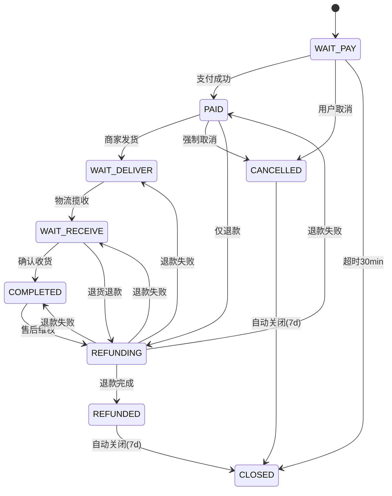
```mermaid
stateDiagram-v2
    [*] --> WAIT_PAY
    WAIT_PAY --> PAID : 支付成功
    WAIT_PAY --> CANCELLED : 用户取消
    WAIT_PAY --> CLOSED : 超时30min
    PAID --> WAIT_DELIVER : 商家发货
    PAID --> CANCELLED : 强制取消
    PAID --> REFUNDING : 仅退款
    WAIT_DELIVER --> WAIT_RECEIVE : 物流揽收
    WAIT_RECEIVE --> COMPLETED : 确认收货
    WAIT_RECEIVE --> REFUNDING : 退货退款
    COMPLETED --> REFUNDING : 售后维权
    REFUNDING --> REFUNDED : 退款完成
    REFUNDING --> PAID : 退款失败
    REFUNDING --> WAIT_DELIVER : 退款失败
    REFUNDING --> WAIT_RECEIVE : 退款失败
    REFUNDING --> COMPLETED : 退款失败
    CANCELLED --> CLOSED : 自动关闭(7d)
    REFUNDED --> CLOSED : 自动关闭(7d)
```

| 当前状态     | 触发事件     | 事件源 | 目标状态     | 前置条件               | 后置动作                                                                     |
| ------------ | ------------ | :----: | ------------ | ---------------------- | ---------------------------------------------------------------------------- |
| WAIT_PAY     | 支付成功     |  回调  | PAID         | 支付金额≥订单应付金额 | ①通知商家发货 ②发送 `mall:order:paid` 事件                               |
| WAIT_PAY     | 用户取消     |  用户  | CANCELLED    |                        | ①恢复库存(outbox) ②释放优惠券(outbox) ③发送 `mall:order:cancelled` 事件 |
| WAIT_PAY     | 支付超时     |  系统  | CLOSED       | 30分钟未支付           | 同用户取消                                                                   |
| PAID         | 商家发货     | 管理端 | WAIT_DELIVER | 物流信息已填写         | ①记录物流单号 ②发送 `mall:order:delivered` 事件                          |
| WAIT_DELIVER | 物流揽收     |  回调  | WAIT_RECEIVE | 快递已揽收             | ①更新物流状态 ②通知用户                                                    |
| PAID         | 强制取消     | 管理端 | CANCELLED    | 客服审核               | ①原路退款 ②恢复库存 ③释放优惠券                                           |
| PAID         | 仅退款售后   |  系统  | REFUNDING    | 售后审核通过           | ①创建退款单 ②调支付服务退款                                                |
| WAIT_RECEIVE | 确认收货     |  用户  | COMPLETED    |                        | ①赠送积分 ②赠送成长值 ③发送 `mall:order:completed` 事件                 |
| WAIT_RECEIVE | 退货退款售后 |  系统  | REFUNDING    | 售后审核通过           | 同 PAID→REFUNDING                                                           |
| COMPLETED    | 申请售后     |  系统  | REFUNDING    | 售后时效内             | 同 PAID→REFUNDING                                                           |
| REFUNDING    | 退款成功回调 |  回调  | REFUNDED     | 渠道退款完成           | ①发送 `mall:order:refunded` 事件                                          |
| REFUNDING    | 退款失败回调 |  回调  | 原状态       | 渠道退款失败           | ①通知用户 ②标记人工介入                                                    |
| CANCELLED    | 自动关闭     |  系统  | CLOSED       | 取消后满7天            | 清理中间数据                                                                 |
| REFUNDED     | 自动关闭     |  系统  | CLOSED       | 退款后满7天            | 清理中间数据                                                                 |

### 4.2 支付状态机

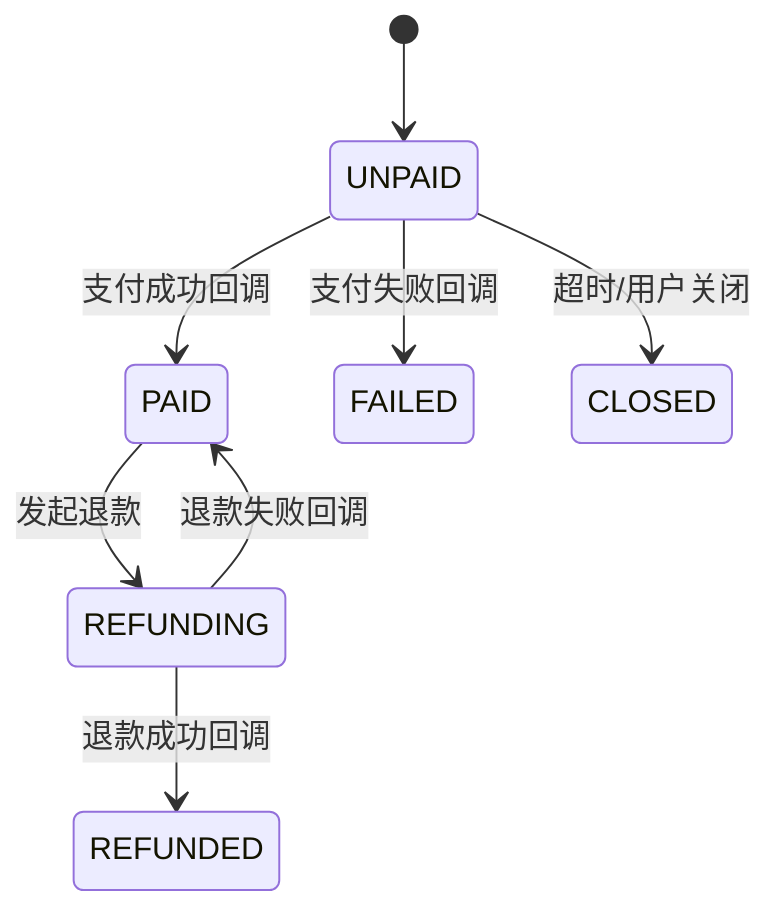
```mermaid
stateDiagram-v2
    [*] --> UNPAID
    UNPAID --> PAID : 支付成功回调
    UNPAID --> FAILED : 支付失败回调
    UNPAID --> CLOSED : 超时/用户关闭
    PAID --> REFUNDING : 发起退款
    REFUNDING --> REFUNDED : 退款成功回调
    REFUNDING --> PAID : 退款失败回调
```

| 当前状态  | 触发事件      |  事件源  | 目标状态  | 前置条件               | 后置动作                                                 |
| --------- | ------------- | :-------: | --------- | ---------------------- | -------------------------------------------------------- |
| UNPAID    | 发起支付      |   用户   | UNPAID    | 支付渠道参数就绪       | ①生成渠道交易号 ②保存渠道预支付参数                    |
| UNPAID    | 支付成功回调  |   回调   | PAID      | 渠道验签通过、订单一致 | ①记录渠道回调结果 ②发送 `mall:payment:paid` 事件     |
| UNPAID    | 支付失败回调  |   回调   | FAILED    | 渠道返回明确失败       | ①记录失败原因                                           |
| UNPAID    | 支付超时/关闭 | 用户/系统 | CLOSED    | 超时或用户主动关闭     |                                                          |
| PAID      | 发起退款      |   系统   | REFUNDING | 订单侧审核通过         | ①创建退款单 ②调渠道退款API                             |
| REFUNDING | 退款成功回调  |   回调   | REFUNDED  | 渠道验签通过           | ①记录渠道回调结果 ②发送 `mall:refund:succeeded` 事件 |
| REFUNDING | 退款失败回调  |   回调   | PAID      | 渠道返回明确失败       | ①记录失败原因 ②通知订单服务                            |

### 4.3 优惠券记录状态机

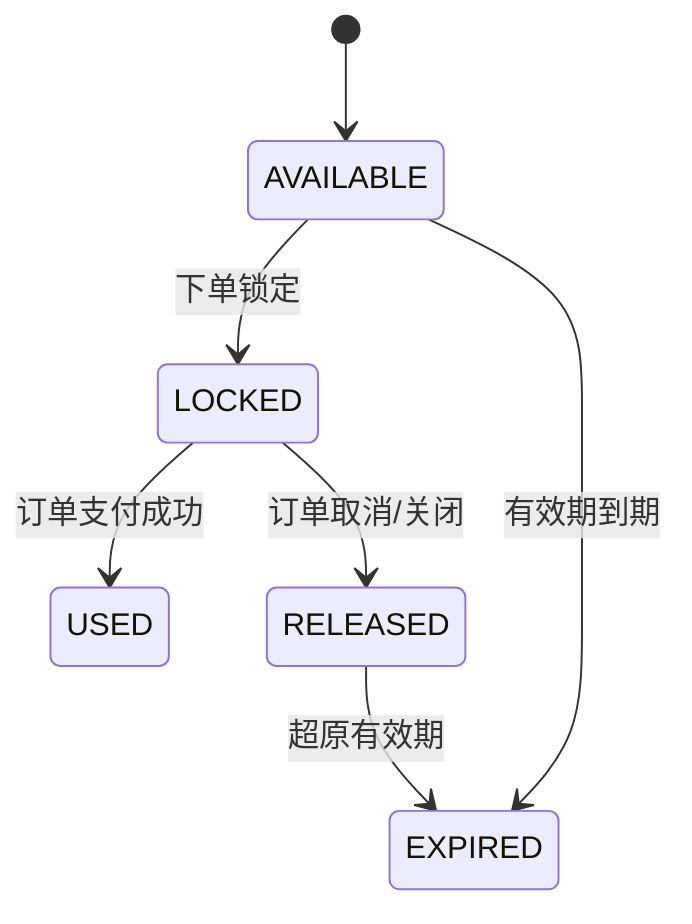
```mermaid
stateDiagram-v2
    [*] --> AVAILABLE
    AVAILABLE --> LOCKED : 下单锁定
    AVAILABLE --> EXPIRED : 有效期到期
    LOCKED --> USED : 订单支付成功
    LOCKED --> RELEASED : 订单取消/关闭
    RELEASED --> EXPIRED : 超原有效期
```

| 当前状态  | 触发事件      | 事件源 | 目标状态 | 前置条件               | 后置动作                 |
| --------- | ------------- | :----: | -------- | ---------------------- | ------------------------ |
| AVAILABLE | 下单锁定      |  系统  | LOCKED   | 优惠试算通过、库存充足 | ①扣减优惠券库存(outbox) |
| LOCKED    | 订单支付成功  |  系统  | USED     | 订单变为 PAID          |                          |
| LOCKED    | 订单取消/关闭 |  系统  | RELEASED | 订单变为 CLOSED        | ①恢复优惠券库存(outbox) |
| AVAILABLE | 有效期到期    |  系统  | EXPIRED  | 超过 validEndTime      | 定时任务批量扫描         |
| RELEASED  | 原有效期到期  |  系统  | EXPIRED  | 超过原 validEndTime    |                          |

---

## 五、核心业务详细流程

### 5.1 下单流程

#### 5.1.1 流程概述

下单是商城最核心的写链路，涉及 `mall-order`、`mall-product`、`mall-marketing` 三个服务的本地事务和 MQ 异步解耦。整体采用 **Try-Confirm 变体**：先锁定资源（库存+优惠券），再创建订单，最后异步投递订单已创建事件。

#### 5.1.2 参与服务与职责

| 服务               | 职责                                             |
| ------------------ | ------------------------------------------------ |
| `mall-order`     | 流程编排、幂等校验、订单创建、价格快照、事件发布 |
| `mall-product`   | 库存锁定（可售→锁定）                           |
| `mall-marketing` | 优惠券锁定（可用→已锁定）                       |

#### 5.1.3 流程图

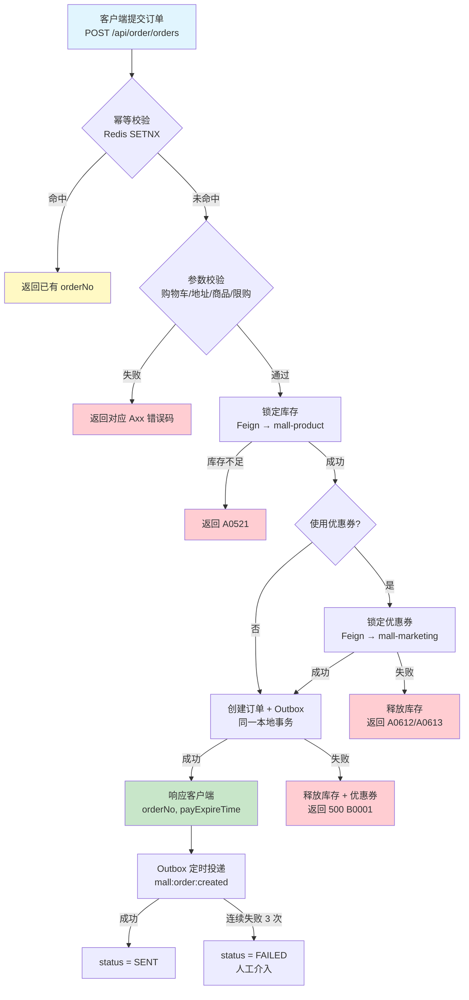
```mermaid
graph TD
    A["客户端提交订单<br/>POST /api/order/orders"] --> B{"幂等校验<br/>Redis SETNX"}
    B -->|"命中"| C["返回已有 orderNo"]
    B -->|"未命中"| D{"参数校验 <br/> 购物车/地址/商品/限购"}
    D -->|"失败"| E["返回对应 Axx 错误码"]
    D -->|"通过"| F["锁定库存 <br/> Feign → mall-product"]
    F -->|"库存不足"| G["返回 A0521"]
    F -->|"成功"| H{"使用优惠券?"}
    H -->|"否"| J["创建订单 + Outbox <br/> 同一本地事务"]
    H -->|"是"| I["锁定优惠券 <br/> Feign → mall-marketing"]
    I -->|"失败"| K["释放库存 <br/> 返回 A0612/A0613"]
    I -->|"成功"| J
    J -->|"成功"| L["响应客户端 <br/> orderNo, payExpireTime"]
    J -->|"失败"| M["释放库存 + 优惠券 <br/> 返回 500 B0001"]
    L --> N["Outbox 定时投递 <br/> mall:order:created"]
    N -->|"成功"| O["status = SENT"]
    N -->|"连续失败 3 次"| P["status = FAILED <br/> 人工介入"]

    style A fill:#e1f5fe
    style L fill:#c8e6c9
    style C fill:#fff9c4
    style G fill:#ffcdd2
    style E fill:#ffcdd2
    style K fill:#ffcdd2
    style M fill:#ffcdd2
```

**关键说明：**

| 编号 | 步骤            | 关键约束                                                                                               |
| ---- | --------------- | ------------------------------------------------------------------------------------------------------ |
| B    | 幂等校验        | Idempotent-Key 为 UUID v4，Redis TTL 30 分钟；命中时直接返回已有结果                                   |
| D    | 参数校验        | 含购物车空校验、地址归属校验、商品上架状态、限购数量（A0711）                                          |
| F    | 锁定库存        | `UPDATE sku SET locked_qty+=#{qty}, available_qty-=#{qty} WHERE available_qty>=#{qty}`，影响行数判断 |
| I    | 锁定优惠券      | `UPDATE user_coupon SET status='LOCKED', locked_order_no=#{orderNo} WHERE status='AVAILABLE'`        |
| J    | 创建订单+Outbox | 计算金额（含运费和优惠分摊）、保存价格快照、初始状态 `WAIT_PAY`；Outbox topic `mall:order:created` |
| N    | Outbox 投递     | 定时扫描 `status=NEW` 记录，成功后标记 `SENT`，连续 3 次失败标记 `FAILED`                        |

#### 5.1.4 时序图

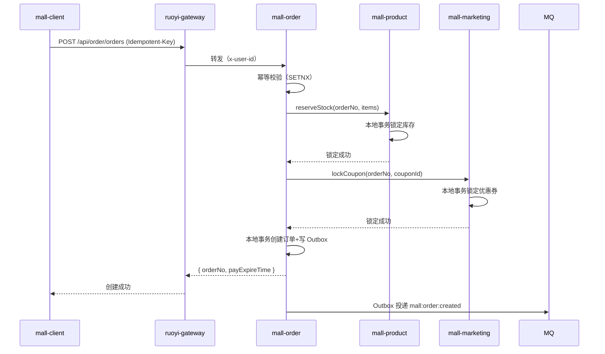
```mermaid
sequenceDiagram
    participant C as mall-client
    participant G as ruoyi-gateway
    participant O as mall-order
    participant P as mall-product
    participant M as mall-marketing
    participant MQ as MQ

    C->>G: POST /api/order/orders (Idempotent-Key)
    G->>O: 转发（x-user-id）
    O->>O: 幂等校验（SETNX）
    O->>P: reserveStock(orderNo, items)
    P->>P: 本地事务锁定库存
    P-->>O: 锁定成功
    O->>M: lockCoupon(orderNo, couponId)
    M->>M: 本地事务锁定优惠券
    M-->>O: 锁定成功
    O->>O: 本地事务创建订单+写 Outbox
    O-->>G: { orderNo, payExpireTime }
    G-->>C: 创建成功
    O->>MQ: Outbox 投递 mall:order:created
```

#### 5.1.5 失败处理矩阵

| 失败位置                               | 处理动作                             | 返回给客户端         |
| -------------------------------------- | ------------------------------------ | -------------------- |
| 幂等校验超时                           | 客户端重试（同 Idempotent-Key）      | 500 + 自动重试       |
| 参数校验失败                           | 不操作                               | 对应 Axx 错误码      |
| 库存锁定失败                           | 不操作                               | A0521 库存不足       |
| 库存锁定成功，优惠锁定失败             | 释放库存（Feign 补偿）               | A0612 优惠不可用     |
| 资源锁定成功，订单创建失败             | 释放库存 + 释放优惠（同步 Feign）    | 500 B0001            |
| 订单创建成功，Outbox 写入失败          | 本地事务整体回滚，资源自动释放       | 500 B0001            |
| 网络超时（资源已锁但客户端未收到响应） | 客户端用同一幂等键重试，查询订单结果 | 幂等返回已有 orderNo |

#### 5.1.6 超时与自动取消

参见 4.4 订单超时关闭。

---

### 5.2 支付流程

#### 5.2.1 流程概述

支付链路涉及 `mall-order`、`mall-payment` 和外部支付平台三方。支付采用**异步回调模式**：客户端发起支付后立即返回支付参数（H5/JSAPI/小程序），支付平台在用户完成后异步通知结果，`mall-payment` 处理回调后通过 MQ 通知 `mall-order` 推进订单。

#### 5.2.2 参与服务与职责

| 服务             | 职责                                           |
| ---------------- | ---------------------------------------------- |
| `mall-payment` | 支付单创建、第三方支付调用、回调处理、事件发布 |
| `mall-order`   | 订单状态校验、支付成功后的状态推进             |
| 支付平台         | 资金划转、异步回调通知                         |

#### 5.2.3 发起支付流程

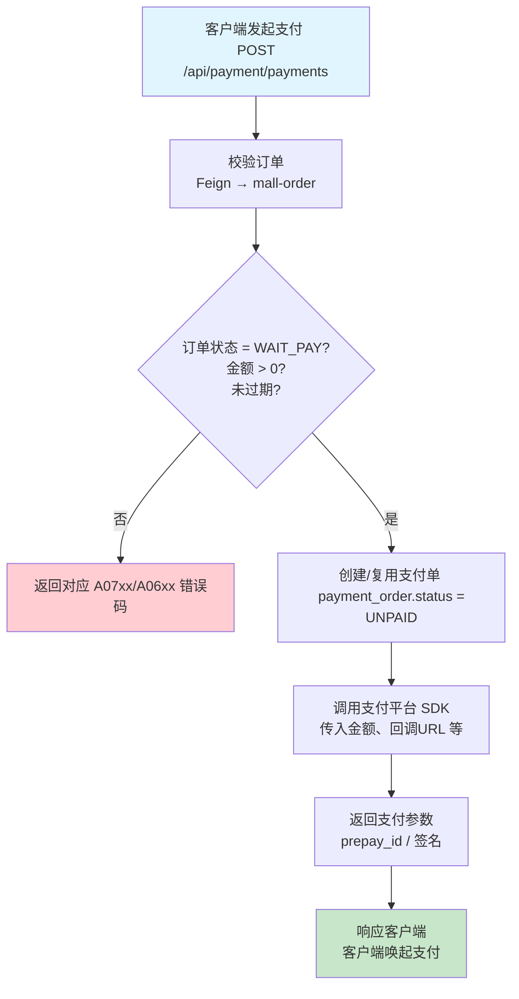
```mermaid
graph TD
    A["客户端发起支付 <br/> POST /api/payment/payments"] --> B["校验订单 <br/> Feign → mall-order"]
    B --> C{"订单状态 = WAIT_PAY? <br/> 金额 > 0? <br/> 未过期?"}
    C -->|"否"| D["返回对应 A07xx/A06xx 错误码"]
    C -->|"是"| E["创建/复用支付单 <br/> payment_order.status = UNPAID"]
    E --> F["调用支付平台 SDK <br/> 传入金额、回调URL 等"]
    F --> G["返回支付参数 <br/> prepay_id / 签名"]
    G --> H["响应客户端 <br/> 客户端唤起支付"]

    style A fill:#e1f5fe
    style H fill:#c8e6c9
    style D fill:#ffcdd2
```

**关键说明：**

| 编号 | 步骤         | 关键约束                                                                         |
| ---- | ------------ | -------------------------------------------------------------------------------- |
| B    | 校验订单     | 金额以订单快照为准，不重新计算；校验支付截止时间                                 |
| E    | 创建支付单   | 同订单同渠道存在 UNPAID 支付单时复用（幂等）；`pay_expire_time` 同订单超时时间 |
| F    | 调用支付平台 | 根据 `channel` 路由不同 SDK；JSAPI 需要传入用户 openid                         |
| H    | 响应客户端   | 返回支付参数后，客户端轮询支付结果或等待用户操作                                 |

#### 5.2.4 支付回调流程

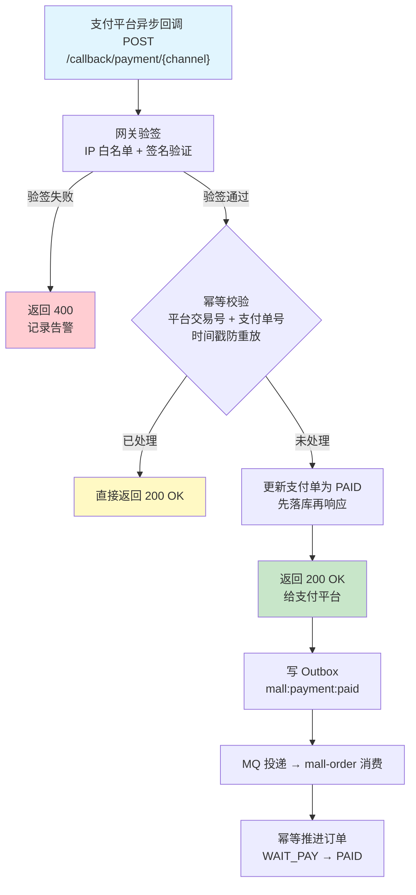
```mermaid
graph TD
    A["支付平台异步回调 <br/> POST /callback/payment/{channel}"] --> B["网关验签 <br/> IP 白名单 + 签名验证"]
    B -->|"验签失败"| C["返回 400 <br/> 记录告警"]
    B -->|"验签通过"| D{"幂等校验 <br/> 平台交易号 + 支付单号 <br/> 时间戳防重放"}
    D -->|"已处理"| E["直接返回 200 OK"]
    D -->|"未处理"| F["更新支付单为 PAID <br/> 先落库再响应"]
    F --> G["返回 200 OK <br/> 给支付平台"]
    G --> H["写 Outbox <br/> mall:payment:paid"]
    H --> I["MQ 投递 → mall-order 消费"]
    I --> J["幂等推进订单 <br/> WAIT_PAY → PAID"]

    style A fill:#e1f5fe
    style G fill:#c8e6c9
    style E fill:#fff9c4
    style C fill:#ffcdd2
```

**关键说明：**

| 编号 | 步骤       | 关键约束                                                                               |
| ---- | ---------- | -------------------------------------------------------------------------------------- |
| B    | 网关验签   | 校验来源 IP 白名单 + 消息体签名（微信/支付宝各自验证方式）                             |
| D    | 幂等校验   | 平台交易号 + 支付单号联合去重；回调时间戳偏差不超过 5 分钟防止重放                     |
| F    | 更新支付单 | `UPDATE payment_order SET status='PAID' WHERE status='UNPAID'`，影响 0 行说明已处理  |
| J    | 订单推进   | `orderNo + 事件类型` 幂等去重；订单状态必须为 WAIT_PAY 才能推进到 PAID（状态机保证） |

#### 5.2.5 时序图

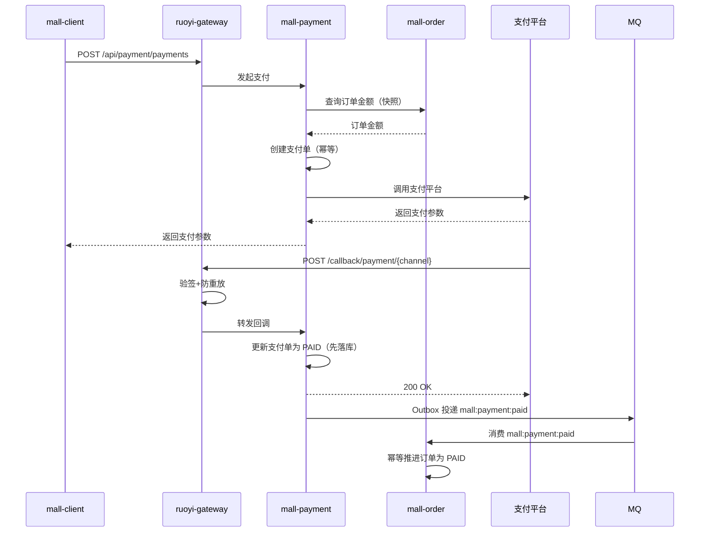
```mermaid
sequenceDiagram
    participant C as mall-client
    participant G as ruoyi-gateway
    participant Pay as mall-payment
    participant O as mall-order
    participant Provider as 支付平台
    participant MQ as MQ

    C->>G: POST /api/payment/payments
    G->>Pay: 发起支付
    Pay->>O: 查询订单金额（快照）
    O-->>Pay: 订单金额
    Pay->>Pay: 创建支付单（幂等）
    Pay->>Provider: 调用支付平台
    Provider-->>Pay: 返回支付参数
    Pay-->>C: 返回支付参数

    Provider->>G: POST /callback/payment/{channel}
    G->>G: 验签+防重放
    G->>Pay: 转发回调
    Pay->>Pay: 更新支付单为 PAID（先落库）
    Pay-->>Provider: 200 OK
    Pay->>MQ: Outbox 投递 mall:payment:paid
    MQ->>O: 消费 mall:payment:paid
    O->>O: 幂等推进订单为 PAID
```

#### 5.2.6 补偿设计

| 场景                                 | 补偿机制                                                                                                              |
| ------------------------------------ | --------------------------------------------------------------------------------------------------------------------- |
| 支付单成功但订单未推进               | 定时任务扫描 `payment_order.status=PAID` vs `mall_order.status=WAIT_PAY` 的不一致记录，重放 `mall:payment:paid` |
| 支付平台回调未收到                   | 定时任务扫描创建时间超过 30 分钟且状态为 UNPAID 的支付单，调用支付平台主动查询交易状态                                |
| 支付单创建后用户未支付（支付单滞留） | 随订单超时一起关闭（参见 4.4）                                                                                        |

---

### 5.3 退款流程

#### 5.3.1 流程概述

退款链路始于 `mall-order` 的售后/退款申请，经由 `mall-payment` 调用支付渠道执行退款，最终通过回调完成退款闭环。支持**仅退款**和**退货退款**两种模式。

#### 5.3.2 参与服务与职责

| 服务             | 职责                                           |
| ---------------- | ---------------------------------------------- |
| `mall-order`   | 售后单创建、订单状态校验、退款金额核算         |
| `mall-payment` | 退款单创建、第三方退款调用、回调处理、事件发布 |

#### 5.3.3 退款发起流程

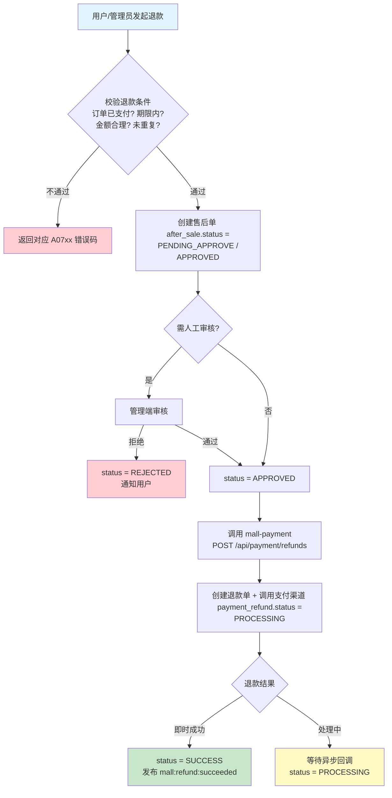
```mermaid
graph TD
    A["用户/管理员发起退款"] --> B{"校验退款条件 <br/> 订单已支付? 期限内? <br/> 金额合理? 未重复?"}
    B -->|"不通过"| C["返回对应 A07xx 错误码"]
    B -->|"通过"| D["创建售后单 <br/> after_sale.status = <br/> PENDING_APPROVE / APPROVED"]
    D --> E{"需人工审核?"}
    E -->|"是"| F["管理端审核"]
    F -->|"拒绝"| G["status = REJECTED <br/> 通知用户"]
    F -->|"通过"| H["status = APPROVED"]
    E -->|"否"| H
    H --> I["调用 mall-payment <br/> POST /api/payment/refunds"]
    I --> J["创建退款单 + 调用支付渠道 <br/> payment_refund.status = PROCESSING"]
    J --> K{"退款结果"}
    K -->|"即时成功"| L["status = SUCCESS <br/> 发布 mall:refund:succeeded"]
    K -->|"处理中"| M["等待异步回调 <br/> status = PROCESSING"]

    style A fill:#e1f5fe
    style L fill:#c8e6c9
    style M fill:#fff9c4
    style C fill:#ffcdd2
    style G fill:#ffcdd2
```

**关键说明：**

| 编号 | 步骤         | 关键约束                                                                          |
| ---- | ------------ | --------------------------------------------------------------------------------- |
| B    | 校验退款条件 | 订单状态 PAID/已收货；退款金额 ≤ 已支付 - 已退款；收货后 7 天内；同一 SKU 不重复 |
| D    | 创建售后单   | 自动审核规则：未发货且金额 ≤ 某阈值时自动 APPROVED，否则 PENDING_APPROVE         |
| F    | 管理端审核   | 调用 `PUT /admin/mall/order/after_sales/{afterSaleId}/status`                   |
| J    | 调用支付渠道 | 原路退回；微信/支付宝大部分情况即时返回；afterSaleId 防重复退款                   |

#### 5.3.4 退款回调流程

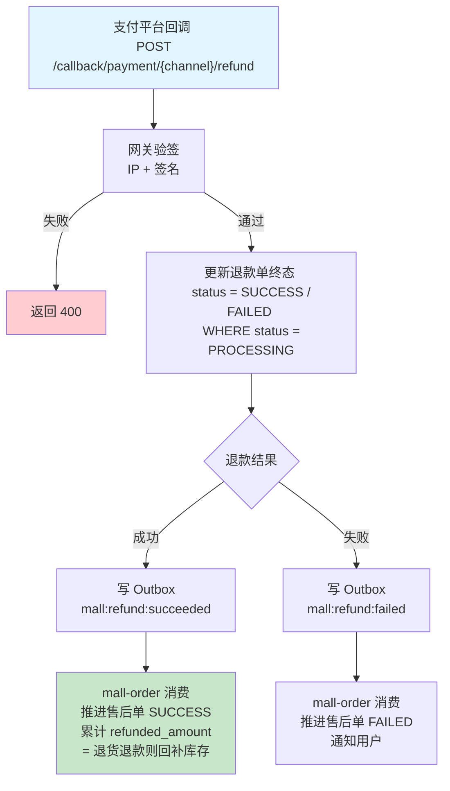
```mermaid
graph TD
    A["支付平台回调 <br/> POST /callback/payment/{channel}/refund"] --> B["网关验签 <br/> IP + 签名"]
    B -->|"失败"| C["返回 400"]
    B -->|"通过"| D["更新退款单终态 <br/> status = SUCCESS / FAILED <br/> WHERE status = PROCESSING"]
    D --> E{"退款结果"}
    E -->|"成功"| F["写 Outbox <br/> mall:refund:succeeded"]
    E -->|"失败"| G["写 Outbox <br/> mall:refund:failed"]
    F --> H["mall-order 消费 <br/> 推进售后单 SUCCESS <br/> 累计 refunded_amount <br/> = 退货退款则回补库存"]
    G --> I["mall-order 消费 <br/> 推进售后单 FAILED <br/> 通知用户"]

    style A fill:#e1f5fe
    style H fill:#c8e6c9
    style C fill:#ffcdd2
```

**关键说明：**

| 编号 | 步骤       | 关键约束                                                                              |
| ---- | ---------- | ------------------------------------------------------------------------------------- |
| D    | 更新退款单 | `UPDATE payment_refund SET status=? WHERE status='PROCESSING'`，影响 0 行说明已处理 |
| H    | 库存回补   | 仅退货退款才回补；仅退款已发货不回补（参见 4.3.6 规则表）                             |

#### 5.3.5 时序图

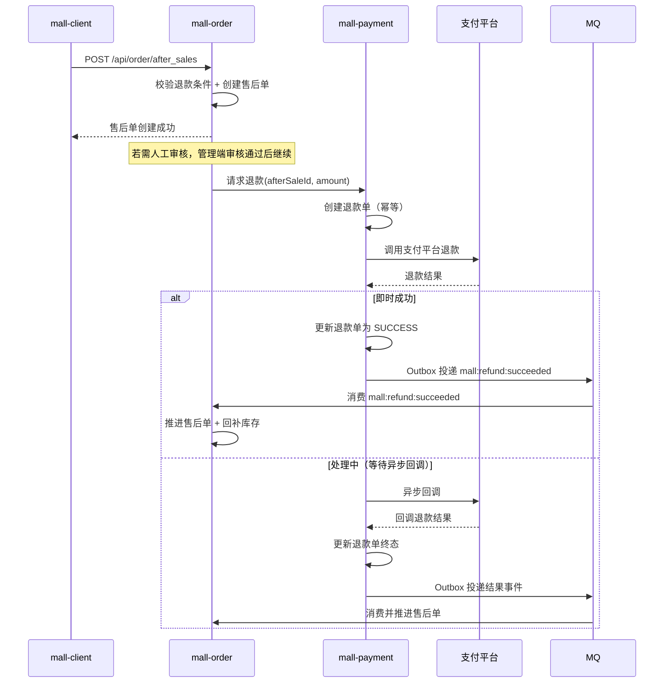
```mermaid
sequenceDiagram
    participant C as mall-client
    participant O as mall-order
    participant Pay as mall-payment
    participant Provider as 支付平台
    participant MQ as MQ

    C->>O: POST /api/order/after_sales
    O->>O: 校验退款条件 + 创建售后单
    O-->>C: 售后单创建成功
    Note over O: 若需人工审核，管理端审核通过后继续

    O->>Pay: 请求退款(afterSaleId, amount)
    Pay->>Pay: 创建退款单（幂等）
    Pay->>Provider: 调用支付平台退款
    Provider-->>Pay: 退款结果

    alt 即时成功
        Pay->>Pay: 更新退款单为 SUCCESS
        Pay->>MQ: Outbox 投递 mall:refund:succeeded
        MQ->>O: 消费 mall:refund:succeeded
        O->>O: 推进售后单 + 回补库存
    else 处理中（等待异步回调）
        Pay->>Provider: 异步回调
        Provider-->>Pay: 回调退款结果
        Pay->>Pay: 更新退款单终态
        Pay->>MQ: Outbox 投递结果事件
        MQ->>O: 消费并推进售后单
    end
```

#### 5.3.6 退款后库存回补规则

| 退款类型         | 库存操作                                                                           |
| ---------------- | ---------------------------------------------------------------------------------- |
| 仅退款（未发货） | 回补所有退款 SKU 的库存：`UPDATE sku SET available_qty = available_qty + #{qty}` |
| 仅退款（已发货） | 不回补库存（实物已发出，视为损耗）                                                 |
| 退货退款         | 收到退货后回补库存：`UPDATE sku SET available_qty = available_qty + #{qty}`      |

---

### 5.4 订单超时关闭

#### 5.4.1 触发方式

订单超时关闭采用 **定时任务扫描 + 状态机推进** 的方式，不依赖 MQ 延迟消息，避免消息积压导致大批量超时订单无法及时关闭。

#### 5.4.2 流程图

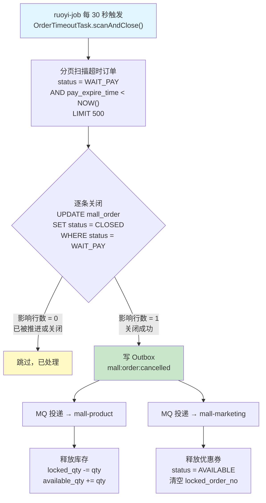
```mermaid
graph TD
    A["ruoyi-job 每 30 秒触发<br/>OrderTimeoutTask.scanAndClose()"] --> B["分页扫描超时订单<br/>status = WAIT_PAY<br/>AND pay_expire_time < NOW()<br/>LIMIT 500"]
    B --> C{"逐条关闭<br/>UPDATE mall_order<br/>SET status = CLOSED<br/>WHERE status = WAIT_PAY"}
    C -->|"影响行数 = 0<br/>已被推进或关闭"| D["跳过，已处理"]
    C -->|"影响行数 = 1<br/>关闭成功"| E["写 Outbox<br/>mall:order:cancelled"]
    E --> F["MQ 投递 → mall-product"]
    E --> G["MQ 投递 → mall-marketing"]
    F --> H["释放库存<br/>locked_qty -= qty<br/>available_qty += qty"]
    G --> I["释放优惠券<br/>status = AVAILABLE<br/>清空 locked_order_no"]

    style A fill:#e1f5fe
    style E fill:#c8e6c9
    style D fill:#fff9c4
```

**关键说明：**

| 编号 | 步骤       | 关键约束                                                                         |
| ---- | ---------- | -------------------------------------------------------------------------------- |
| B    | 分页扫描   | 排序 `pay_expire_time ASC` 优先关闭最早超时订单；单次 500 条防内存溢出         |
| C    | 乐观锁关闭 | `WHERE status = 'WAIT_PAY'` 保证与支付回调/手动取消的并发安全；影响 0 行则跳过 |
| H    | 释放库存   | 幂等去重（orderNo 维度）；`locked_qty` 扣减后 `available_qty` 回补           |
| I    | 释放优惠券 | 幂等去重；`WHERE locked_order_no = ?` 避免误释放其他订单的优惠券               |

#### 5.4.3 分页扫描说明

| 参数     | 值                            | 说明                            |
| -------- | ----------------------------- | ------------------------------- |
| 扫描间隔 | 30 秒                         | 与超时时间（30 分钟）相比足够短 |
| 单次上限 | 500 条                        | 防止一次加载过多导致内存溢出    |
| 排序     | `pay_expire_time ASC`       | 优先关闭最早超时的订单          |
| 乐观锁   | `WHERE status = 'WAIT_PAY'` | 防止补偿任务重复关闭            |

#### 5.4.4 补偿保障

- 定时任务本身幂等：连续两次执行不会重复关闭已关闭订单（状态机保证）
- 若 `order:cancelled` 事件投递失败，Outbox 重试机制保证最终投递
- 若库存/优惠券释放失败，各自服务的 Outbox 重试保证最终一致
- 支付回调与超时关闭存在竞态 ⇒ 状态机保证：`WAIT_PAY → PAID` 与 `WAIT_PAY → CLOSED` 只有一个能成功

#### 5.4.5 超时时间配置

| 配置项                          | 默认值 | 说明                           |
| ------------------------------- | ------ | ------------------------------ |
| `order.pay-expire-minutes`    | 30     | 下单后未支付，N 分钟后自动关闭 |
| `order.timeout-scan-interval` | 30     | 定时扫描间隔（秒）             |
| `order.timeout-batch-size`    | 500    | 每批扫描上限                   |

---

### 5.5 搜索索引同步

#### 5.5.1 架构说明

商品搜索索引同步采用 **双通道策略** 确保数据最终一致性：

- **通道一（实时通道）**：管理端操作商品时，通过 Feign 直调 `mall-search` 同步索引
- **通道二（异步通道）**：商品变更后写 Outbox，MQ 异步投递到 `mall-search`
- **兜底通道（补偿任务）**：定时扫描不一致记录，回补同步

#### 5.5.2 增量同步流程图（双通道）

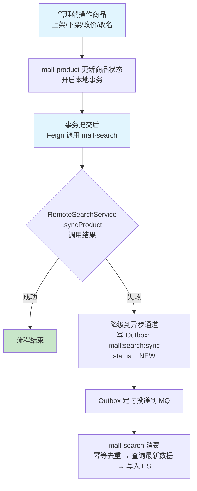
```mermaid
graph TD
    A["管理端操作商品<br/>上架/下架/改价/改名"] --> B["mall-product 更新商品状态<br/>开启本地事务"]
    B --> C["事务提交后<br/>Feign 调用 mall-search"]
    C --> D{"RemoteSearchService<br/>.syncProduct<br/>调用结果"}
    D -->|"成功"| E["流程结束"]
    D -->|"失败"| F["降级到异步通道<br/>写 Outbox: mall:search:sync<br/>status = NEW"]
    F --> G["Outbox 定时投递到 MQ"]
    G --> H["mall-search 消费<br/>幂等去重 → 查询最新数据 → 写入 ES"]

    style A fill:#e1f5fe
    style C fill:#e1f5fe
    style E fill:#c8e6c9
```

**双通道策略对比：**

| 特性       | 实时通道（Feign 直调）     | 异步通道（Outbox + MQ）          |
| ---------- | -------------------------- | -------------------------------- |
| 触发方式   | 事务提交后同步调用         | 降级触发 or 仅用异步模式（可选） |
| 主流程依赖 | 不依赖（失败降级）         | 不依赖（异步解耦）               |
| 一致性级别 | 最终一致（因调用在事务外） | 最终一致（Outbox 保证必达）      |
| 延迟       | 毫秒级                     | 秒级                             |
| 幂等       | 天然幂等（幂等写入 ES）    | productId + operation 去重       |

#### 5.5.3 全量重建流程图

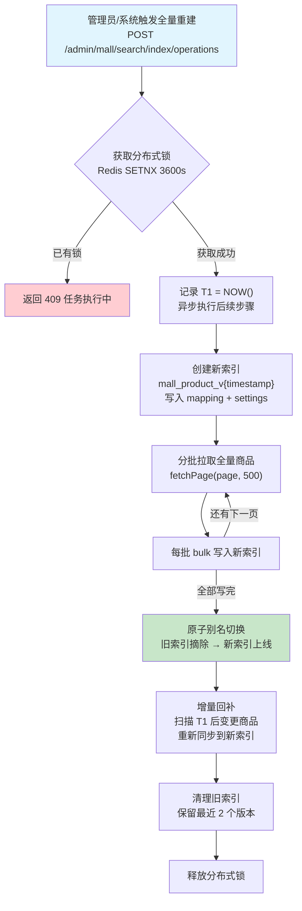
```mermaid
graph TD
    A["管理员/系统触发全量重建<br/>POST /admin/mall/search/index/operations"] --> B{"获取分布式锁<br/>Redis SETNX 3600s"}
    B -->|"已有锁"| C["返回 409 任务执行中"]
    B -->|"获取成功"| D["记录 T1 = NOW()<br/>异步执行后续步骤"]
    D --> E["创建新索引<br/>mall_product_v{timestamp}<br/>写入 mapping + settings"]
    E --> F["分批拉取全量商品<br/>fetchPage(page, 500)"]
    F --> G["每批 bulk 写入新索引"]
    G -->|"还有下一页"| F
    G -->|"全部写完"| H["原子别名切换<br/>旧索引摘除 → 新索引上线"]
    H --> I["增量回补<br/>扫描 T1 后变更商品<br/>重新同步到新索引"]
    I --> J["清理旧索引<br/>保留最近 2 个版本"]
    J --> K["释放分布式锁"]

    style A fill:#e1f5fe
    style H fill:#c8e6c9
    style C fill:#ffcdd2
```

**关键说明：**

| 编号 | 步骤       | 关键约束                                                        |
| ---- | ---------- | --------------------------------------------------------------- |
| B    | 分布式锁   | 3600s 自动过期防止死锁；全量重建期间禁止重复触发                |
| E    | 创建新索引 | 独立索引名避免影响线上读写；mapping/settings 与当前生产索引一致 |
| H    | 别名切换   | ES 原子 `_aliases` API，读写切换零停机                        |
| I    | 增量回补   | T1 时间的商品变更可能在分批阶段被漏掉，回补保证完整             |
| J    | 清理旧索引 | 保留 2 个版本支持快速回滚                                       |

#### 5.5.5 时序图

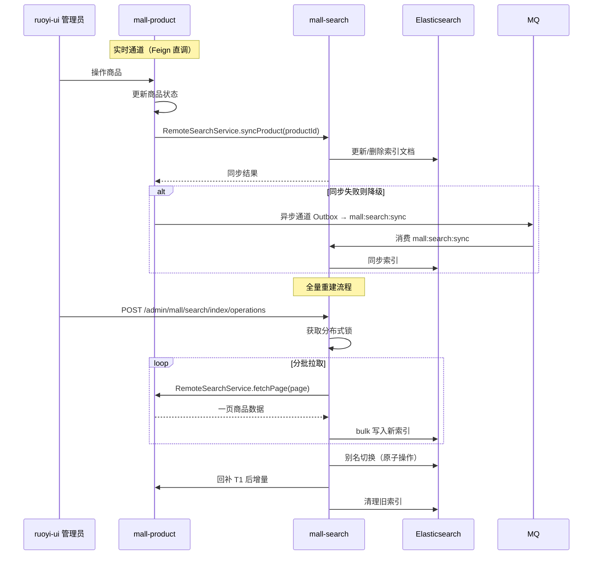
```mermaid
sequenceDiagram
    participant Admin as ruoyi-ui 管理员
    participant P as mall-product
    participant S as mall-search
    participant ES as Elasticsearch
    participant MQ as MQ

    Note over P: 实时通道（Feign 直调）
    Admin->>P: 操作商品
    P->>P: 更新商品状态
    P->>S: RemoteSearchService.syncProduct(productId)
    S->>ES: 更新/删除索引文档
    S-->>P: 同步结果

    alt 同步失败则降级
        P->>MQ: 异步通道 Outbox → mall:search:sync
        MQ->>S: 消费 mall:search:sync
        S->>ES: 同步索引
    end

    Note over S: 全量重建流程
    Admin->>S: POST /admin/mall/search/index/operations
    S->>S: 获取分布式锁
    loop 分批拉取
        S->>P: RemoteSearchService.fetchPage(page)
        P-->>S: 一页商品数据
        S->>ES: bulk 写入新索引
    end
    S->>ES: 别名切换（原子操作）
    S->>P: 回补 T1 后增量
    S->>ES: 清理旧索引
```

#### 5.5.6 补偿回补任务

| 配置项   | 值                                                                           |
| -------- | ---------------------------------------------------------------------------- |
| 任务名称 | 搜索索引同步回补                                                             |
| 触发方式 | ruoyi-job 定时，每 5 分钟                                                    |
| 扫描范围 | 最近 1 小时内更新的商品                                                      |
| 处理逻辑 | 查询 ES 中文档 `updated_at` 与 DB 中 `updated_at` 不一致的记录，重新同步 |
| 幂等保证 | 以 ES 最终状态为准，重复执行仅多一次写入                                     |

---

## 六、缓存与一致性设计

### 6.1 Redis 缓存策略

#### 6.1.1 Key 命名规范

格式：`mall:{service}:{biz}:{id}`

| Key                                                  | 用途             | TTL                                 |
| ---------------------------------------------------- | ---------------- | ----------------------------------- |
| `mall:user:token:{token}`                          | 登录令牌         | 同 token 有效期（30分钟，自动续期） |
| `mall:user:profile:{userId}`                       | 用户信息缓存     | 30分钟                              |
| `mall:product:sku:{skuId}`                         | SKU 信息缓存     | 10分钟                              |
| `mall:order:idempotent:{userId}:{clientRequestNo}` | 幂等键去重       | 30分钟                              |
| `mall:payment:callback:{channel}:{tradeNo}`        | 回调防重放       | 24小时                              |
| `mall:marketing:coupon_lock:{orderNo}`             | 优惠券锁定标记   | 30分钟                              |
| `mall:search:index:rebuild_lock`                   | 全量重建分布式锁 | 持有期间+30s                        |
| `mall:search:suggestion:hot_keywords`              | 热门搜索词缓存   | 1小时                               |

#### 6.1.2 缓存更新策略

三种策略按场景选用：

| 策略                              | 适用场景                       | 说明                               |
| --------------------------------- | ------------------------------ | ---------------------------------- |
| **Cache Aside**（旁路缓存） | 用户信息、SKU 信息、热门搜索词 | 读时缓存，写时先更新 DB 再删缓存   |
| **Write Through**           | 幂等键、回调防重放             | 写入时同 DB 一起 SET，无需后续更新 |
| **Distributed Lock**        | 全量重建锁、优惠券锁定         | SETNX + 超时自动释放               |

#### 6.1.3 硬约束

1. 所有 key **必须设 TTL**，禁止永久 key
2. Redis **不能作为唯一事实来源**，核心状态必须落 MySQL
3. 分布式锁必须设置过期时间 + 唯一 value（防止误释放）
4. 敏感数据（token、手机号等）不入 Redis，或脱敏后入

#### 6.1.4 缓存穿透 / 击穿 / 雪崩防护

| 问题               | 现象                                            | 防护方案                                                                                                                                        |
| ------------------ | ----------------------------------------------- | ----------------------------------------------------------------------------------------------------------------------------------------------- |
| **缓存穿透** | 查询不存在的 key（如伪造的 skuId），每次穿到 DB | ① 布隆过滤器预判 key 是否存在；② 对不存在的结果也缓存空值，TTL 设短（1~3 分钟）                                                               |
| **缓存击穿** | 热点 key 过期瞬间，大量并发打到 DB              | ① 热点 key 设逻辑过期（value 存 `expireAt`），异步刷新，不等 TTL 物理过期；② 查 DB 时加互斥锁（`SETNX lock:refresh:key`），仅一个线程回源 |
| **缓存雪崩** | 大批 key 同时过期或 Redis 宕机，DB 瞬间被打爆   | ① TTL 加随机偏移（±10%~30%），避免集中过期；② 本地 Caffeine 二级缓存兜底；③ 限流熔断（Sentinel 对 DB 查询做限流）                           |

**实现选型建议：**

| 场景               | 推荐方案                         | 理由                                |
| ------------------ | -------------------------------- | ----------------------------------- |
| SKU 查询（穿透）   | 布隆过滤器 + 空值短 TTL          | Key 空间可控，布隆建在 Redis 或本地 |
| 用户信息（击穿）   | 逻辑过期 + 互斥锁异步刷新        | 读多写少，热点集中                  |
| 优惠券库存（击穿） | 互斥锁单线程回源                 | 强一致要求，不适合异步刷新          |
| 全量缓存（雪崩）   | TTL 随机偏移 + Caffeine 二级缓存 | 最低成本防雪崩，二级缓存兜底        |

#### 6.1.5 缓存数据结构选型

| 数据类型              | 适用场景                   | Key 示例                                              | 说明                                 |
| --------------------- | -------------------------- | ----------------------------------------------------- | ------------------------------------ |
| **String**      | 单值缓存、分布式锁、计数器 | `mall:product:sku:{skuId}`                          | 存储序列化后的对象 JSON              |
| **Hash**        | 对象部分字段缓存、购物车   | `mall:order:cart:{userId}` → `{skuId: quantity}` | 避免整对象序列化开销，可单独更新字段 |
| **List**        | 消息队列、最新列表         | `mall:product:newest:list`                          | LPUSH + LTRIM 保留固定长度           |
| **Set**         | 标签、去重集合             | `mall:product:tag:{tagId}`                          | 商品标签交集、差集运算               |
| **ZSet**        | 排行榜、延迟队列、分页     | `mall:product:hot:rank`                             | 热销排行、搜索热词排序               |
| **Bitmap**      | 签到、日活统计             | `mall:user:sign:{userId}:{yyyyMM}`                  | 极小内存统计用户行为                 |
| **HyperLogLog** | UV 统计                    | `mall:product:uv:{productId}`                       | 误差 0.81% 内的去重计数              |

#### 6.1.6 Cache Aside 详细流程

读操作（伪代码）：

```
func getProduct(skuId):
    val = redis.get("mall:product:sku:" + skuId)
    if val != null:
        if val == "NULL":        // 空值缓存，防止穿透
            return null
        return deserialize(val)
    // 缓存未命中
    return queryDBAndSetCache(skuId)
```

写操作（伪代码）：

```
func updateProduct(sku):
    db.update(sku)               // ① 先写 DB
    redis.del("mall:product:sku:" + sku.skuId)  // ② 再删缓存
    // 延迟双删（高并发场景）：
    redis.del("mall:product:sku:" + sku.skuId)  // ③ 延迟 500ms 后再删一次
```

**并发双写问题处理：**

- 不采用「先删缓存再写 DB」，避免写 DB 期间其他线程回种旧数据
- 延迟双删：写 DB → 删缓存 → 延迟 500ms → 再删缓存，防止并发读到旧值回种
- 核心接口（如 SKU 价格）可上分布式读写锁保证强一致

#### 6.1.7 分布式锁详细实现

加锁（Lua 原子脚本）：

```lua
-- SET lock_key UUID NX EX ttl_seconds
if redis.call("SET", KEYS[1], ARGV[1], "NX", "EX", ARGV[2]) then
    return 1
else
    return 0
end
```

释放（Lua 防误删）：

```lua
-- 仅当 value 匹配时才删除，防止释放别人的锁
if redis.call("GET", KEYS[1]) == ARGV[1] then
    return redis.call("DEL", KEYS[1])
else
    return 0
end
```

续期（看门狗）：

```
// 后台定时任务，每 ttl/3 检查并续期
if redis.eval(check_lua, lockKey, uuid) == 1:
    redis.expire(lockKey, ttl_seconds)  // 续期
```

| 锁场景           | TTL    |     是否需要看门狗     |
| ---------------- | ------ | :---------------------: |
| 全量重建锁       | 3600s  | 是（重建可能超 1 小时） |
| 优惠券锁定       | 30分钟 |   是（防止提前释放）   |
| 缓存刷新互斥锁   | 10s    |    否（回源速度快）    |
| 定时任务单次执行 | 60s    |   否（执行时间可控）   |

#### 6.1.8 缓存预热策略

| 阶段       | 操作                                     | 说明                     |
| ---------- | ---------------------------------------- | ------------------------ |
| 服务启动   | 预加载商品分类、热门 SKU、配置项到 Redis | 避免启动瞬间大量请求击穿 |
| 重建后     | 全量重建完成后，批量回种热点搜索词       | 搜索服务可立即命中       |
| 突发流量前 | 手动触发预热脚本，缓存运营活动商品       | 秒杀/大促场景            |
| 过期前     | 热点 key 设逻辑过期，提前 N 秒异步刷新   | 不等 TTL 物理过期        |

预热实现：

```java
@Component
public class CacheWarmer implements ApplicationRunner {
    @Override
    public void run(ApplicationArguments args) {
        // 1. 加载商品分类树
        List<Category> categories = categoryMapper.selectAll();
        for (Category c : categories) {
            redis.set("mall:product:category:" + c.getId(), JSON.toJSONString(c), 30, TimeUnit.MINUTES);
        }
        // 2. 加载热门搜索词
        List<String> hotKeywords = searchMapper.topKeywords(20);
        redis.set("mall:search:suggestion:hot_keywords", JSON.toJSONString(hotKeywords), 1, TimeUnit.HOURS);
    }
}
```

#### 6.1.9 序列化方案

| 方案                   | 适用场景                  | 优点                                | 缺点                           |
| ---------------------- | ------------------------- | ----------------------------------- | ------------------------------ |
| **Jackson JSON** | 通用缓存（用户信息、SKU） | 可读性好，兼容性强                  | 体积大，序列化慢               |
| **Protobuf**     | 高频读写（购物车、热榜）  | 体积小（1/3 JSON），序列化快 3~5 倍 | 需预定义 .proto，不可读        |
| **JDK 序列化**   | 禁止使用                  | —                                  | 不安全、不可跨语言、版本兼容差 |

**规则：** 默认 Jackson，购物车/排行榜等高频率场景用 Protobuf。禁止 JDK 原生序列化。

#### 6.1.10 缓存监控指标

| 指标       | 计算方式                                              | 告警阈值          |
| ---------- | ----------------------------------------------------- | ----------------- |
| 缓存命中率 | `keyspace_hits / (keyspace_hits + keyspace_misses)` | < 90% 告警        |
| 穿透次数   | 缓存命中了空值标记的次数                              | > 100/min 告警    |
| 击穿次数   | 互斥锁竞争次数（`lock:refresh:*` 创建数）           | > 10/min 告警     |
| 雪崩风险   | 同一分钟过期 key 数量                                 | > 总量的 30% 告警 |
| 内存使用率 | `used_memory / maxmemory`                           | > 80% 告警        |
| 慢查询     | `SLOWLOG GET 100`                                   | > 10ms 告警       |

暴露方式：Spring Boot Actuator + Micrometer → Prometheus → Grafana 面板。

### 6.2 幂等方案

#### 6.2.1 双层幂等架构

| 层                   | 机制                        | 作用                     | 举例                                     |
| -------------------- | --------------------------- | ------------------------ | ---------------------------------------- |
| **请求入口层** | Redis SETNX / DB 唯一约束   | 防用户重复提交、回调重放 | 用户双击提交 → 命中幂等键直接返回       |
| **状态推进层** | 状态机乐观锁（参见第 3 章） | 防状态非法跳转、并发覆盖 | 支付回调与超时关闭同时触发，只有一方成功 |

两层的覆盖关系：入口层拦截重复输入，状态机层兜底并发安全。入口层失败时降级依赖状态机层。

#### 6.2.2 必须幂等的场景

| # | 场景         | 幂等键格式                                            | 存储           | TTL    | 关键约束                               | 命中后响应                           |
| - | ------------ | ----------------------------------------------------- | -------------- | ------ | -------------------------------------- | ------------------------------------ |
| 1 | 创建订单     | `mall:order:idempotent:{userId}:{clientRequestNo}`  | Redis          | 30分钟 | SETNX 原子写入，value 存 orderNo       | 返回原 orderNo（200 + 相同 data）    |
| 2 | 发起支付     | `payment_order:orderNo:channel`                     | DB 唯一约束    | 永久   | `UNIQUE(order_no, channel)`          | 复用已有支付单，返回相同的支付参数   |
| 3 | 支付回调     | `mall:payment:callback:{channel}:{tradeNo}`         | Redis          | 24h    | 先 SETNX 再处理，防支付平台多次回调    | 已处理则直接返回 200，不重复通知订单 |
| 4 | 退款申请     | `after_sale:orderNo:refundType`                     | DB 唯一约束    | 永久   | `UNIQUE(order_no, refund_type)`      | 返回已有售后单，不重复创建           |
| 5 | 退款回调     | `mall:payment:refund_callback:{channel}:{refundNo}` | Redis          | 24h    | 同支付回调                             | 已处理直接返回 200                   |
| 6 | MQ 消费      | `mall:mq:dedup:{messageId}:{consumerGroup}`         | Redis          | 24h    | 消费前 SETNX，消费成功后不删           | 幂等跳过，确认 ACK                   |
| 7 | 搜索索引同步 | `mall:search:dedup:{productId}:{operation}`         | Redis          | 1h     | productId + operation（UPSERT/DELETE） | 跳过重复同步                         |
| 8 | 全量重建     | `mall:search:index:rebuild_lock`                    | Redis 分布式锁 | 3600s  | SETNX + UUID + 看门狗                  | 返回 409（任务执行中）               |

> 注：库存锁定、优惠券锁定、订单状态推进的幂等性由状态机 + DB 乐观锁保障，详见第 3 章状态机设计。

#### 6.2.3 幂等键生成规范

| 规范                 | 说明                                                                   | 示例                                           |
| -------------------- | ---------------------------------------------------------------------- | ---------------------------------------------- |
| **格式**       | `mall:{service}:idempotent:{维度1}:..:{维度N}`                       | `mall:order:idempotent:10001:REQ20260517001` |
| **客户端生成** | `clientRequestNo` 由前端生成 UUID v4，放入 `Idempotent-Key` 请求头 | `550e8400-e29b-41d4-a716-446655440000`       |
| **服务端生成** | `messageId` 由 MQ 生产者生成雪花 ID，消费端去重用                    | `1234567890123456789`                        |
| **回调被动**   | `channel:tradeNo` 由支付平台提供，不做自生成                         | `wechat:4200001234202305171234567890`        |
| **禁止**       | 不依赖数据库自增 ID 做幂等键；不拼接电话/邮箱等敏感信息                | —                                             |

#### 6.2.4 命中幂等后的响应策略

| 场景         | 存入值                 | 命中行为           | HTTP | errorCode | userTip                          | data                        |
| ------------ | ---------------------- | ------------------ | :--: | --------- | -------------------------------- | --------------------------- |
| 创建订单     | orderNo                | 返回已有 orderNo   | 200 | 00000     | —                               | `{orderNo}`               |
| 发起支付     | payOrderNo + payParams | 返回已有支付参数   | 200 | 00000     | —                               | 相同支付参数 JSON           |
| 支付回调     | "1"                    | 直接返回成功       | 200 | 00000     | —                               | 支付平台要求的 success 应答 |
| 退款申请     | afterSaleId            | 返回已有售后单     | 200 | 00000     | —                               | 已有售后单信息              |
| 退款回调     | "1"                    | 直接返回成功       | 200 | 00000     | —                               | channel 要求的 success 应答 |
| MQ 消费      | "1"                    | ACK 确认，跳过处理 |  —  | —        | —                               | —                          |
| 搜索索引同步 | "1"                    | 跳过写入 ES        |  —  | —        | —                               | —                          |
| 全量重建     | lock UUID              | 返回 409           | 409 | A0503     | "全量重建任务执行中，请稍后再试" | —                          |

#### 6.2.5 Redis 不可用降级方案

| 降级策略                  | 触发条件                     | 行为                                                            | 风险                                                 |
| ------------------------- | ---------------------------- | --------------------------------------------------------------- | ---------------------------------------------------- |
| **DB 唯一约束兜底** | Redis SETNX 超时或报错 C0110 | 跳过 Redis 幂等校验，依赖 DB 状态机/唯一约束                    | 短时性能下降，并发下可能 DB 报 DuplicateKeyException |
| **直接拒绝**        | 核心写链路（支付回调）       | SETNX 失败时返回 500，拒绝处理，userTip："系统繁忙，请稍后再试" | 支付平台会重试回调（24h 内），最终成功               |
| **本地缓存兜底**    | Redis 不可超过 30s           | 降级到 Caffeine 本地缓存的幂等标记（TTL 30s）                   | 标记过期后可能重复处理，需状态机兜底                 |

**降级顺序：** 正常（Redis）→ Redis 不可用（本地 Caffeine 短 TTL）→ 本地不可用（DB 行锁/唯一约束兜底）。

#### 6.2.6 幂等键清理策略

| 策略         | TTL 到期自动释放 | 业务终态后主动删除 | 选择依据                                  |
| ------------ | :--------------: | :----------------: | ----------------------------------------- |
| 创建订单     |        ✅        |         ❌         | 30分钟 TTL 覆盖最长支付周期，不删         |
| 支付回调     |        ✅        |         ❌         | TTL 到期自动释放，支付平台超 24h 不再重试 |
| MQ 消费      |        ✅        |         ❌         | TTL 24h 超过消息存活时间                  |
| 全量重建锁   |        ✅        |         ✅         | TTL 兜底，重建完成后立即 DEL（不等 TTL）  |
| 搜索索引同步 |        ✅        |         ❌         | 1h TTL 覆盖最长补偿周期                   |

**规则：** 优先用 TTL 自动清理，减少主动删除代码的遗漏风险。仅分布式锁在任务完成后主动释放。

### 6.3 Outbox 消息可靠投递

#### 6.3.1 Outbox 表结构

每个需要发布事件的服务维护本地 Outbox 表（表名 `outbox`）：

| 字段            | 类型         | 说明                                            |
| --------------- | ------------ | ----------------------------------------------- |
| id              | bigint       | 主键，雪花 ID                                   |
| message_id      | varchar(64)  | 消息唯一 ID（雪花 ID），幂等去重                |
| topic           | varchar(128) | MQ topic                                        |
| event_type      | varchar(64)  | 事件类型，如 `mall:order:created`             |
| aggregate_type  | varchar(64)  | 聚合根类型，如 `Order`                        |
| aggregate_id    | varchar(64)  | 聚合根 ID，如 `orderNo`                       |
| payload         | text         | 消息体 JSON（lowerCamelCase，不序列化 DB 实体） |
| status          | varchar(16)  | NEW / PENDING / SENT / FAILED                   |
| retry_count     | int          | 已重试次数，默认 0                              |
| next_retry_time | datetime     | 下次重试时间                                    |
| create_time     | datetime     | 创建时间                                        |
| update_time     | datetime     | 更新时间                                        |

#### 6.3.2 投递流程

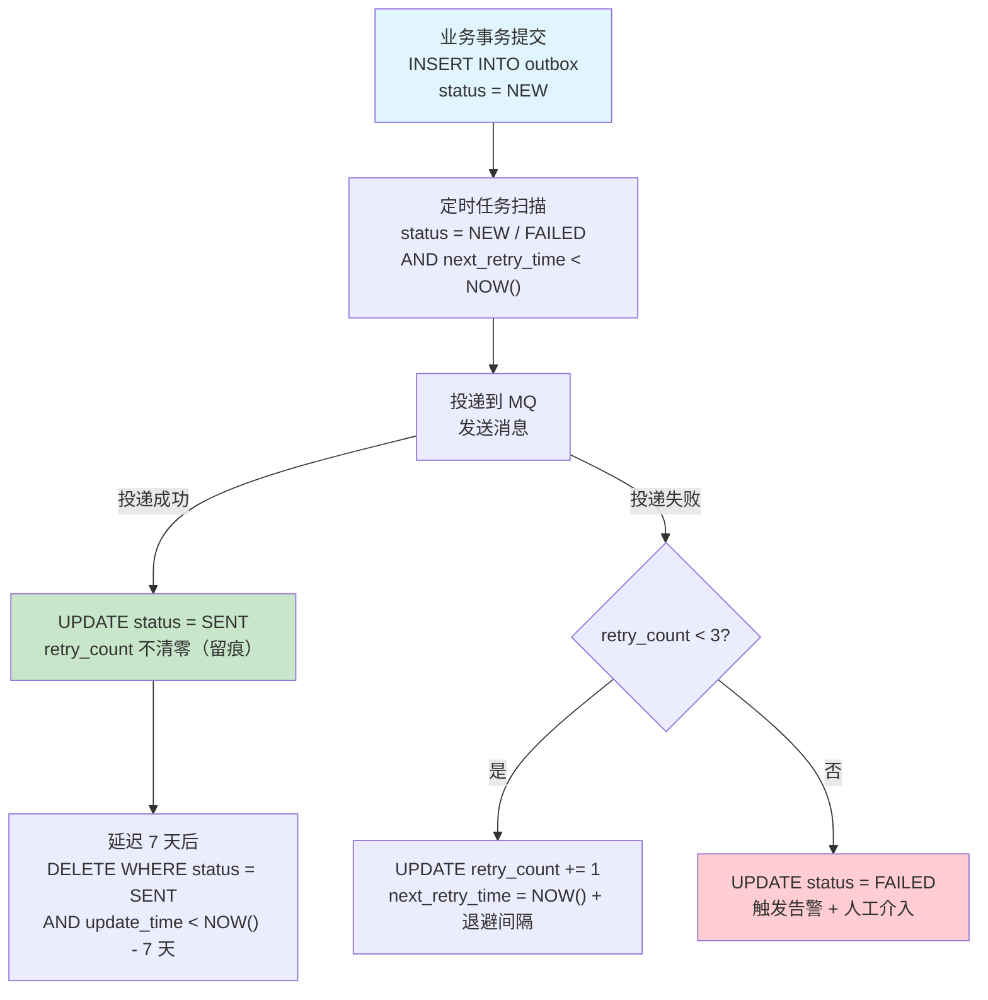
```mermaid
graph TD
    A["业务事务提交<br/>INSERT INTO outbox<br/>status = NEW"] --> B["定时任务扫描<br/>status = NEW / FAILED<br/>AND next_retry_time < NOW()"]
    B --> C["投递到 MQ<br/>发送消息"]
    C -->|"投递成功"| D["UPDATE status = SENT<br/>retry_count 不清零（留痕）"]
    C -->|"投递失败"| E{"retry_count < 3?"}
    E -->|"是"| F["UPDATE retry_count += 1<br/>next_retry_time = NOW() + 退避间隔"]
    E -->|"否"| G["UPDATE status = FAILED<br/>触发告警 + 人工介入"]
    D --> H["延迟 7 天后<br/>DELETE WHERE status = SENT<br/>AND update_time < NOW() - 7 天"]

    style A fill:#e1f5fe
    style D fill:#c8e6c9
    style G fill:#ffcdd2
```

#### 6.3.3 重试策略

| 重试次数 | 间隔 | next_retry_time           |
| :-------: | ---- | ------------------------- |
|  第 1 次  | 10s  | NOW() + 10s               |
|  第 2 次  | 30s  | NOW() + 30s               |
|  第 3 次  | 60s  | NOW() + 60s               |
| 超过 3 次 | —   | status = FAILED，死信处理 |

#### 6.3.4 各服务 Outbox 归属

| 服务           | 发布的事件                                                         | topic                                                                                                                                                   |
| -------------- | ------------------------------------------------------------------ | ------------------------------------------------------------------------------------------------------------------------------------------------------- |
| mall-order     | 订单创建、订单已支付、订单取消、订单已发货、订单已完成、订单已退款 | `mall:order:created` / `mall:order:paid` / `mall:order:cancelled` / `mall:order:delivered` / `mall:order:completed` / `mall:order:refunded` |
| mall-payment   | 支付成功、退款成功、退款失败                                       | `mall:payment:paid` / `mall:refund:succeeded` / `mall:refund:failed`                                                                              |
| mall-product   | 搜索索引同步                                                       | `mall:search:sync`                                                                                                                                    |
| mall-marketing | 优惠券已使用                                                       | `mall:coupon:used`                                                                                                                                    |

#### 6.3.5 关键约束

| 约束           | 说明                                                            |
| -------------- | --------------------------------------------------------------- |
| 同一本地事务   | Outbox INSERT 与业务 UPDATE/INSERT 必须在同一事务               |
| 投递顺序       | 不要求严格顺序，消费方通过状态机 + 幂等保证最终一致             |
| 死信队列       | 每个 topic 对应 `{topic}:dlq`，死信消息人工处理或补偿任务扫描 |
| 过期清理       | SENT 记录延迟 7 天删除，避免表膨胀                              |
| 禁止序列化实体 | payload 必须为精简 DTO，禁止直接放 JPA/MyBatis Entity           |
| payload 格式   | JSON，lowerCamelCase，字段命名同 API 响应体                     |

#### 6.3.6 扫描器实现细节

扫描 SQL（分页 + 乐观锁防重复）：

```sql
-- ① 先抢占待投递记录（乐观锁防多实例）
UPDATE outbox
SET status = 'PENDING', update_time = NOW()
WHERE status IN ('NEW', 'FAILED')
  AND next_retry_time <= NOW()
  AND (status != 'FAILED' OR retry_count < 3)
ORDER BY create_time ASC
LIMIT 100;

-- ② 查询抢占到的记录
SELECT * FROM outbox
WHERE status = 'PENDING'
  AND update_time >= NOW() - INTERVAL 5 SECOND
LIMIT 100;

-- ③ 逐条投递 MQ，成功后标记 SENT
```

| 参数     | 建议值                    | 说明                                              |
| -------- | ------------------------- | ------------------------------------------------- |
| 扫描频率 | 每 5 秒                   | 足够及时，不大幅增加负载                          |
| 单次上限 | 100 条                    | 防止一次投递过多导致 MQ 积压                      |
| 抢占状态 | PENDING                   | 中间状态，防多实例抢同一条                        |
| 死锁兜底 | PENDING 超 60s 回滚到 NEW | 定时任务扫描 PENDING 但 update_time 超 60s 的记录 |

**多实例防重复：** 第①步 `UPDATE ... LIMIT 100` 利用 MySQL 行锁，同一行不会被两个实例同时抢到，再用 `SELECT ... WHERE status = 'PENDING'` 只拿自己抢到的。

#### 6.3.7 退避算法

采用指数退避 + 随机抖动：

```
next_retry_time = NOW() + min(base * 2^(retry_count), max_delay) + random_jitter

// 参数
base = 10s       // 初始间隔
max_delay = 120s // 最大间隔上限
random_jitter = random(0, 5s)  // 随机抖动，避免重试风暴

// 实际间隔
retry_count = 0 → 10s + jitter   // 首次投递失败，10s 后重试
retry_count = 1 → 30s + jitter   // 第 2 次
retry_count = 2 → 60s + jitter   // 第 3 次
retry_count = 3 → 120s + jitter  // 第 4 次（上限）
retry_count ≥ 3 → 不会再有第 4 次，直接 FAILED
```

#### 6.3.8 监控与告警

| 指标                | 采集方式                                                   | 告警阈值 | 说明                   |
| ------------------- | ---------------------------------------------------------- | -------- | ---------------------- |
| Outbox 待投递堆积量 | `SELECT COUNT(*) WHERE status IN ('NEW', 'FAILED')`      | > 1000   | 投递速度跟不上生成速度 |
| FAILED 堆积量       | `SELECT COUNT(*) WHERE status = 'FAILED'`                | > 50     | 人工介入前不得超 50 条 |
| 投递延迟 P99        | `update_time - create_time WHERE status = 'SENT'`        | > 30s    | 消息不能滞后太久       |
| PENDING 超时数量    | `WHERE status = 'PENDING' AND update_time < NOW() - 60s` | > 10     | 投递线程可能卡死       |
| 死信队列深度        | MQ 监控                                                    | > 100    | 消费大规模失败         |
| 投递成功率          | `SENT / 总计扫描`                                        | < 95%    | MQ 可能不可用          |

告警通道：Prometheus AlertManager → 企业微信/钉钉/邮件。

#### 6.3.9 幂等投递保证

三层防护：

| 层                    | 机制                                             | 防护场景                     |
| --------------------- | ------------------------------------------------ | ---------------------------- |
| **扫描抢占**    | `UPDATE ... LIMIT 100` + PENDING 状态          | 多实例同时扫描不抢同一条     |
| **MQ 投递幂等** | message_id 写入 MQ header + 消费端去重           | 投递成功但 ACK 丢失，MQ 重发 |
| **消费幂等**    | 消费方 `messageId + consumerGroup` Redis SETNX | MQ 重发导致重复消费          |

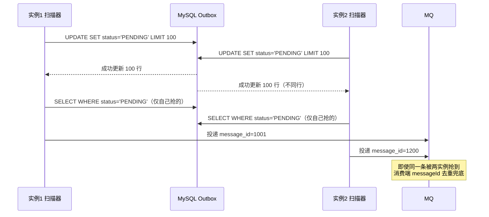
```mermaid
sequenceDiagram
    participant S1 as 实例1 扫描器
    participant DB as MySQL Outbox
    participant S2 as 实例2 扫描器
    participant MQ as MQ

    S1->>DB: UPDATE SET status='PENDING' LIMIT 100
    S2->>DB: UPDATE SET status='PENDING' LIMIT 100
    DB-->>S1: 成功更新 100 行
    DB-->>S2: 成功更新 100 行（不同行）
    S1->>DB: SELECT WHERE status='PENDING'（仅自己抢的）
    S2->>DB: SELECT WHERE status='PENDING'（仅自己抢的）
    S1->>MQ: 投递 message_id=1001
    S2->>MQ: 投递 message_id=1200
    Note over MQ: 即使同一条被两实例抢到<br/>消费端 messageId 去重兜底
```

### 6.4 数据补偿任务

#### 6.4.1 补偿任务全景

| # | 任务            | 触发                 | 扫描条件                                          | 处理                            | 幂等键                    |
| - | --------------- | -------------------- | ------------------------------------------------- | ------------------------------- | ------------------------- |
| 1 | 订单超时关闭    | ruoyi-job 每 30s     | `status=WAIT_PAY AND pay_expire_time<NOW()`     | 关闭订单 + 释放库存/优惠        | `orderNo` + 状态乐观锁  |
| 2 | 支付成功未推进  | ruoyi-job 每 60s     | `payment.status=PAID AND order.status=WAIT_PAY` | 重放 `mall:payment:paid` 事件 | `orderNo` + 状态乐观锁  |
| 3 | Outbox 投递重试 | 各服务定时 每 5s     | `status IN ('NEW','FAILED') AND retry_count<3`  | 重新投递 MQ                     | 参见 5.3.9                |
| 4 | 搜索索引回补    | ruoyi-job 每 5min    | ES `updated_at` ≠ DB `updated_at`            | 重新同步索引                    | `productId` + 写覆盖    |
| 5 | 优惠券过期处理  | ruoyi-job 每小时     | `status=AVAILABLE AND expire_time<NOW()`        | 标记 EXPIRED                    | `couponId` + 状态乐观锁 |
| 6 | Outbox 过期清理 | 各服务定时 每天 1 次 | `status=SENT AND update_time<NOW()-7天`         | 物理删除                        | —                        |

#### 6.4.2 通用约束

| # | 约束                         | 说明                                             |
| - | ---------------------------- | ------------------------------------------------ |
| 1 | **必须幂等**           | 允许重复执行，依赖状态乐观锁或业务幂等键         |
| 2 | **必须告警**           | 连续 3 次失败触发告警，不得静默忽略              |
| 3 | **分页扫描**           | 单次最大 500 条，防止 OOM                        |
| 4 | **禁止并发**           | 同一任务同一时刻只有一个实例执行（分布式锁）     |
| 5 | **补偿不覆盖主动操作** | 状态机保证：`WHERE status = #{expectedStatus}` |

#### 6.4.3 分布式锁保护

补偿任务由 `ruoyi-job` 调度，多实例部署时必须加分布式锁：

```java
String lockKey = "mall:job:lock:order_timeout";
String uuid = UUID.randomUUID().toString();
if (redis.set(lockKey, uuid, "NX", "EX", 120)) {
    try {
        scanAndClose();
    } finally {
        // Lua 脚本释放（仅 value 匹配时删除）
        redis.eval("if redis.call('GET', KEYS[1]) == ARGV[1] then return redis.call('DEL', KEYS[1]) else return 0 end", lockKey, uuid);
    }
}
```

| 任务         | 锁 TTL                   | 说明           |
| ------------ | ------------------------ | -------------- |
| 订单超时关闭 | 120s（实际约 3s 内完成） | TTL 留足余量   |
| 支付补偿扫描 | 120s                     | 同上           |
| 优惠券过期   | 300s                     | 数据量可能较大 |
| 索引回补     | 300s                     | 分页拉取耗时   |

#### 6.4.4 补偿任务告警

| 告警条件                       | 严重程度 | 通知方式      |
| ------------------------------ | :------: | ------------- |
| 任意补偿任务连续 3 次执行失败  |    P2    | 企业微信/钉钉 |
| 单次扫描超时未完成（超锁 TTL） |    P3    | 邮件          |
| FAILED 记录超过阈值（50 条）   |    P2    | 企业微信/钉钉 |
| 死信队列堆积超过阈值           |    P1    | 电话告警      |

---

## 七、安全详细设计

### 7.1 数据加密

#### 7.1.1 需加密的字段

| 字段             | 敏感度 | 加密原因                             |
| ---------------- | :----: | ------------------------------------ |
| 手机号           |   高   | PII，可关联到自然人                  |
| 邮箱             |   高   | PII                                  |
| 身份证号         |  极高  | 法律要求保护                         |
| 真实姓名         |   中   | PII                                  |
| 支付回调原始报文 |   中   | 含第三方交易流水号，对账后可加密归档 |

#### 7.1.2 加密算法

采用 **AES-256-GCM**（Galois/Counter Mode），Java 8+ 原生支持，无需额外依赖。

```java
// 加密
Cipher cipher = Cipher.getInstance("AES/GCM/NoPadding");
GCMParameterSpec gcmSpec = new GCMParameterSpec(128, iv);  // 128-bit 认证标签
cipher.init(Cipher.ENCRYPT_MODE, secretKey, gcmSpec);
byte[] encrypted = cipher.doFinal(plainText.getBytes(StandardCharsets.UTF_8));
// 输出: IV(12字节) + 密文 + 认证标签(16字节)

// 解密
cipher.init(Cipher.DECRYPT_MODE, secretKey, gcmSpec);
byte[] decrypted = cipher.doFinal(encrypted);
```

**约束：**

| 项目             | 要求                                     |
| ---------------- | ---------------------------------------- |
| 密钥长度         | 256 bit                                  |
| IV（初始化向量） | 每次加密随机生成 12 字节，与密文一起存储 |
| IV 重用          | 绝对禁止同一密钥下重复使用同一 IV        |
| 认证标签         | GCM 自动附加，解密时自动校验完整性       |

#### 7.1.3 密钥管理

密钥由 **Nacos** 统一管理，`mall-auth` 作为密钥持有方，其他服务通过 Feign 调用解密接口，不直接持有密钥。

```
Nacos 配置：
mall.security.aes-key = xxxxxxxx（base64 编码的 32 字节密钥）
```

| 约束     | 说明                                   |
| -------- | -------------------------------------- |
| 密钥存储 | 仅存 Nacos，不进代码仓库、不硬编码     |
| 密钥分发 | mall-auth 持有，其他服务 Feign 调解密  |
| 密钥轮换 | 不主动定时轮换，仅在密钥泄漏时手工更换 |

#### 7.1.4 加密字段查询

采用 **SHA256 哈希辅助列** 实现等值匹配：

```sql
-- 建表时同时建哈希列
phone_encrypted varchar(255)  NOT NULL  -- AES-GCM 加密后的密文
phone_hash      varchar(64)   NOT NULL  -- SHA256(phone + salt)

-- 查询时
SELECT * FROM mall_user WHERE phone_hash = SHA2(CONCAT('13800138000', ?), 256)
```

**约束：**

- salt 全局固定，存 Nacos，不走代码
- 仅支持等值匹配，不支持 LIKE 模糊查询
- phone_hash 必须加普通索引，非唯一索引（SHA256 碰撞概率极低但不为零）

#### 7.1.5 解密调用链路

为避免密钥分散到每个服务，解密统一由 `mall-auth` 提供 Feign 接口：

```
服务A（需要解密手机号）→ Feign → mall-auth.decrypt(encryptedData)
                                → mall-auth 用 Nacos 密钥解密
                                → 返回明文
```

| 约束     | 说明                                                       |
| -------- | ---------------------------------------------------------- |
| 批量解密 | 支持一次请求传入最多 50 条，避免多次 Feign 往返            |
| 超时控制 | Feign 超时 2s，失败重试 1 次                               |
| 缓存     | mall-auth 解密后可选缓存明文 1 分钟（Redis），减少重复解密 |

### 7.2 脱敏策略

> 依据：阿里规范【强制】— 用户敏感数据禁止直接展示，必须对展示数据进行脱敏。

#### 7.2.1 脱敏规则

| 数据类型     | 日志中 | C 端 API |     管理端     | 脱敏规则              | 示例                   |
| ------------ | :-----: | :------: | :------------: | --------------------- | ---------------------- |
| 手机号       |   ✅   |    ✅    |     可查看     | 前 3 后 4             | `138****8000`        |
| 邮箱         |   ✅   |    ✅    |     可查看     | 用户名首字符 +`***` | `z***@example.com`   |
| 身份证号     |   ✅   | ❌ 不返 |       ✅       | 前 3 后 4             | `320***********0012` |
| 真实姓名     |   ✅   |    ✅    |     可查看     | 保留首字符            | `张*`                |
| 银行卡号     | ❌ 不存 | ❌ 不返 |       ✅       | 前 4 后 4             | `6222****1234`       |
| 支付回调报文 |   —   | ❌ 不返 | 可查看（审计） | 不脱敏，但加密存储    | —                     |

#### 7.2.2 实现方式：Jackson + AOP 双层组合

**第一层：API 返回脱敏 — Jackson 自定义序列化**

```java
@Retention(RetentionPolicy.RUNTIME)
@JacksonAnnotationsInside
@JsonSerialize(using = SensitiveSerializer.class)
public @interface Sensitive {
    SensitiveType value();  // PHONE / EMAIL / ID_CARD / NAME / BANK_CARD
}
```

```java
// C 端 DTO 加注解，序列化自动脱敏
public class UserProfileDTO {
    @Sensitive(PHONE)  private String phone;       // "13812348000" → "138****8000"
    @Sensitive(EMAIL)  private String email;       // "zhang@example.com" → "z***@example.com"
    @Sensitive(NAME)   private String realName;    // "张三" → "张*"
    private String nickname;    // 非敏感，不脱敏
}
```

管理端需查看完整数据时，使用独立的 `AdminUserDetailDTO`，**不加 @Sensitive**。

**第二层：日志脱敏 — AOP 切面**

```java
@Aspect
@Component
public class DesensitizeLogAspect {
    @Around("@annotation(com.jhstore.mall.common.annotation.DesensitizeLog)")
    public Object around(ProceedingJoinPoint pjp) throws Throwable {
        Object[] args = pjp.getArgs();
        Object[] sanitized = DesensitizeUtil.deepCopyAndMask(args);
        log.info("调用 {}.{} 参数: {}",
            pjp.getSignature().getDeclaringTypeName(),
            pjp.getSignature().getName(),
            JSON.toJSONString(sanitized));
        return pjp.proceed();
    }
}
```

#### 7.2.3 脱敏实现类

```java
public class DesensitizeUtil {
    public static String maskPhone(String phone) {
        if (phone == null || phone.length() != 11) return "****";
        return phone.substring(0, 3) + "****" + phone.substring(7);
    }
    public static String maskEmail(String email) {
        if (email == null || !email.contains("@")) return "****";
        int idx = email.indexOf('@');
        return email.charAt(0) + "***" + email.substring(idx);
    }
    public static String maskIdCard(String idCard) {
        if (idCard == null || idCard.length() < 8) return "****";
        return idCard.substring(0, 3) + "***********" + idCard.substring(idCard.length() - 4);
    }
    public static String maskName(String name) {
        if (name == null || name.isEmpty()) return "**";
        return name.charAt(0) + "*";
    }
    public static String maskBankCard(String cardNo) {
        if (cardNo == null || cardNo.length() < 8) return "****";
        return cardNo.substring(0, 4) + "****" + cardNo.substring(cardNo.length() - 4);
    }
}
```

#### 7.2.4 关键约束

| 约束             | 说明                                                  |
| ---------------- | ----------------------------------------------------- |
| 脱敏不可逆       | 脱敏是单向的，不能从脱敏值还原原始值                  |
| 日志先脱敏再打印 | AOP 在方法执行前完成脱敏，不能打到明文                |
| DTO 分层         | C 端用带 @Sensitive 的 DTO，管理端用无注解的 AdminDTO |
| 内部 Feign 调用  | 服务间调用不脱敏，传输完整数据，由调用方决定是否脱敏  |
| 审计日志         | 审计日志记录操作人 + 操作对象 ID，不记 PII 明文       |

### 7.3 内部请求头签名

#### 7.3.1 防护目标

防止绕过网关直接调用后端服务，以及中间人篡改内部请求头（`X-User-Id`、`X-Admin-Id` 等）。

#### 7.3.2 签名算法

采用 **HMAC-SHA256**，JDK 原生支持，零额外依赖。

**请求头定义：**

| 请求头                   | 示例             | 说明                                        |
| ------------------------ | ---------------- | ------------------------------------------- |
| `X-Internal-Timestamp` | `1715947200`   | Unix 秒级时间戳                             |
| `X-Internal-Nonce`     | `a1b2c3d4e5f6` | 随机 16 位 hex，防重放                      |
| `X-Internal-Signature` | `4f8a2c...`    | HMAC-SHA256(body\|timestamp\|nonce, secret) |

**签名生成（网关侧）：**

```java
String payload = timestamp + "|" + nonce;
if (body != null && !body.isEmpty()) {
    payload += "|" + body;
}
Mac mac = Mac.getInstance("HmacSHA256");
mac.init(new SecretKeySpec(secret.getBytes(StandardCharsets.UTF_8), "HmacSHA256"));
String signature = Hex.encodeHexString(mac.doFinal(payload.getBytes(StandardCharsets.UTF_8)));
```

**验签（服务侧）：**

```java
// 1. 检查时间戳偏差（±5 分钟）
long now = System.currentTimeMillis() / 1000;
if (Math.abs(now - Long.parseLong(timestamp)) > 300) {
    throw new InvalidSignatureException("时间戳偏差过大");
}
// 2. 检查 nonce 是否已使用（Redis SETNX）
if (!redis.setIfAbsent("mall:internal:nonce:" + nonce, "1", Duration.ofMinutes(5))) {
    throw new InvalidSignatureException("nonce 重复使用");
}
// 3. 重新计算签名并对比
String expectedSign = hmacSha256(body, timestamp, nonce, secret);
if (!expectedSign.equals(signature)) {
    throw new InvalidSignatureException("签名验证失败");
}
```

#### 7.3.3 Nonce 防重放

| 项目 | 配置                                               |
| ---- | -------------------------------------------------- |
| 存储 | Redis `SETNX`，key 前缀 `mall:internal:nonce:` |
| TTL  | 5 分钟（与时间戳偏差窗口一致）                     |
| 查询 | O(1)，不随请求量增长                               |

#### 7.3.4 关键约束

| 约束     | 说明                                                                |
| -------- | ------------------------------------------------------------------- |
| 签名密钥 | 仅存 Nacos 配置，不进代码仓库                                       |
| 验签顺序 | 先校验时间戳 → 再校验 nonce → 最后校验签名（短路优化）            |
| 网关职责 | 清理外部 `X-*` 头 → 注入可信内部头 → 生成签名                   |
| 白名单   | 健康检查 `/actuator/health`、回调 `/callback/payment/**` 可免签 |
| 强制要求 | 生产环境必须开启，不允许绕过                                        |

### 7.4 网关安全链路

#### 7.4.1 三条链路概述

| 链路   | 路由前缀         | 认证方式          | 核心检查                           |
| ------ | ---------------- | ----------------- | ---------------------------------- |
| 管理端 | `/admin/**`    | 若依 token + RBAC | token 有效性 → 角色权限 → 权限码 |
| C 端   | `/api/**`      | mall-auth token   | token 有效性 → 用户状态 → 黑名单 |
| 回调   | `/callback/**` | 支付平台验签      | 签名 → IP 白名单 → nonce 防重放  |

#### 7.4.2 限流策略

采用 **Sentinel** 集群流控（项目已集成 Spring Cloud Alibaba Sentinel）。

| 限流维度   | 策略                        | 说明                                 |
| ---------- | --------------------------- | ------------------------------------ |
| 全局 QPS   | 网关层全局限流              | 防止整体过载，默认 10000 QPS         |
| 接口级 QPS | 核心接口独立限流            | 下单 100/s、支付 50/s、搜索 500/s    |
| 用户级     | 同一用户 N 秒内最多 M 次    | 防单人刷接口，如注册 60s 内最多 3 次 |
| IP 级      | 单 IP 限流                  | 防脚本攻击                           |
| 降级       | 触发限流返回 429 +`A0410` | "请求过于频繁，请稍后再试"           |

#### 7.4.3 请求头清洗与注入

网关在转发前按以下顺序处理：

```
① 剥离：删除请求中所有 X-User-*、X-Admin-*、X-Internal-*
② 认证：根据路由前缀选择认证链路
    ├─ /admin/** → 校验若依 token → 解析 adminId + 角色 + 权限码
    ├─ /api/**   → 校验 mall-auth token → 解析 userId + memberId
    └─ /callback/** → 验签 + IP 白名单 + nonce 防重放
③ 注入：写入可信内部请求头
    ├─ X-Request-Id: traceId
    ├─ (管理端) X-Admin-Id: xxx, X-Admin-Roles: [...]
    └─ (C端) X-User-Id: xxx, X-Member-Id: xxx
④ 签名：生成 X-Internal-Timestamp / X-Internal-Nonce / X-Internal-Signature
⑤ 转发：路由到目标服务
```

#### 7.4.4 关键约束

| 约束         | 说明                                                              |
| ------------ | ----------------------------------------------------------------- |
| HTTPS        | 生产环境强制 HTTPS，HTTP 请求直接 403                             |
| X-Request-Id | 网关生成 traceId，全链路透传，用于日志关联                        |
| 回退不降级   | 认证失败不降级到匿名的任何操作；token 校验失败直接 401            |
| 限流提示     | 被限流返回 HTTP 429 +`A0410`，userTip 含重试时间建议            |
| 签名强制     | 内部请求头签名在生产环境不允许关闭                                |
| CSRF         | JWT 存 Header 非 Cookie，天然免疫 CSRF；管理端若依自带 CSRF Token |
| URL 重定向   | 网关禁止响应外部 302 到非白名单域名；后端不直接拼接用户输入做跳转 |

---

## 八、部署与配置

### 8.1 各服务配置清单

> 简写版，详见后续独立部署文档。

| 服务           | 端口 |  DB  |      Redis      |       MQ       |  ES  | 依赖服务                                   |
| -------------- | :--: | :--: | :--------------: | :-------------: | :---: | ------------------------------------------ |
| ruoyi-gateway  | 8080 |  —  |     session     |       —       |  —  | ruoyi-auth, mall-auth                      |
| ruoyi-auth     | 9200 | sys |      token      |       —       |  —  | ruoyi-system                               |
| ruoyi-system   | 9201 | sys |        —        |       —       |  —  | —                                         |
| ruoyi-job      | 9203 | sys |       lock       |       —       |  —  | 各服务 Feign                               |
| ruoyi-file     | 9300 | sys |        —        |       —       |  —  | —                                         |
| mall-auth      | 9210 | mall |      token      |       —       |  —  | —                                         |
| mall-user      | 9301 | mall |      cache      |       —       |  —  | mall-auth(解密)                            |
| mall-product   | 9302 | mall |      cache      |     outbox     |  —  | mall-search                                |
| mall-order     | 9303 | mall | cache+idempotent | outbox+consumer |  —  | mall-product, mall-marketing, mall-payment |
| mall-payment   | 9304 | mall | cache+idempotent | outbox+consumer |  —  | 支付平台                                   |
| mall-marketing | 9305 | mall |      cache      | outbox+consumer |  —  | —                                         |
| mall-search    | 9306 |  —  |       lock       |    consumer    | index | mall-product                               |

### 8.2 Nacos 配置项

> 简写版，列出关键配置项，完整配置见后续部署文档。

```yaml
# --- 安全 ---
mall.security.aes-key: ${AES_KEY}
mall.security.internal-sign-secret: ${SIGN_KEY}
mall.security.jwt-secret: ${JWT_SECRET}

# --- 订单 ---
mall.order.pay-expire-minutes: 30
mall.order.timeout-scan-interval: 30
mall.order.timeout-batch-size: 500

# --- 支付 ---
mall.payment.callback.timeout: 30
mall.payment.channels: wechat,alipay
```

### 8.3 测试环境内存配置

#### 8.3.1 6GB 虚拟机（推荐，全量启动）

| 组件                |     内存     | JVM / 配置                      |
| ------------------- | :-----------: | ------------------------------- |
| MySQL 8.0           |     384MB     | `innodb_buffer_pool_size=64M` |
| Redis 7.4           |     128MB     | `maxmemory 128mb`             |
| RocketMQ NameServer |     128MB     | `-Xms128m -Xmx128m`           |
| RocketMQ Broker     |     384MB     | `-Xms256m -Xmx384m`           |
| Nacos 3.2           |     256MB     | `-Xms256m -Xmx256m`，单机     |
| Elasticsearch 8.x   |     512MB     | `-Xms512m -Xmx512m`，单节点   |
| Java 服务 × 12     |     1.5GB     | 每个 `-Xmx128m`               |
| OS + Docker         |     500MB     | —                              |
| 余量                |    ~2.4GB    |                                 |
| **合计**      | **6GB** |                                 |

#### 8.3.2 4GB 虚拟机（极限压缩）

| 组件                |      内存      | JVM / 配置                                              |
| ------------------- | :-------------: | ------------------------------------------------------- |
| MySQL 8.0           |      256MB      | `innodb_buffer_pool_size=32M`                         |
| Redis 7.4           |      128MB      | `maxmemory 128mb`                                     |
| RocketMQ NameServer |      128MB      | `-Xms128m -Xmx128m`                                   |
| RocketMQ Broker     |      256MB      | `-Xms128m -Xmx256m`                                   |
| Nacos 3.2           |      256MB      | `-Xms256m -Xmx256m`，单机                             |
| Elasticsearch 8.x   | **384MB** | `-Xms128m -Xmx256m`，`bootstrap.memory_lock: false` |
| Java 服务 × 12     |      1.5GB      | 每个 `-Xmx128m`                                       |
| OS + Docker         |      500MB      | —                                                      |
| 余量                |     ~600MB     |                                                         |
| **合计**      |  **4GB**  |                                                         |

> **4GB 注意：** ES 极限压缩，仅支持百条级测试数据；出现 OOM 时适当减少索引或调大 `-Xmx`。

#### 8.3.3 Docker Compose 概览

```yaml
services:
  nacos:         image: nacos/nacos-server:v3.2.1
  mysql:         image: mysql:8.0
  redis:         image: redis:7.4.9
  rocketmq:      image: apache/rocketmq:5.x
  elasticsearch: image: elasticsearch:8.x
```

完整编排和具体 JVM 参数见 `deploy/docker/` 目录。
