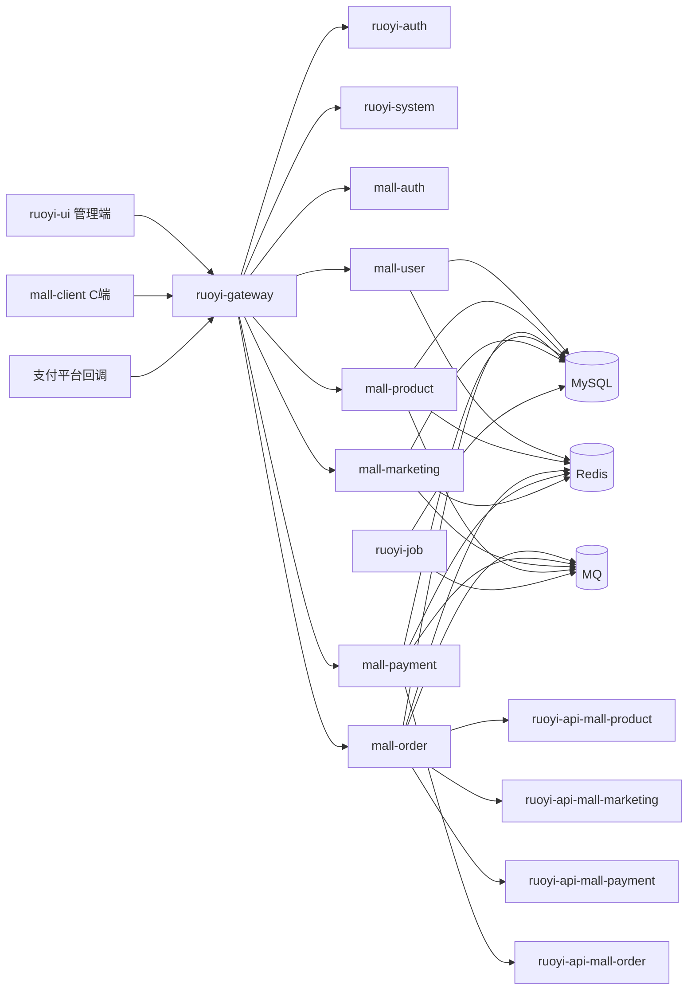
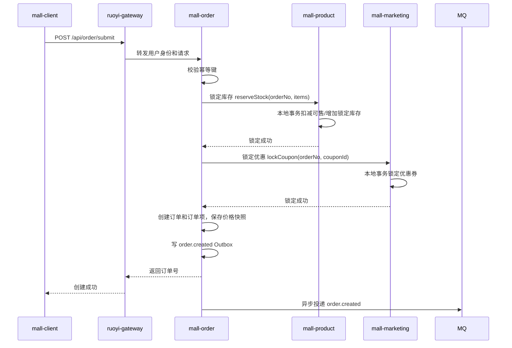
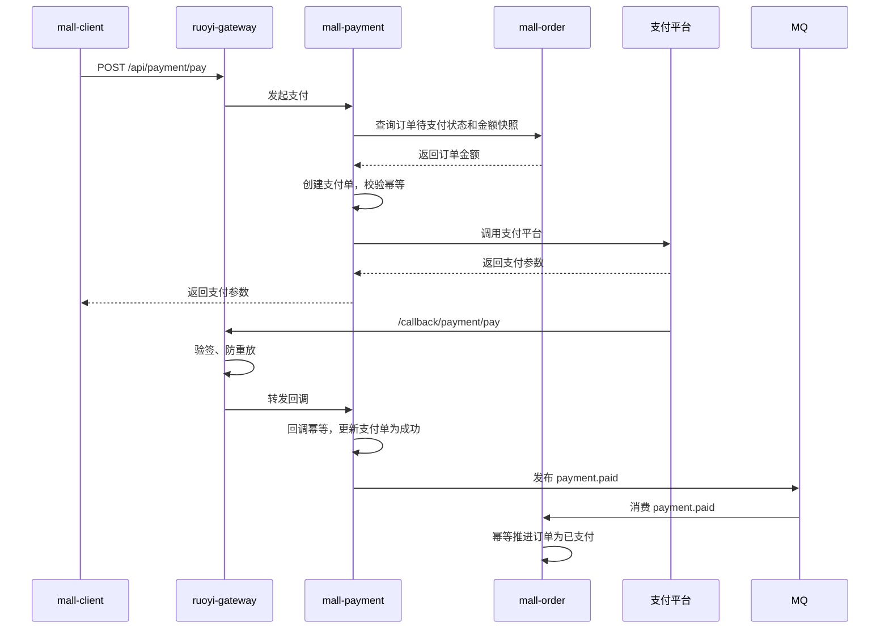

# 商城系统架构设计

## 1. 文档定位

本文档定义一个基于若依生态扩展商城业务的项目架构。它不是单纯的目录树，而是约束代码边界、运行时拓扑、认证授权、数据一致性、部署运维和核心业务链路的架构基线。

目标是：

- 保留若依完整工程结构，复用若依已有网关、认证、公共模块、文件、任务、监控等全局能力。
- 商城业务只做逻辑拆分，不额外物理拆出 `platform/`、`common/` 等平行工程。
- 商城业务域独立演进，服务边界清晰，依赖关系可控。
- 管理端和 C 端的认证、权限、限流、审计边界清晰。
- 下单、支付、退款、库存、优惠券等核心链路具备可恢复、可追踪、可补偿能力。
- 数据库实体类 `domain/` 按微服务模块归属拆分，避免跨服务共享表模型。

## 2. 架构原则

### 2.1 若依作为完整管理框架

若依负责网关、认证、管理员、角色、菜单、权限、公共工具、文件、任务、监控等管理和基础能力。商城业务在若依工程内按业务域新增模块，复用若依全局能力，但不把商城业务规则写入若依系统管理模块。

约束：

- 保留若依原生物理结构，不新增平行的 `platform/`、`common/` 根目录承载若依已有能力。
- 商城后端模块放在 `ruoyi-modules/mall-*` 下，和 `ruoyi-system`、`ruoyi-job`、`ruoyi-file` 保持同级模块关系。
- 全局技术能力直接复用 `ruoyi-common-*`，例如返回结构、异常、Redis、日志、安全上下文、Feign、Swagger、MyBatis 等。
- 服务间契约放在 `ruoyi-api/ruoyi-api-mall-*`，只放 Feign Client、DTO、事件对象和必要枚举。
- 商城业务规则、订单状态、支付规则、优惠规则不能写入 `ruoyi-common-*` 或 `ruoyi-system`。
- 如必须读取若依管理员、角色、权限信息，通过 `ruoyi-api-system` 契约或网关注入身份完成，不跨模块直接访问 `ruoyi-system` 表。

### 2.2 网关复用若依网关

统一网关复用 `ruoyi-gateway`。商城只在网关配置中增加路由、白名单、限流和过滤链，不另建 `platform-gateway`。

网关职责：

- 路由转发。
- 管理端认证链路。
- C 端认证链路。
- 外部回调验签链路。
- 限流、黑白名单、请求日志、traceId 注入。

网关不负责：

- 复杂业务判断。
- 数据库访问。
- 跨服务事务编排。
- 把认证失败包装成业务成功。

### 2.3 服务拥有自己的数据

每个服务拥有自己的表和业务状态。服务之间不能跨库跨表 join，不能直接读写对方表。

早期可以物理上共用一个 MySQL 实例甚至同一个 schema，但必须通过表前缀、迁移目录、Mapper 包和 `domain/` 实体归属保持逻辑隔离。

数据库实体类约束：

- `domain/` 是数据库实体类目录，对应本服务拥有的 MySQL 表。
- `mall-user` 的用户、会员、地址实体只放在 `mall-user/domain`。
- `mall-product` 的商品、SKU、库存实体只放在 `mall-product/domain`。
- `mall-order` 的购物车、订单、订单项、售后实体只放在 `mall-order/domain`。
- `mall-payment` 的支付单、退款单、渠道流水实体只放在 `mall-payment/domain`。
- `mall-marketing` 的优惠券、活动、核销记录实体只放在 `mall-marketing/domain`。
- 任何 `domain` 实体不能放入 `ruoyi-api-*` 或 `ruoyi-common-*`。

### 2.4 API 契约不暴露数据库实体

服务间调用只使用契约 DTO、事件对象和客户端接口。数据库实体、Mapper、Service 实现、前端 VO 不能放进 `ruoyi-api-*`。

### 2.5 关键链路用最终一致性

商城核心链路默认采用本地事务 + 可靠消息 + 幂等 + 补偿任务。除非有强监管或强一致要求，不默认引入全局 XA 事务。

### 2.6 服务拆分适度

当前只做逻辑服务拆分，保留用户、商品、订单、支付、营销五个核心商城模块。购物车、售后等先放入订单域内部，业务复杂后再拆。避免一开始拆出过多独立工程、独立公共包或独立平台层导致调用链、事务和部署复杂度失控。

## 3. 推荐目录结构

```text
your-project-root/
├─ README.md
├─ pom.xml                         # 根 POM，只做模块聚合和 dependencyManagement
├─ docker-compose.yml              # 本地开发依赖：Nacos、MySQL、Redis、MQ 等
├─ .gitignore
│
├─ docs/                           # 架构、接口、部署、ADR、数据库说明
│  ├─ architecture.md
│  ├─ api.md
│  ├─ deploy.md
│  ├─ database.md
│  └─ adr/
│
├─ deploy/                         # 部署资产
│  ├─ docker/
│  ├─ k8s/
│  ├─ nginx/
│  └─ nacos/
│
├─ db/                             # 数据库迁移脚本，按服务归档
│  ├─ ruoyi/
│  ├─ mall-user/
│  ├─ mall-product/
│  ├─ mall-order/
│  ├─ mall-payment/
│  └─ mall-marketing/
│
├─ ruoyi-gateway/                  # 复用若依网关，新增商城路由和安全过滤链
├─ ruoyi-auth/                     # 复用若依管理端认证
│
├─ ruoyi-api/                      # 复用若依 API 聚合目录，新增商城服务契约
│  ├─ ruoyi-api-system/            # 若依系统服务契约
│  ├─ ruoyi-api-mall-user/         # 商城用户服务契约，不放数据库实体
│  ├─ ruoyi-api-mall-product/      # 商品服务契约，不放数据库实体
│  ├─ ruoyi-api-mall-order/        # 订单服务契约，不放数据库实体
│  ├─ ruoyi-api-mall-payment/      # 支付服务契约，不放数据库实体
│  └─ ruoyi-api-mall-marketing/    # 营销服务契约，不放数据库实体
│
├─ ruoyi-common/                   # 复用若依全局公共模块，不另建 common
│  ├─ ruoyi-common-core/           # 返回结构、异常、工具、基础上下文
│  ├─ ruoyi-common-redis/          # Redis 能力
│  ├─ ruoyi-common-security/       # 安全上下文、权限注解、Token 基础能力
│  ├─ ruoyi-common-log/            # 操作日志、审计日志能力
│  ├─ ruoyi-common-swagger/        # OpenAPI/Swagger 配置
│  ├─ ruoyi-common-datascope/      # 数据权限
│  ├─ ruoyi-common-datasource/     # 多数据源能力，如项目已有则复用
│  └─ ruoyi-common-seata/          # 如项目已有且确需使用，再按场景启用
│
├─ ruoyi-modules/                  # 业务服务模块目录，商城只在这里做逻辑拆分
│  ├─ ruoyi-system/                # 若依系统管理，尽量不写商城业务
│  ├─ ruoyi-gen/                   # 复用若依代码生成
│  ├─ ruoyi-job/                   # 复用若依任务调度，承载补偿、对账、清理任务
│  ├─ ruoyi-file/                  # 复用若依文件服务，封装本地、OSS、MinIO 等
│  ├─ mall-auth/                   # C 端认证中心，独立于管理端认证逻辑
│  ├─ mall-user/                   # 用户、会员、地址、成长值、积分账户
│  │  └─ src/main/java/com/yourcompany/mall/user/domain/
│  ├─ mall-product/                # 商品、类目、SKU、库存、价格基础信息
│  │  └─ src/main/java/com/yourcompany/mall/product/domain/
│  ├─ mall-order/                  # 购物车、订单、订单项、售后申请、订单状态机
│  │  └─ src/main/java/com/yourcompany/mall/order/domain/
│  ├─ mall-payment/                # 支付单、退款单、支付渠道、回调、对账
│  │  └─ src/main/java/com/yourcompany/mall/payment/domain/
│  └─ mall-marketing/              # 优惠券、活动、促销计算、权益核销
│     └─ src/main/java/com/yourcompany/mall/marketing/domain/
│
├─ ruoyi-visual/                   # 复用若依监控、链路、注册中心控制台等可视化能力
├─ ruoyi-ui/                       # 管理端前端，基于若依 UI 扩展商城菜单
│
└─ mall-client/                    # C 端前端，Uni-app 或其他多端方案
```

说明：

- 这里的拆分是若依工程内的模块拆分，不是把若依拆成 `platform`、`common`、`mall` 三套独立工程。
- `ruoyi-common-*`、`ruoyi-gateway`、`ruoyi-job`、`ruoyi-file` 等已有模块直接复用，除非确实缺少通用能力才在原模块内按若依规范扩展。
- `domain/` 只出现在具体服务实现模块中，表示本服务拥有的数据库实体类；`ruoyi-api-*` 只能放 DTO、事件和客户端契约。

## 4. 模块依赖规则

### 4.1 允许的依赖方向

```text
ruoyi-ui / mall-client
  -> ruoyi-gateway
    -> ruoyi-auth / ruoyi-system
    -> mall-auth / mall-* services

mall-* services
  -> ruoyi-common-*
  -> ruoyi-api-mall-*
  -> other ruoyi-api-mall-* when necessary
  -> ruoyi-api-system when administrator/user contract is required
  -> ruoyi-file / MQ / Redis / MySQL

ruoyi-*
  -> ruoyi-common-*
  -> ruoyi-api-*

ruoyi-job
  -> mall service API or HTTP endpoint when compensation/check tasks are required
```

### 4.2 禁止的依赖

- `mall-*` 禁止依赖其他商城服务的实现模块，例如 `mall-order` 不能依赖 `mall-product`。
- `ruoyi-api-mall-*` 禁止放 `Entity`、`Mapper`、`ServiceImpl`、Controller VO。
- `ruoyi-common-*` 禁止放商城订单状态、支付渠道业务规则、优惠券规则等业务语义。
- `ruoyi-system` 禁止承载商城订单、商品、支付、营销等业务表和业务流程。
- `domain/` 数据库实体禁止上移到公共模块，必须保留在拥有该表的微服务模块内。
- 网关禁止依赖 Mapper 或业务 Service。

### 4.3 API 契约包规范

每个 `ruoyi-api-mall-xxx` 推荐结构：

```text
ruoyi-api-mall-product/
└─ src/main/java/com/yourcompany/mall/product/api/
   ├─ client/                     # Feign Client 或 RPC Client
   ├─ dto/                        # 服务间请求与响应 DTO
   ├─ event/                      # 对外发布的领域事件
   ├─ enums/                      # 仅限跨服务必须共享的枚举
   └─ fallback/                   # 降级实现，必须显式失败或返回可识别状态
```

不允许：

```text
domain/
Entity
mapper/
service/
controller/
vo/
```

## 5. 运行时架构



## 6. 网关与路由设计

### 6.1 路由前缀

| 路由 | 目标 | 认证链路 | 说明 |
| --- | --- | --- | --- |
| `/admin/auth/**` | `ruoyi-auth` | 管理端登录 | 管理员登录、刷新 token |
| `/admin/system/**` | `ruoyi-system` | 管理端 token + RBAC | 若依系统管理能力 |
| `/admin/mall/user/**` | `mall-user` | 管理端 token + 权限码 | 商城用户管理 |
| `/admin/mall/product/**` | `mall-product` | 管理端 token + 权限码 | 商品后台管理 |
| `/admin/mall/order/**` | `mall-order` | 管理端 token + 权限码 | 订单后台管理 |
| `/admin/mall/payment/**` | `mall-payment` | 管理端 token + 权限码 | 支付与退款后台管理 |
| `/admin/mall/marketing/**` | `mall-marketing` | 管理端 token + 权限码 | 营销后台管理 |
| `/api/auth/**` | `mall-auth` | C 端登录 | 手机号、微信、小程序等登录 |
| `/api/user/**` | `mall-user` | C 端 token | 用户资料、地址、会员 |
| `/api/product/**` | `mall-product` | 可匿名或 C 端 token | 商品浏览、详情 |
| `/api/order/**` | `mall-order` | C 端 token | 购物车、下单、订单查询 |
| `/api/payment/**` | `mall-payment` | C 端 token | 支付发起、支付状态查询 |
| `/api/marketing/**` | `mall-marketing` | C 端 token | 领券、活动、权益 |
| `/callback/payment/**` | `mall-payment` | 支付平台验签 | 支付、退款回调 |

### 6.2 网关安全链路

管理端链路：

1. 校验管理端 token。
2. 解析管理员 ID、角色、权限码。
3. 校验路由权限。
4. 注入内部请求头：`X-User-Type=ADMIN`、`X-Admin-Id`、`X-Request-Id`。
5. 转发到后端服务。

C 端链路：

1. 校验 C 端 token。
2. 解析用户 ID、会员 ID、设备 ID。
3. 校验用户状态、登录态、黑名单。
4. 注入内部请求头：`X-User-Type=MEMBER`、`X-User-Id`、`X-Member-Id`、`X-Request-Id`。
5. 转发到后端服务。

回调链路：

1. 不接受普通用户 token。
2. 校验支付平台签名、时间戳、nonce、防重放。
3. 校验回调 IP 白名单或平台证书。
4. 将原始报文落库或入日志，便于对账追溯。
5. 转发到 `mall-payment`。

### 6.3 内部请求头保护

业务服务不能盲信外部传入的 `X-User-Id`。网关必须在转发前清理所有外部 `X-User-*`、`X-Admin-*`、`X-Internal-*` 请求头，再注入可信头。

生产环境建议增加内部签名头：

```text
X-Internal-Timestamp
X-Internal-Nonce
X-Internal-Signature
```

服务端使用共享密钥或网关私钥验证签名，避免绕过网关直接调用服务。

### 6.4 网关部署形态

代码层保留若依原生 `ruoyi-gateway` 模块，便于统一路由、限流、日志和安全能力。生产部署可以按 profile 拆成两个运行实例：

```text
admin-gateway    只暴露 /admin/**
api-gateway      只暴露 /api/** 和 /callback/**
```

这样可以让管理端和 C 端使用不同域名、证书、限流策略、网络入口和发布节奏。即使早期部署为同一个 `ruoyi-gateway` 进程，也必须在配置上保持两套独立 filter chain。

## 7. 认证与权限设计

### 7.1 管理端认证

管理端认证由 `ruoyi-auth` 负责。权限模型沿用若依的用户、角色、菜单、权限码。

商城后台接口必须绑定权限码，例如：

```text
mall:user:list
mall:user:detail
mall:product:create
mall:product:update
mall:order:list
mall:order:refund
mall:marketing:coupon:issue
```

商城服务只接收网关注入的管理员身份，不直接解析若依内部 session 结构。

### 7.2 C 端认证

C 端认证由 `mall-auth` 负责，独立于管理端。

要求：

- C 端 token 与管理端 token 使用不同 issuer、secret、Redis key 前缀。
- 支持多端登录策略：互踢、多端共存、设备级失效需要明确。
- C 端用户状态变更后，应支持主动踢下线。
- 登录、绑定手机号、换绑、注销账号要有审计日志。

### 7.3 权限分层

| 层级 | 负责内容 |
| --- | --- |
| 网关 | token 校验、路由级权限、限流、黑白名单 |
| Controller | 参数校验、权限注解、资源归属快速校验 |
| Service | 业务权限、状态机校验、幂等校验 |
| DAO | 只负责数据访问，不做业务权限决策 |

## 8. 服务边界

### 8.1 `mall-user`

职责：

- C 端用户账号。
- 会员资料。
- 地址簿。
- 积分账户和成长值账户。
- 用户状态、注销、黑名单。

不负责：

- 订单历史统计的最终口径。
- 优惠券核销规则。
- 支付账户流水。

### 8.2 `mall-product`

职责：

- 类目、品牌、SPU、SKU。
- 商品上下架。
- SKU 库存。
- 商品基础价格。
- 商品缓存和搜索索引同步。

不负责：

- 订单成交价。
- 优惠后价格。
- 支付金额。

订单必须保存商品名称、SKU、图片、成交价等快照，不能在历史订单展示时依赖实时商品数据。

### 8.3 `mall-order`

职责：

- 购物车。
- 订单创建。
- 订单项。
- 订单状态机。
- 订单价格快照。
- 订单取消、超时关闭。
- 售后申请状态，退款业务单。

不负责：

- 实际支付渠道交互。
- 真实退款通道调用。
- 商品库存最终存储。

`mall-order` 是下单链路编排方，但不拥有商品库存和支付流水。

### 8.4 `mall-payment`

职责：

- 支付单。
- 退款单。
- 支付渠道配置。
- 支付发起。
- 支付回调。
- 退款回调。
- 对账。

不负责：

- 修改商品库存。
- 直接修改用户积分。
- 绕过订单服务修改订单业务状态。

支付成功后通过事件或订单 API 通知 `mall-order`，由订单服务根据状态机推进订单状态。

### 8.5 `mall-marketing`

职责：

- 优惠券。
- 活动。
- 促销规则。
- 优惠试算。
- 优惠锁定。
- 优惠核销。
- 优惠释放。

不负责：

- 订单最终金额落库。
- 支付金额确认。

订单创建时，`mall-order` 调用 `mall-marketing` 进行优惠试算和锁定，最终金额由订单服务落快照。

## 9. 数据架构

### 9.1 数据库归属

推荐同库表前缀，后续数据量或治理要求上来后再演进为独立 schema：

| 服务 | 逻辑库或表前缀 | 说明 |
| --- | --- | --- |
| `ruoyi-system` | `sys_*` | 若依系统表 |
| `mall-user` | `mall_user_*`、`mall_member_*` | 用户、会员、地址、积分 |
| `mall-product` | `mall_product_*`、`mall_sku_*` | 商品、SKU、库存 |
| `mall-order` | `mall_order_*`、`mall_cart_*`、`mall_after_sale_*` | 购物车、订单、售后 |
| `mall-payment` | `mall_payment_*`、`mall_refund_*` | 支付、退款、回调、对账 |
| `mall-marketing` | `mall_coupon_*`、`mall_promotion_*` | 优惠券、活动 |

早期建议部署在同一个 MySQL 实例和同一个 schema 中，通过表前缀、Mapper 包、`domain/` 实体目录和迁移脚本目录隔离访问范围。不要为了形式上的微服务边界过早拆数据源或拆库。

### 9.2 基础字段

业务表建议统一字段：

```text
id                  bigint primary key
create_time         datetime
update_time         datetime
create_by           varchar
update_by           varchar
deleted             tinyint
version             int
remark              varchar
```

订单、支付、退款、优惠券核销等关键表额外要求：

```text
biz_no              varchar unique      # 业务单号
request_id          varchar             # 请求追踪
idempotent_key      varchar             # 幂等键
status              varchar/int         # 状态机状态
status_reason       varchar             # 状态原因
```

### 9.3 数据迁移

数据库变更必须放在 `db/{service}/` 下，按版本递增：

```text
db/mall-order/
├─ V1.0.0__create_order_tables.sql
├─ V1.0.1__add_order_timeout_index.sql
└─ V1.1.0__create_after_sale_tables.sql
```

要求：

- 禁止手工改生产表后不提交迁移脚本。
- 索引变更需要说明查询场景。
- 大表 DDL 必须有灰度或在线变更方案。

### 9.4 Redis Key 规范

```text
{system}:{service}:{biz}:{id}

mall:user:token:{token}
mall:user:profile:{userId}
mall:product:sku:{skuId}
mall:order:idempotent:{key}
mall:payment:callback:{channel}:{tradeNo}
mall:marketing:coupon_lock:{orderNo}
```

要求：

- 所有 key 必须有明确 TTL 或明确说明永久保存原因。
- 分布式锁必须设置过期时间和唯一 value。
- 不能用 Redis 作为唯一事实来源，核心状态必须落 MySQL。

## 10. 一致性与事务设计

### 10.1 基本策略

默认策略：

```text
本地事务提交业务状态
  -> 写 Outbox 消息
  -> 异步投递 MQ
  -> 消费方幂等处理
  -> 失败进入重试或补偿任务
```

不默认使用全局分布式事务。跨服务状态通过业务状态机、可靠消息和补偿任务达成最终一致。

### 10.2 幂等要求

必须做幂等的场景：

- 创建订单。
- 锁库存。
- 锁优惠券。
- 发起支付。
- 支付回调。
- 退款申请。
- 退款回调。
- 积分发放。
- MQ 消费。

幂等键建议：

```text
用户请求：userId + clientRequestNo
订单操作：orderNo + action
支付回调：channel + tradeNo + eventType
退款回调：channel + refundNo + eventType
MQ 消费：messageId + consumerGroup
```

### 10.3 Outbox 表

每个需要发布事件的服务维护本地 Outbox 表：

```text
id
message_id
topic
event_type
aggregate_type
aggregate_id
payload
status              # NEW/SENT/FAILED
retry_count
next_retry_time
create_time
update_time
```

业务状态和 Outbox 消息必须在同一个本地事务中提交。投递器异步扫描并发送 MQ。

### 10.4 核心事件

```text
mall.order.created
mall.order.cancelled
mall.order.paid
mall.order.completed
mall.stock.reserved
mall.stock.released
mall.payment.created
mall.payment.paid
mall.payment.failed
mall.refund.created
mall.refund.succeeded
mall.coupon.locked
mall.coupon.used
mall.coupon.released
```

事件 payload 使用稳定 DTO，不直接序列化数据库实体。

## 11. 核心业务链路

### 11.1 下单链路



失败处理：

- 库存锁定失败：直接返回库存不足。
- 优惠锁定失败：释放库存，返回优惠不可用。
- 订单创建失败：释放库存和优惠。
- 网络超时：客户端用同一幂等键查询或重试。

### 11.2 支付链路



要求：

- 支付金额必须以订单快照为准，不能实时重新计算。
- 支付回调必须先落库再响应支付平台。
- 支付成功事件重复消费不能导致订单重复推进。
- 支付单成功但订单未成功时，由补偿任务重放 `payment.paid`。

### 11.3 订单超时关闭

1. `mall-order` 创建待支付订单时记录 `pay_expire_time`。
2. `ruoyi-job` 定时扫描超时未支付订单。
3. `mall-order` 幂等关闭订单。
4. 发布 `mall.order.cancelled`。
5. `mall-product` 释放库存。
6. `mall-marketing` 释放优惠券。

### 11.4 退款链路

1. 用户或管理员在 `mall-order` 发起售后或退款申请。
2. `mall-order` 校验订单状态，生成退款业务单。
3. `mall-payment` 创建退款单并调用支付渠道。
4. 支付渠道回调退款结果。
5. `mall-payment` 发布 `mall.refund.succeeded`。
6. `mall-order` 推进售后状态，必要时触发库存、积分、优惠补偿。

## 12. 状态机设计

### 12.1 订单状态

```text
CREATED        已创建，待支付
PAID           已支付，待发货或待履约
DELIVERING     履约中
COMPLETED      已完成
CANCELLED      已取消
CLOSED         已关闭
REFUNDING      退款中
REFUNDED       已退款
```

所有状态变更必须通过状态机方法完成，禁止直接 update 状态字段。

### 12.2 支付状态

```text
INIT
PAYING
SUCCESS
FAILED
CLOSED
REFUNDING
REFUNDED
```

### 12.3 优惠券记录状态

```text
AVAILABLE
LOCKED
USED
RELEASED
EXPIRED
```

## 13. 前端架构

### 13.1 管理端 `ruoyi-ui`

管理端基于若依 UI 扩展商城菜单。

目录建议：

```text
ruoyi-ui/src/
├─ api/
│  ├─ system/
│  └─ mall/
│     ├─ user/
│     ├─ product/
│     ├─ order/
│     ├─ payment/
│     └─ marketing/
├─ views/
│  ├─ system/
│  └─ mall/
│     ├─ user/
│     ├─ product/
│     ├─ order/
│     ├─ payment/
│     └─ marketing/
└─ router/
```

约束：

- 若依原生页面尽量不改。
- 商城页面统一放在 `views/mall`。
- 商城接口统一调用 `/admin/mall/**`。
- 权限按钮使用若依权限码体系。

### 13.2 C 端 `mall-client`

目录建议：

```text
mall-client/
├─ pages/
│  ├─ index/
│  ├─ product/
│  ├─ cart/
│  ├─ order/
│  ├─ payment/
│  └─ mine/
├─ components/
├─ api/
├─ store/
├─ utils/
├─ static/
├─ manifest.json
└─ pages.json
```

约束：

- C 端接口统一调用 `/api/**`。
- 支付结果页不能只信前端回跳，必须查询服务端支付状态。
- 下单、支付、领券等写操作必须带 `clientRequestNo`。

## 14. 可观测性

### 14.1 日志

所有服务输出结构化日志，至少包含：

```text
traceId
spanId
requestId
userType
userId/adminId
service
uri
method
status
costMs
bizNo
errorCode
```

敏感字段禁止明文输出：

- 手机号。
- 身份证。
- 地址。
- token。
- 支付平台密钥。
- 回调原始签名密钥。

### 14.2 链路追踪

网关生成或透传 `X-Request-Id`。Feign、MQ、Job 调用都必须透传 traceId。

### 14.3 指标

核心指标：

- QPS、错误率、P95/P99 延迟。
- 下单成功率。
- 支付成功率。
- 支付回调延迟。
- 库存锁定失败率。
- 优惠券锁定失败率。
- MQ 积压量。
- Outbox 重试量。
- 订单超时关闭数量。
- 退款成功率。

### 14.4 告警

必须告警：

- 支付成功但订单未支付超过阈值。
- Outbox 消息连续投递失败。
- MQ 死信增加。
- 支付回调验签失败突增。
- 库存扣减失败突增。
- 订单创建错误率突增。

## 15. 稳定性设计

### 15.1 超时

Feign 调用必须配置连接超时和读取超时。禁止默认无限等待。

建议起点：

```text
连接超时：1s
读取超时：3s
支付渠道调用：5s-10s，按渠道单独配置
```

### 15.2 熔断与降级

降级原则：

- 查询类接口可以返回缓存或明确的降级提示。
- 写操作不能伪成功。
- 支付、退款、库存、优惠券相关接口降级必须返回明确失败或处理中状态。

### 15.3 限流

网关限流维度：

- IP。
- 用户 ID。
- 设备 ID。
- 接口路径。
- 活动 ID。

高风险接口：

- 登录。
- 发送验证码。
- 领券。
- 下单。
- 支付。
- 支付回调。

## 16. 部署架构

### 16.1 本地开发

`docker-compose.yml` 启动基础依赖：

```text
Nacos
MySQL
Redis
MQ
MinIO
```

本地服务可按需启动：

```text
ruoyi-gateway
ruoyi-auth
ruoyi-system
ruoyi-job
ruoyi-file
mall-auth
mall-user
mall-product
mall-order
mall-payment
mall-marketing
```

### 16.2 环境划分

```text
dev        本地和开发联调
test       测试环境
staging    预发环境，连接准生产依赖或沙箱支付
prod       生产环境
```

配置必须按环境隔离：

- Nacos namespace。
- Redis database 或 key prefix。
- MySQL 实例或 schema。
- 支付渠道配置。
- OSS/MinIO bucket。
- 日志索引。

### 16.3 服务端口建议

| 服务 | 端口 |
| --- | --- |
| `ruoyi-gateway` | 8080 |
| `ruoyi-auth` | 9200 |
| `ruoyi-system` | 9201 |
| `mall-auth` | 9210 |
| `ruoyi-visual` | 9100 |
| `ruoyi-job` | 9203 |
| `ruoyi-file` | 9300 |
| `mall-user` | 9301 |
| `mall-product` | 9302 |
| `mall-order` | 9303 |
| `mall-payment` | 9304 |
| `mall-marketing` | 9305 |

端口只作为本地开发约定，生产环境以服务发现名称为准。

## 17. 配置与密钥管理

配置分类：

- 普通配置：Nacos。
- 敏感配置：密钥管理系统或环境变量注入。
- 本地开发密钥：`.env.local`，禁止提交 Git。

敏感配置包括：

- JWT secret。
- 支付商户私钥。
- 支付平台证书。
- OSS access key。
- 数据库密码。
- Redis 密码。
- 内部请求签名密钥。

要求：

- 生产密钥不能出现在 `application.yml`。
- 日志不能打印完整配置。
- 密钥轮换要支持双 key 过渡。

## 18. 测试策略

### 18.1 单元测试

重点覆盖：

- 订单状态机。
- 支付状态机。
- 优惠券锁定与释放。
- 库存锁定与释放。
- 金额计算。
- 幂等逻辑。

### 18.2 集成测试

重点覆盖：

- 下单成功。
- 库存不足。
- 优惠券不可用。
- 支付成功回调。
- 支付重复回调。
- 订单超时关闭。
- 退款成功。

### 18.3 契约测试

`ruoyi-api-mall-*` 的 DTO、错误码、接口语义变更必须有契约测试或兼容性说明。

### 18.4 E2E 测试

最小 E2E 链路：

```text
注册/登录
浏览商品
加入购物车
提交订单
发起支付
模拟支付回调
订单变为已支付
申请退款
模拟退款回调
订单变为已退款
```

## 19. 错误码规范

错误码按服务分段：

```text
10000-19999 common
20000-29999 auth
30000-39999 user
40000-49999 product
50000-59999 order
60000-69999 payment
70000-79999 marketing
```

返回结构：

```json
{
  "code": 0,
  "msg": "success",
  "data": {},
  "requestId": "..."
}
```

要求：

- 前端可感知错误必须有稳定错误码。
- 内部异常不能把堆栈返回给前端。
- 支付和订单错误必须可追踪到业务单号。

## 20. 代码生成与开发规范

若依代码生成器可以用于初始 CRUD，但生成后必须按商城分层规范调整。

服务内部推荐结构：

```text
ruoyi-modules/mall-order/
└─ src/main/java/com/yourcompany/mall/order/
   ├─ controller/
   │  ├─ admin/
   │  └─ api/
   ├─ application/                # 用例编排，可选
   ├─ domain/                     # 数据库实体类，对应 mall-order 拥有的 MySQL 表
   ├─ service/                    # 业务服务
   ├─ mapper/                     # 数据访问
   ├─ statemachine/               # 订单状态机、支付状态机等业务状态流转
   ├─ infrastructure/             # MQ、外部服务适配
   ├─ convert/                    # DTO/VO/Entity 转换
   └─ MallOrderApplication.java
```

约束：

- Controller 不写业务流程。
- Mapper 不跨服务访问表。
- `domain/` 只放本服务数据库实体类，不放服务间 DTO，不放公共基类，不放其他服务表实体。
- Service 不返回数据库实体给前端。
- 金额统一使用 `BigDecimal` 或以分为单位的 `Long`，不能使用 `double`。
- 时间统一存储为数据库时间或 UTC 时间，展示时由前端或网关按时区处理。

## 21. 关键架构决策

| 决策 | 结论 | 原因 |
| --- | --- | --- |
| 网关位置 | 复用 `ruoyi-gateway` | 若依已有完整网关能力，不新增 `platform-gateway` |
| 全局公共能力 | 复用 `ruoyi-common-*` | 不重复建设 `common/`，只禁止把商城业务规则放进公共模块 |
| 商城模块位置 | 放在 `ruoyi-modules/mall-*` | 在若依工程内做逻辑拆分，避免物理拆散框架 |
| 管理端与 C 端认证 | 两套 token、两套链路 | 用户模型、权限模型、风险策略不同 |
| API 契约 | 按服务拆 `ruoyi-api-mall-*` | 降低全域公共包耦合 |
| 数据实体归属 | `domain/` 拆到各微服务模块 | 数据库实体对应服务拥有的 MySQL 表，避免跨服务表模型耦合 |
| 跨服务事务 | 本地事务 + Outbox + MQ + 补偿 | 比全局事务更适合商城核心链路 |
| 服务拆分 | 五个核心服务，购物车和售后先放订单域 | 控制早期复杂度 |
| 若依复用 | 复用完整管理框架和全局模块 | 保持工程一致性，减少重复平台建设 |

## 22. 后续演进点

以下能力不建议一开始全部实现，但架构需要预留：

- 商品搜索服务：`ruoyi-modules/mall-search`，同步商品索引到 Elasticsearch 或 OpenSearch。
- 推荐服务：独立推荐域，避免污染商品服务。
- 多租户：若业务需要，再在网关、数据表、权限和缓存 key 中系统性引入 `tenant_id`。
- 分库分表：订单量达到阈值后按 `user_id` 或 `order_no` 分片。
- 秒杀活动：独立活动库存、排队、限流和异步下单链路。
- 风控服务：登录、领券、下单、支付前置风控。

## 23. 架构检查清单

上线前检查：

- 网关是否清理并重新注入内部身份头。
- 管理端和 C 端 token 是否完全隔离。
- 商城服务是否只复用若依公共技术能力，没有把商城业务规则写入 `ruoyi-common-*`。
- `ruoyi-api-mall-*` 是否没有数据库实体、Mapper、Service 实现。
- 各服务 `domain/` 是否只包含本服务拥有的 MySQL 表实体。
- 下单链路是否有幂等键。
- 支付回调是否可重复执行。
- 订单、支付、退款是否有状态机。
- 库存锁定和释放是否可补偿。
- 优惠券锁定和释放是否可补偿。
- Outbox 消息是否有重试和死信处理。
- Job 补偿任务是否有告警。
- 核心接口是否有限流。
- 敏感字段是否脱敏。
- 数据库变更是否有迁移脚本。
- 核心链路是否有集成测试。
